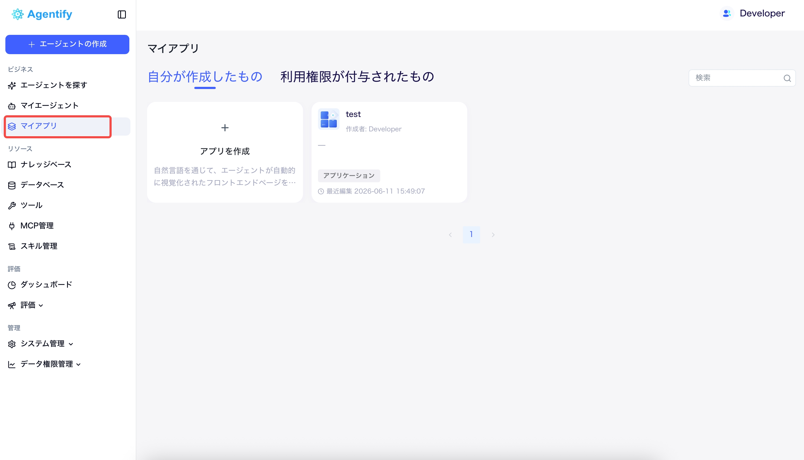

# ユーザー操作マニュアル 一覧

対象読者: 日本語環境で 営業支援（SFA）、経費精算、受発注管理システム、共通管理を利用する一般ユーザー、承認者、管理者

最終更新日: 2026-07-01

## 営業支援（SFA）

営業支援（SFA）は、Agentify にログインした後、「マイアプリ」から起動する営業活動管理システムです。顧客、案件、商材、販促活動、営業実績、市場リサーチを管理します。

| ファイル | 対象 | 内容 |
| --- | --- | --- |
| [営業支援（SFA）操作マニュアル](./sfa-management-manual.md) | 営業担当者・営業管理者・営業責任者 | 顧客登録、案件管理、商談進捗、AI 要約、市場リサーチ、営業実績確認 |
| [営業支援（SFA）スクリーンショット撮影ガイド](./sfa-screenshot-guide.md) | マニュアル作成担当者 | SFA マニュアル用スクリーンショットの保存先、撮影画面、撮影ポイント |

## 経費精算

経費精算は、受発注管理システムとは別の業務アプリとして扱います。利用できる画面や操作は、マスタ情報管理で設定されたユーザー、部門、ロール権限に基づいて制御されます。freee 連携に関する認証方式や利用権限の扱いは、運用設定に合わせて確認してください。

| ファイル | 対象 | 内容 |
| --- | --- | --- |
| [経費精算 操作マニュアル](./expense-management-manual.md) | 経費申請者・承認者・精算担当者・経理担当者 | 領収書読取、経費申請、承認、精算、Excel・freee 連携 |

## 受発注管理システム

| ファイル | 対象 | 内容 |
| --- | --- | --- |
| [受注管理 操作マニュアル](./order-management-manual.md) | 営業・請求・入金担当者 | 受注作成、請求作成、入金登録、売掛確認 |
| [発注管理 操作マニュアル](./purchase-management-manual.md) | 購買依頼者・購買担当・検収担当・経理担当 | 購買依頼、発注案件、納品・検収、仕入計上、支払予定 |

## 共通管理

共通管理では、受発注管理システムと経費精算で利用するユーザー、部門、ロール、権限を管理します。画面やボタンの表示は、ここで設定したロール権限に基づきます。

| ファイル | 対象 | 内容 |
| --- | --- | --- |
| [マスタ情報管理 操作マニュアル](./master-management-manual.md) | システム管理者 | テナント、部門、ユーザー、ロール権限の管理 |
| [権限・ロール説明書](./role-permission-guide.md) | 管理者・部門責任者 | ロール別の表示メニュー、操作可能範囲、注意点 |
| [ロール別操作ガイド](./role-based-operation-guide.md) | 管理者・マニュアル作成担当者 | ロール別に表示される画面、ボタン、利用できない操作 |

## 受発注管理システム 担当別手順

初回研修や日常業務では、以下の受発注管理システム向け担当別手順書を利用します。各手順書は、担当者が日常的に使う画面と操作だけをまとめています。

| 手順書 | 対象 |
| --- | --- |
| [受注営業担当者向け](./quick-guides/order-sales-quick-guide.md) | 受注作成を行う営業担当者 |
| [受注経理担当者向け](./quick-guides/order-accounting-quick-guide.md) | 請求・入金・売掛確認を行う経理担当者 |
| [購買依頼者向け](./quick-guides/purchase-requester-quick-guide.md) | 購買依頼を作成・申請するユーザー |
| [購買担当・承認者向け](./quick-guides/purchase-manager-quick-guide.md) | 発注案件作成、承認、発注登録を行う担当者 |
| [検収担当者向け](./quick-guides/purchase-inspection-quick-guide.md) | 納品確認、検収登録を行う担当者 |
| [発注経理担当者向け](./quick-guides/purchase-accounting-quick-guide.md) | 支払予定確認、支払済み更新を行う経理担当者 |

## 共通の利用開始手順

営業支援（SFA）、経費精算、受発注管理システム、共通管理は、Agentify にログインした後、「マイアプリ」から起動します。

基本手順:

1. ブラウザで Agentify のログイン画面を開きます。
2. メールアドレスとパスワードを入力してログインします。
3. ログイン後、メニューまたはホーム画面から「マイアプリ」を開きます。
4. 利用するアプリを選択します。
   - 営業支援（SFA）を利用する場合: 「営業支援（SFA）」アプリを開きます。
   - 経費精算を利用する場合: 「経費精算」アプリを開きます。利用にはマスタ情報管理で経費精算ロールが付与されている必要があります。
   - 受発注管理システムを利用する場合: 「受注管理」または「発注管理」を開きます。
   - 共通管理を利用する場合: 「マスタ情報管理」を開きます。
5. アプリ画面が表示されたら、左メニューから必要な機能を選択します。




注意:

- マイアプリに対象アプリが表示されない場合は、Agentify 側でアプリ利用権限が付与されていない可能性があります。
- 受発注管理システムで一部メニューやボタンが表示されない場合は、業務ロールまたはアプリ内権限が不足している可能性があります。
- 経費精算で一部メニューやボタンが表示されない場合は、経費精算ロール、部門範囲、申請ステータスを確認してください。
- 権限の追加や変更が必要な場合は、自社のシステム管理者に依頼してください。

## 画像の配置ルール

本文中の画像は、以下のような Markdown 形式で参照しています。

```md

```

スクリーンショットを取得したら、対応するファイル名で保存してください。

| アプリ | 保存先 |
| --- | --- |
| 共通画面 | `docs/manuals/assets/common/` |
| 受注管理 | `docs/manuals/assets/order/` |
| 発注管理 | `docs/manuals/assets/purchase/` |
| 経費精算 | `docs/manuals/assets/expense/` |
| マスタ情報管理 | `docs/manuals/assets/master/` |
| 営業支援（SFA） | `docs/manuals/assets/sfa/` |

## 作成・更新時の注意

- マニュアル本文では、原則として内部権限コードを表示しません。
- 受発注管理システムの権限コードは、管理者向けの [権限・ロール説明書](./role-permission-guide.md) にだけ記載します。
- 経費精算の利用可否は、マスタ情報管理のロール権限を前提に記載します。freee 連携の認証方式や外部側の権限は、確定した運用に合わせて別途補足します。
- 画面文言が変わった場合は、スクリーンショットと本文を同時に更新してください。
- 受発注管理システムの業務フローや権限仕様を変更した場合は、まず権限・ロール説明書を更新してから各操作マニュアルを修正してください。
