# 経費精算 操作マニュアル

対象読者: 経費申請者、承認者、精算担当者、経理担当者

最終更新日: 2026-07-01

## はじめに: Agentify から経費精算を開く

経費精算は、Agentify にログインした後、「マイアプリ」から起動します。

操作手順:

1. ブラウザで Agentify のログイン画面を開きます。
2. メールアドレスとパスワードを入力し、「ログイン」をクリックします。
3. ログイン後、ホーム画面またはメニューから「マイアプリ」を開きます。
4. アプリ一覧から「経費精算」を選択します。
5. 経費精算のダッシュボードが表示されます。

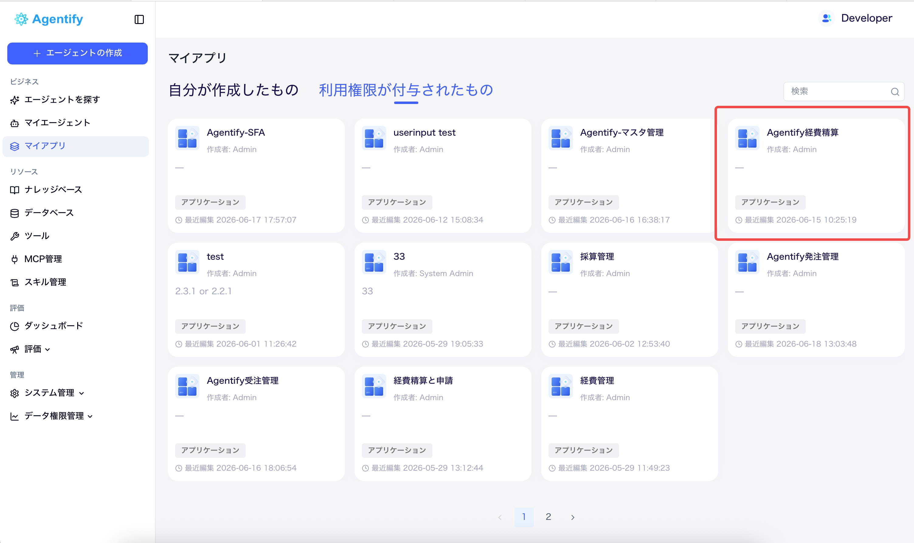

注意:

- 「経費精算」がマイアプリに表示されない場合は、Agentify 側で経費精算アプリの利用設定が有効になっていません。
- 経費精算は、受注管理・発注管理とは別アプリですが、ユーザー、部門、ロール権限はマスタ情報管理で管理します。
- freee 連携の認証方式や利用権限の扱いは、運用設定により異なります。連携操作が利用できない場合は、経費精算ロールと freee 連携状態を確認してください。

## 1. 経費精算でできること

経費精算では、領収書・請求書のアップロードから経費申請、承認、精算完了までを管理します。

主な業務の流れ:

1. 領収書または請求書をアップロードします。
2. AI 読取結果を確認し、必要に応じて修正します。
3. 経費申請を下書き保存、または申請します。
4. 承認者が申請内容を確認し、承認または差戻しを行います。
5. 承認後、申請は承認済みになります。
6. 承認済み以降の申請で、勘定科目・税区分を確認・設定します。
7. 必要に応じて、承認済み以降かつ勘定科目・税区分が設定済みの申請を freee に連携します。
8. 精算担当者が精算登録を行い、精算処理の対象にします。
9. 精算処理が完了したら、精算済みに更新します。

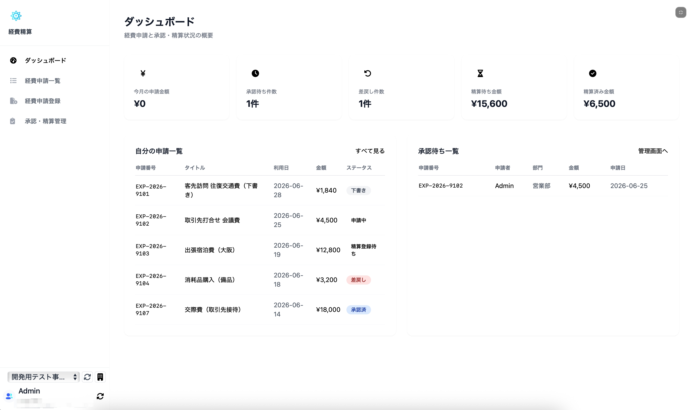

## 2. 画面構成

| メニュー | 用途 |
| --- | --- |
| ダッシュボード | 今月の申請金額、承認待ち、差戻し、精算状況などを確認 |
| 経費申請一覧 | 申請の検索、詳細確認、編集、取下げ、再申請、外部連携 |
| 経費申請登録 | 領収書・請求書をアップロードして経費申請を作成 |
| 承認・精算管理 | 承認待ち申請、精算待ち申請の処理 |

表示されるメニューとボタンは、マスタ情報管理で付与された経費精算ロール、部門範囲、申請ステータス、ログインユーザーと申請者の関係、freee 連携状態によって異なります。

主なロール別の利用範囲:

| ロール | 主な利用者 | 主な操作 |
| --- | --- | --- |
| 経費申請者 | 一般利用者 | 自分の経費申請の作成、下書き保存、提出、取下げ、再申請 |
| 経費承認者 | 部門責任者 | 担当部門の申請確認、承認、差戻し |
| 経費精算担当 | 経理・精算担当者 | 承認済み申請の必須設定確認、freee 連携、精算登録、精算済み更新、Excel 出力 |
| 経費精算管理者 | 管理者 | 経費精算の全操作 |
| 経理担当者 | 経理担当者 | 全社の精算対象確認、精算登録、精算済み更新、Excel 出力、freee 連携 |

## 3. ダッシュボードを確認する

1. 左メニューから「ダッシュボード」をクリックします。
2. 画面上部の集計カードを確認します。
3. 「自分の申請一覧」または「承認待ち一覧」から、必要な申請を開きます。

確認できる主な項目:

| 項目 | 説明 |
| --- | --- |
| 今月の申請金額 | 当月に申請された経費金額の合計 |
| 承認待ち件数 | ステータスが申請中の件数 |
| 差戻し件数 | ステータスが差戻しの件数 |
| 精算待ち金額 | ステータスが精算登録待ちまたは精算待ちの金額合計 |
| 精算済み金額 | ステータスが精算済みの金額合計 |

## 4. 経費申請を作成する

### 4.1 新規申請画面を開く

1. 左メニューから「経費申請登録」をクリックします。
2. 「領収書・請求書をアップロード」画面が表示されます。
3. 申請番号が表示されていることを確認します。

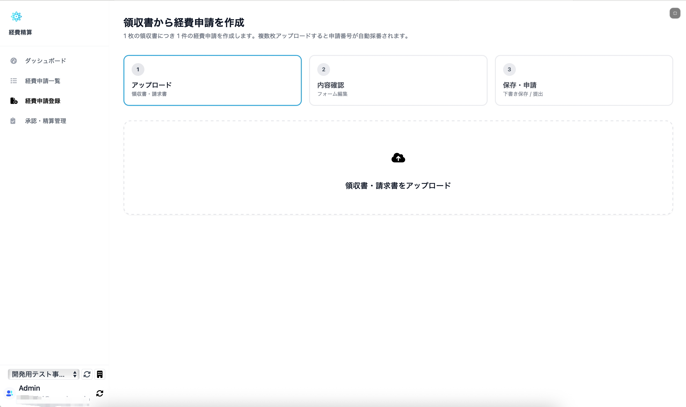

### 4.2 領収書・請求書をアップロードする

アップロードエリアにファイルをドラッグアンドドロップするか、アップロードエリアをクリックしてファイルを選択します。

利用できる主なファイル形式:

| ファイル形式 | 説明 |
| --- | --- |
| PDF | 領収書、請求書など |
| JPG / JPEG | 撮影した領収書画像など |
| PNG | 画像形式の領収書など |

注意:

- 複数ファイルを選択できます。
- 1 ファイルごとに 1 件の経費申請として読み取られます。
- 画像が不鮮明な場合や複数の領収書が 1 ファイルに含まれる場合、読取結果が不正確になることがあります。

### 4.3 AI 読取結果を確認する

ファイルをアップロードすると、読取処理が開始されます。処理中は読取件数や対象ファイル名が表示されます。

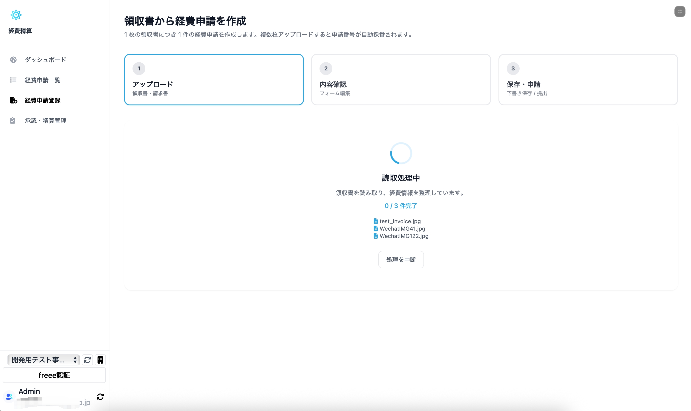

読取が完了すると、基本情報と領収書ごとの経費情報が表示されます。

注意:

- AI 読取は入力補助です。申請前に必ず人が内容を確認してください。
- 金額、利用日、支払先、税率、インボイス登録番号は特に確認してください。

### 4.4 基本情報を確認・入力する

基本情報では、申請全体に関する内容を確認します。

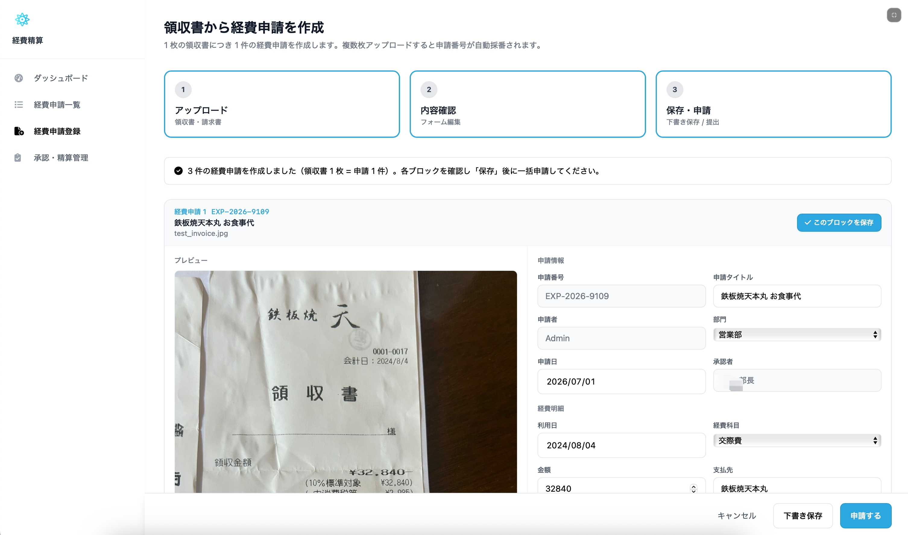

入力・確認する主な項目:

| 項目 | 説明 |
| --- | --- |
| 申請番号 | 自動採番される番号 |
| 申請タイトル | 申請内容が分かる名称 |
| 申請者 | 経費を申請するユーザー |
| 部門 | 申請者の所属部門 |
| 申請日 | 申請を作成する日付 |
| 承認者 | 申請を承認する担当者 |
| 備考 | 補足事項 |

### 4.5 領収書ごとの経費情報を確認する

領収書ごとのブロックで、読取結果を確認・修正します。

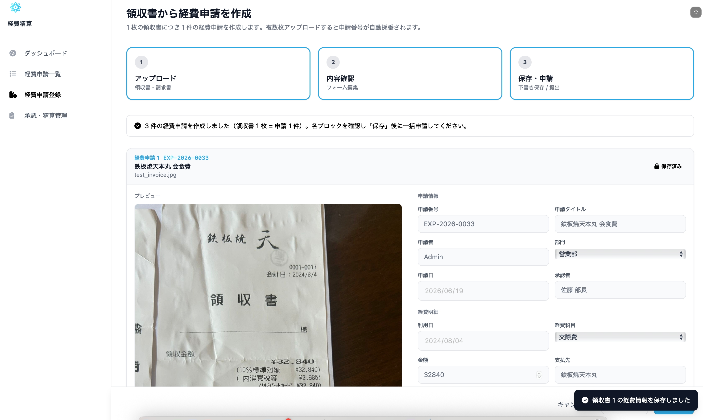

入力・確認する主な項目:

| 項目 | 説明 |
| --- | --- |
| 利用日 | 経費を利用した日付 |
| 経費科目 | 交通費、会議費、交際費、消耗品費など |
| 金額 | 領収書または請求書の金額 |
| 支払先 | 店舗名、取引先名など |
| 内容 | 経費の内容 |
| 支払方法 | 現金、クレジットカード、会社カード、立替など |
| 税率 | 10%、8%、0% |
| インボイス登録番号 | 必要に応じて入力 |
| 適格請求書 | あり、なし、不明 |

内容を確認したら、各ブロックの「このブロックを保存」をクリックします。保存済みのブロックは編集できない状態になります。

注意:

- 申請する前に、すべての領収書ブロックを保存してください。
- 未保存のブロックがある場合、申請時にエラーが表示されます。

### 4.6 下書き保存または申請する

画面下部のボタンを使って保存します。

| ボタン | 説明 |
| --- | --- |
| キャンセル | 入力を中止して一覧へ戻ります。 |
| 下書き保存 | 後で編集するために保存します。 |
| 申請する | 承認者へ申請します。 |

申請時には確認ポップアップが表示されます。

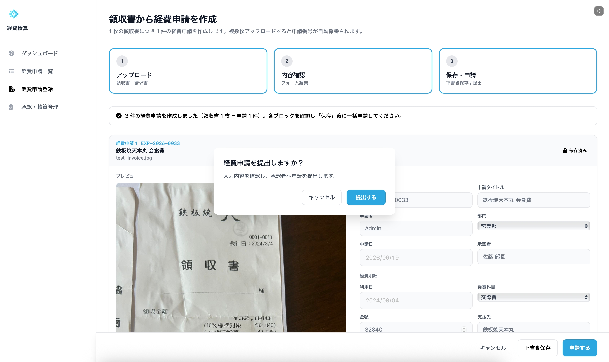

注意:

- 下書き保存した申請は、後から編集、申請、削除できます。
- 「申請する」を実行すると、ステータスは申請中になります。

## 5. 経費申請一覧を確認する

### 5.1 申請一覧を開く

1. 左メニューから「経費申請一覧」をクリックします。
2. 経費申請一覧が表示されます。
3. 必要に応じてステータス、申請者、経費科目、申請日、利用日、freee 連携状態、キーワードで絞り込みます。

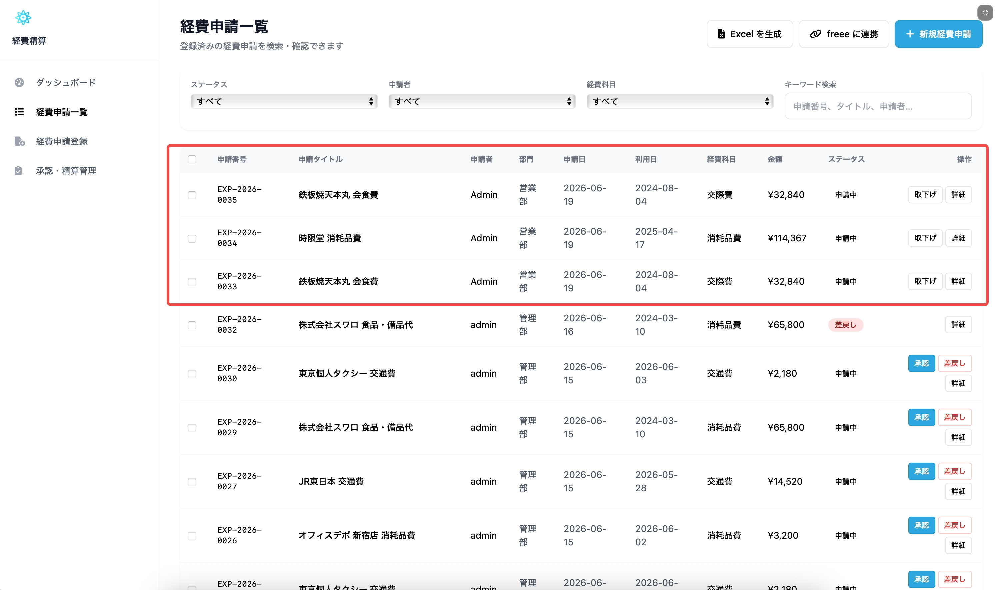

検索条件:

| 条件 | 説明 |
| --- | --- |
| ステータス | 下書き、申請中、承認済み、差戻し、精算登録待ち、精算待ち、精算済み |
| 申請者 | 申請者名 |
| 経費科目 | 交通費、会議費、交際費など |
| 申請日 | 申請日の From / To |
| 利用日 | 利用日の From / To |
| 連携状態（freee） | 未連携、連携済みなど |
| キーワード検索 | 申請番号、タイトル、申請者、支払先、内容 |

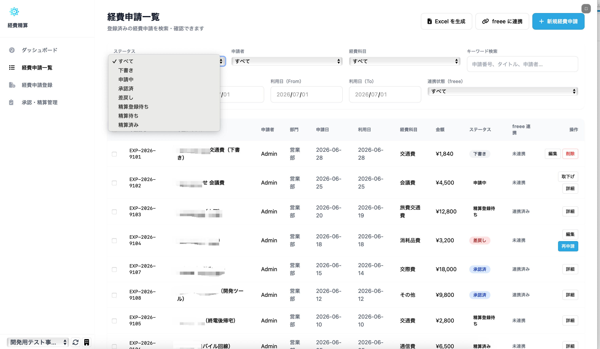

### 5.2 一覧上で操作する

一覧の「操作」欄には、ステータスやユーザーに応じたボタンが表示されます。

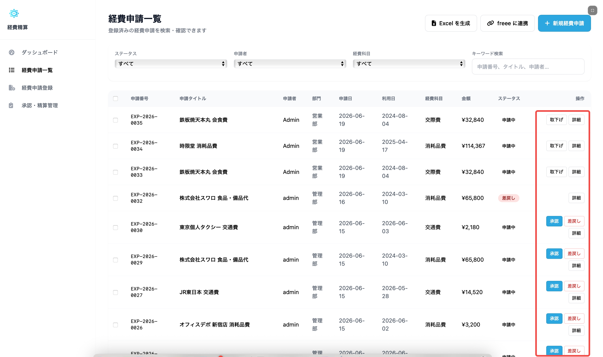

主な操作:

| ステータス | 操作 | 説明 |
| --- | --- | --- |
| 下書き | 編集 | 内容を修正 |
| 下書き | 削除 | 下書きを削除 |
| 申請中 | 取下げ | 自分の申請を下書きに戻す |
| 申請中 | 承認 | 他の申請者の申請を承認 |
| 申請中 | 差戻し | 他の申請者の申請を理由付きで差戻し |
| 差戻し | 編集 | 差戻し内容を修正 |
| 差戻し | 再申請 | 修正後に再申請 |
| 承認済み | freee 連携 | 勘定科目・税区分が設定済みの場合、freee に連携 |
| 承認済み | 精算登録 | 精算対象として登録 |
| 承認済み・精算登録待ち・精算待ち・精算済み | 詳細 | 申請内容を確認 |

注意:

- 「取下げ」は申請者本人の操作です。
- 「差戻し」は承認者が理由付きで申請者へ戻す操作です。
- 表示されていないボタンは、そのユーザーが実行できない操作、または現在のステータスでは実行できない操作です。

## 6. 申請詳細を確認する

### 6.1 申請詳細を開く

1. 「経費申請一覧」または「ダッシュボード」で対象申請を確認します。
2. 対象行または「詳細」をクリックします。
3. 申請詳細画面が表示されます。

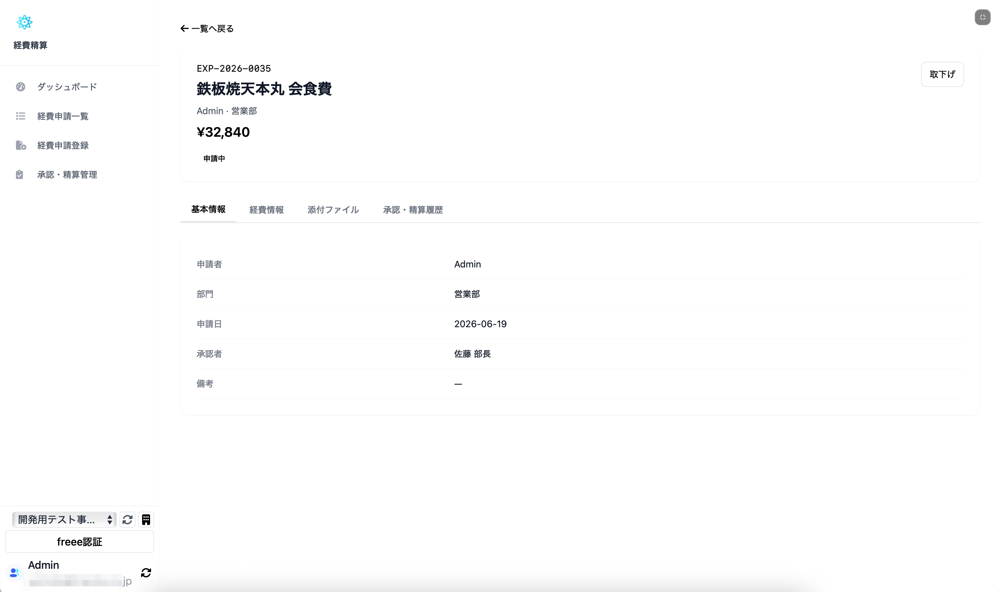

申請詳細では、以下のタブを確認できます。

| タブ | 内容 |
| --- | --- |
| 基本情報 | 申請者、部門、申請日、承認者、備考 |
| 経費情報 | 利用日、経費科目、内容、支払先、金額、税、インボイス情報 |
| 添付ファイル | 領収書、補足資料 |
| 承認・精算履歴 | 申請、承認、差戻し、精算などの履歴 |

### 6.2 freee 取引連携の必須設定を確認する

基本情報タブでは、freee 取引連携に必要な勘定科目と税区分を確認・設定します。

1. 「基本情報」タブを開きます。
2. 「freee 取引連携の必須設定（勘定科目・税区分）」を確認します。
3. 勘定科目を選択します。
4. 税区分を選択します。
5. 必要に応じて「マスタ取得」または「自動設定」を使用します。

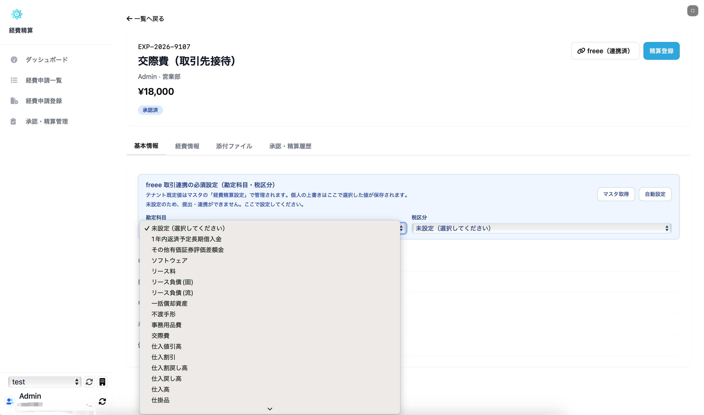

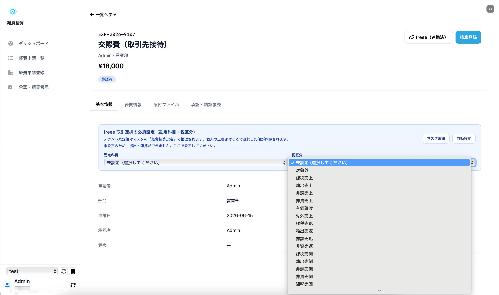

注意:

- 勘定科目・税区分が未設定の場合、申請提出や freee 連携ができない場合があります。
- テナント既定値はマスタ情報管理側で管理されます。申請ごとの上書きは、この画面で選択した値が保存されます。
- freee 側のマスタを最新化する場合は、運用ルールに従って「マスタ取得」または「自動設定」を実行してください。

### 6.3 承認・精算履歴を確認する

「承認・精算履歴」タブでは、申請に対して行われた操作を時系列で確認できます。

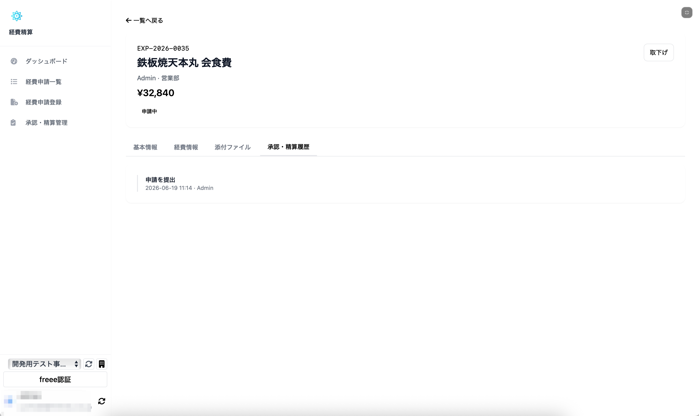

履歴に記録される主な操作:

- 下書きを保存
- 申請を提出
- 申請を取り下げ
- 承認
- 差戻し
- 再申請を提出
- 精算登録
- 精算済み
- freee に連携

## 7. 申請者の操作

### 7.1 下書きを編集する

1. 「経費申請一覧」でステータスが下書きの申請を確認します。
2. 「編集」をクリックします。
3. 内容を修正します。
4. 「下書き保存」または「申請する」をクリックします。

注意:

- 下書きのまま保存した場合、承認者には提出されません。
- 承認を依頼する場合は、必ず「申請する」をクリックしてください。

### 7.2 申請を取下げる

1. 「経費申請一覧」で自分の申請中データを確認します。
2. 「取下げ」をクリックします。
3. ステータスが下書きに戻ったことを確認します。

注意:

- 取下げ後は、内容を修正して再度申請できます。
- 取下げは、承認者による差戻しとは異なります。

### 7.3 差戻しされた申請を再申請する

1. 「経費申請一覧」でステータスが差戻しの申請を確認します。
2. 「編集」をクリックします。
3. 差戻し理由を確認し、内容を修正します。
4. 「再申請」をクリックします。
5. 確認ポップアップで「提出する」をクリックします。

再申請後、ステータスは申請中になります。

### 7.4 下書きを削除する

1. 「経費申請一覧」でステータスが下書きの申請を確認します。
2. 「削除」をクリックします。
3. 確認ポップアップで内容を確認します。
4. 「削除する」をクリックします。

注意:

- 削除した申請は元に戻せません。
- 削除は、誤って作成した下書きなどに対して行ってください。

## 8. 承認者が申請を承認・差戻しする

### 8.1 承認待ち一覧を確認する

1. 左メニューから「承認・精算管理」をクリックします。
2. 「承認待ち」タブを開きます。
3. 承認対象の申請を確認します。

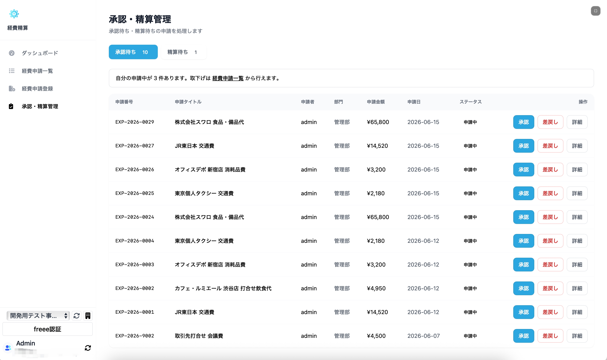

注意:

- 承認待ち一覧には、他の申請者が提出した申請中データが表示されます。
- 自分の申請中データがある場合、取下げは「経費申請一覧」から行います。

### 8.2 申請を承認する

1. 承認待ち一覧で対象申請を確認します。
2. 「承認」をクリックします。
3. 確認ポップアップで「承認する」をクリックします。

承認後、ステータスは承認済みになります。承認済み以降、精算担当者は詳細画面で勘定科目・税区分を確認し、必要に応じて freee 連携と精算登録を行います。

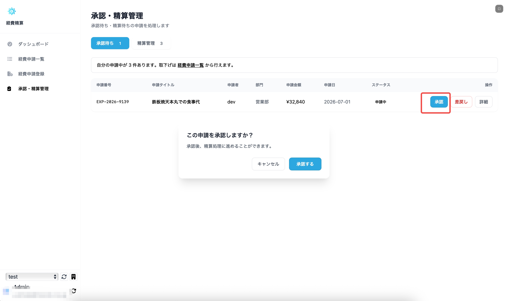

### 8.3 申請を差戻しする

1. 承認待ち一覧で対象申請を確認します。
2. 「差戻し」をクリックします。
3. 差戻し理由を入力します。
4. 「差戻しする」をクリックします。

差戻し後、ステータスは差戻しになります。入力した理由は、承認・精算履歴に記録されます。

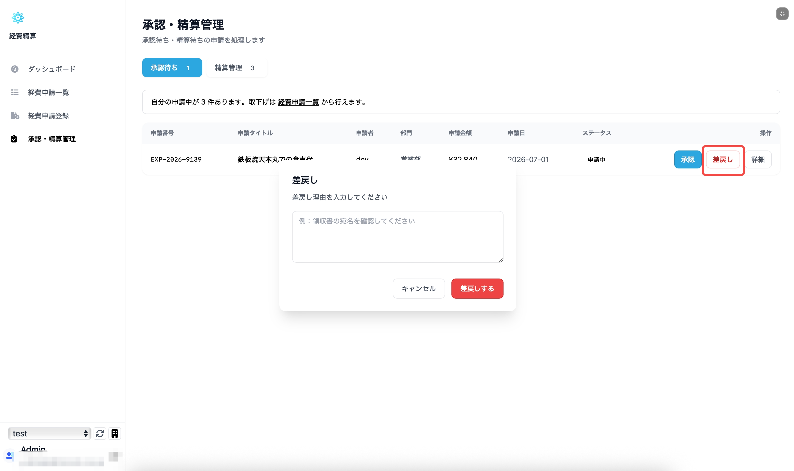

## 9. 精算処理を行う

### 9.1 承認済み申請の必須設定を確認する

1. 「経費申請一覧」または「承認・精算管理」で、ステータスが承認済みの申請を開きます。
2. 基本情報タブで勘定科目・税区分が設定済みであることを確認します。
3. 未設定の場合は、勘定科目と税区分を選択します。
4. freee 連携を行う場合は、申請が承認済み以降であり、勘定科目・税区分が設定済みであることを確認します。

注意:

- 勘定科目・税区分が未設定の場合、freee 連携や精算登録ができないことがあります。
- freee 連携済みの場合は、画面右上に「freee（連携済）」と表示されます。

### 9.2 必要に応じて freee に連携する

1. 承認済み以降の申請であることを確認します。
2. 勘定科目・税区分が設定済みであることを確認します。
3. 経費申請一覧または申請詳細から「freee に連携」をクリックします。
4. 確認ポップアップで対象内容を確認し、「連携する」をクリックします。

注意:

- 申請中、下書き、差戻しの申請は freee 連携できません。
- 勘定科目・税区分が未設定の申請は freee 連携の対象外になります。
- すでに連携済みの申請は再連携できません。

### 9.3 承認済み申請を精算登録する

1. 承認済み申請の詳細を開きます。
2. 勘定科目・税区分が設定済みであることを確認します。
3. 画面右上の「精算登録」をクリックします。
4. 処理後、ステータスが精算登録待ちまたは精算待ちに進んだことを確認します。

### 9.4 精算待ち一覧を確認する

1. 左メニューから「承認・精算管理」をクリックします。
2. 精算対象の申請を確認します。
3. 申請番号、申請者、部門、承認日、精算金額、ステータスを確認します。

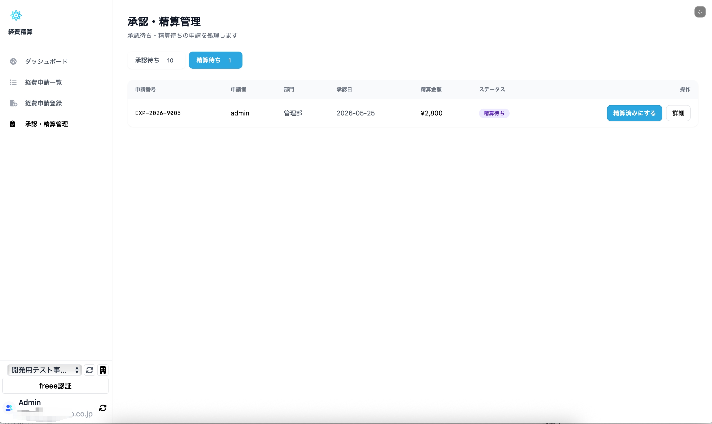

### 9.5 精算済みにする

1. 精算待ち一覧で対象申請を確認します。
2. 「精算済みにする」をクリックします。
3. 確認ポップアップで「精算済みにする」をクリックします。

処理後、ステータスは精算済みになります。

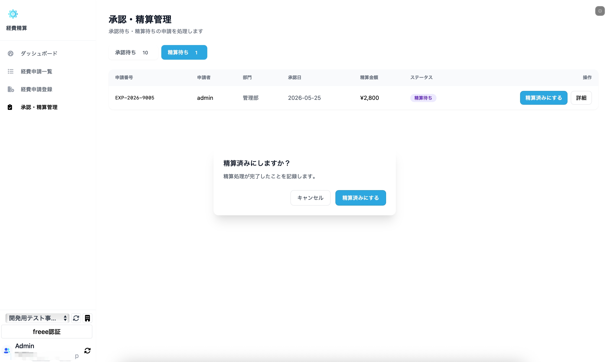

## 10. Excel 生成・freee 連携を行う

### 10.1 Excel を生成する

1. 「経費申請一覧」で対象申請にチェックを入れます。
2. 画面右上の「Excel を生成」をクリックします。
3. 生成完了メッセージを確認します。

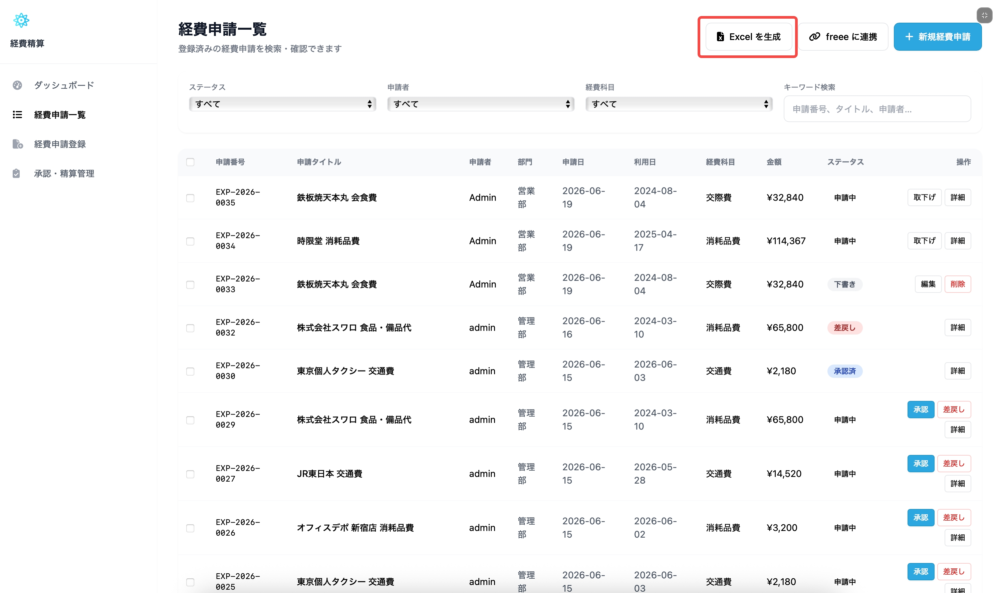

注意:

- Excel 生成は、申請内容を外部出力用ファイルとして作成する操作です。

### 10.2 freee 連携条件を確認する

freee 連携を行う前に、対象申請の状態と必須設定を確認します。

1. 対象申請が承認済み、精算登録待ち、精算待ち、精算済みのいずれかであることを確認します。
2. 詳細画面で勘定科目・税区分が設定済みであることを確認します。
3. 一覧の「連携状態（freee）」または詳細画面右上の表示で、未連携か連携済みかを確認します。
4. freee 連携権限があるユーザーで操作していることを確認します。

注意:

- freee 連携は、承認済みになる前の申請では実行できません。
- freee 連携は、経費申請一覧または申請詳細の上部ボタンから行います。
- freee 認証方式や利用権限の扱いは、運用設定により異なります。
- 勘定科目・税区分が未設定の場合、freee 連携の対象外になります。

### 10.3 freee に連携する

1. 「経費申請一覧」で対象申請にチェックを入れます。
2. 画面右上の「freee に連携」をクリックします。
3. 確認ポップアップで対象件数を確認し、「連携する」をクリックします。
4. 連携結果メッセージを確認します。
5. 必要に応じて、freee 側で登録結果を確認します。

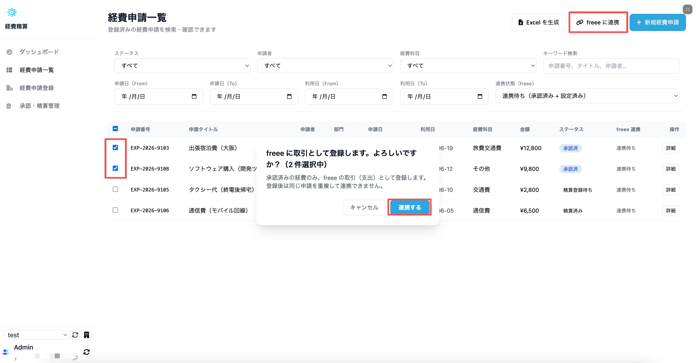

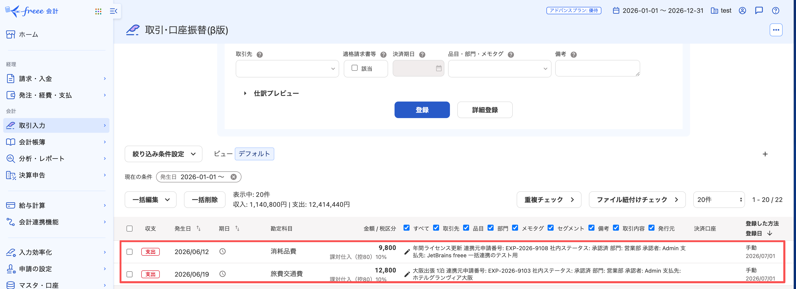

注意:

- freee 連携は、経費申請データを会計側へ反映するための操作です。
- freee 連携ボタンの表示や実行可否は、経費精算ロール、申請ステータス、freee 連携状態、勘定科目・税区分の設定状態、運用上の認証設定によって変わります。
- freee 連携を利用しない環境では、この操作は表示されない、または利用対象外になる場合があります。

### 10.4 freee 認証が求められた場合

freee 認証画面が表示された場合は、表示内容を確認して認証します。

1. freee のログイン画面が表示されたら、freee ID、または Google / Apple / Microsoft などの連携アカウントでログインします。
2. アプリ連携確認画面で、アプリ名、ユーザー、事業所名、要求されるアクセス権を確認します。
3. 内容に問題がなければ「許可する」をクリックします。

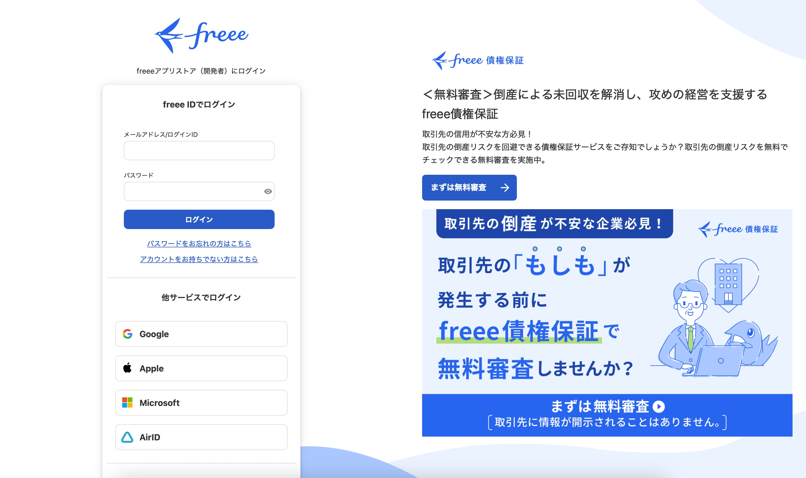

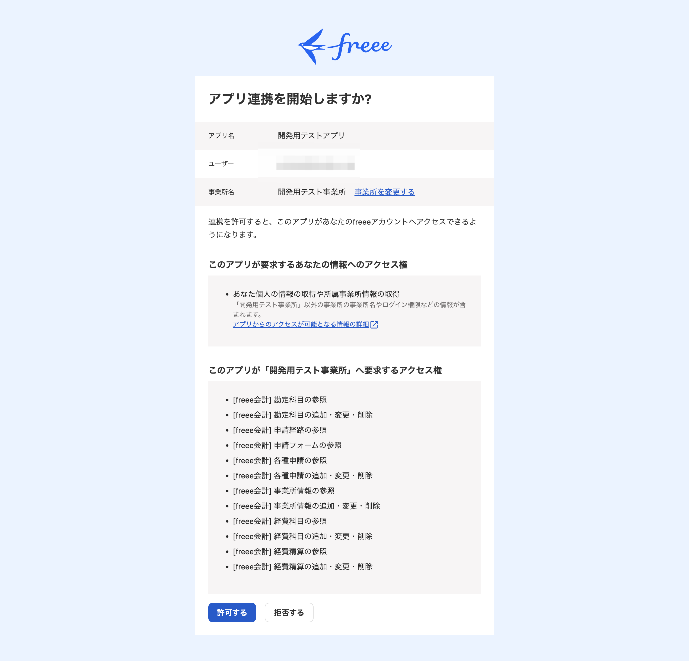

注意:

- アプリ連携確認画面では、要求されるアクセス権を確認してから許可してください。
- freee 側で必要な権限が付与されていない場合、認証後でも連携操作が失敗することがあります。

## 11. ステータス一覧

経費申請では、以下のステータスを使用します。

| ステータス | 説明 | 主な操作 |
| --- | --- | --- |
| 下書き | 申請前の保存状態 | 編集、申請、削除 |
| 申請中 | 承認者へ提出済み | 取下げ、承認、差戻し |
| 承認済み | 承認者が承認し、freee 連携や精算登録に進める状態 | 詳細確認、勘定科目・税区分設定、freee 連携、精算登録 |
| 差戻し | 承認者から修正依頼済み | 編集、再申請 |
| 精算登録待ち | 精算登録後、精算処理へ進む前の状態 | 詳細確認、freee 連携 |
| 精算待ち | 精算処理の対象になった状態 | 精算済みにする、freee 連携 |
| 精算済み | 精算処理が完了 | 詳細確認 |

## 12. 操作時の注意

- 申請前に、すべての領収書ブロックで「このブロックを保存」をクリックしてください。
- AI 読取結果は必ず確認し、必要に応じて修正してください。
- 複数ファイルをアップロードした場合、1 ファイルごとに 1 件の経費申請として扱われます。
- 「取下げ」は申請者本人が申請中データを下書きへ戻す操作です。
- 「差戻し」は承認者が理由付きで申請者へ戻す操作です。
- freee 連携は、承認済み以降かつ勘定科目・税区分が設定済みの申請だけが対象です。
- 勘定科目・税区分は、申請提出、精算登録、freee 連携の前に確認してください。
- 削除した下書き申請は元に戻せません。
- 経費精算の利用可否や表示メニューは、マスタ情報管理で付与された経費精算ロールに基づきます。権限変更後は、対象ユーザーで再ログインして表示を確認してください。
