# マスタ情報管理 操作マニュアル

対象読者: システム管理者、スーパー管理者

最終更新日: 2026-06-16

## はじめに: Agentify からマスタ情報管理を開く

マスタ情報管理は、Agentify にログインした後、「マイアプリ」から起動します。

操作手順:

1. ブラウザで Agentify のログイン画面を開きます。
2. メールアドレスとパスワードを入力し、「ログイン」をクリックします。
3. ログイン後、ホーム画面またはメニューから「マイアプリ」を開きます。
4. アプリ一覧から「マスタ情報管理」を選択します。
5. マスタ情報管理のトップ画面が表示されます。

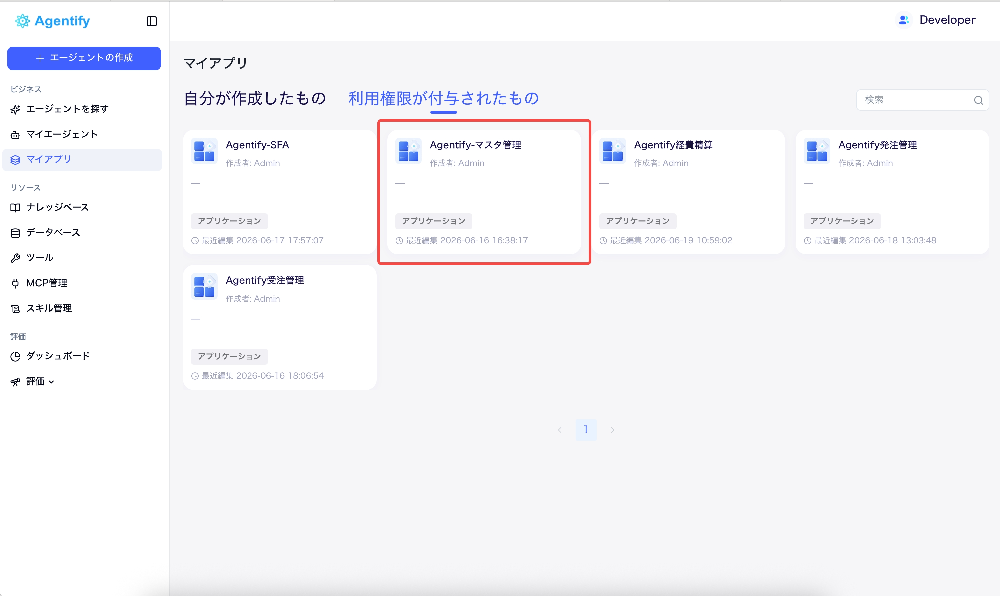

注意:

- 「マスタ情報管理」がマイアプリに表示されない場合は、Agentify 側でアプリ利用権限が付与されていません。
- マスタ情報管理を開けても、管理できるテナントや操作範囲はログインユーザーの管理権限によって変わります。
- 権限変更は業務影響が大きいため、変更前に対象ユーザー、対象ロール、対象テナントを確認してください。

## 1. マスタ情報管理でできること

マスタ情報管理では、各アプリで利用するユーザー、部門、ロール、権限を管理します。受注管理、発注管理、経費精算の表示メニューや操作範囲は、ここで設定したロール権限に基づきます。

主な管理対象:

- テナント情報
- ユーザー情報
- ユーザー所属部門
- 部門マスタ
- ロール
- 受注管理・発注管理・経費精算のロール別権限

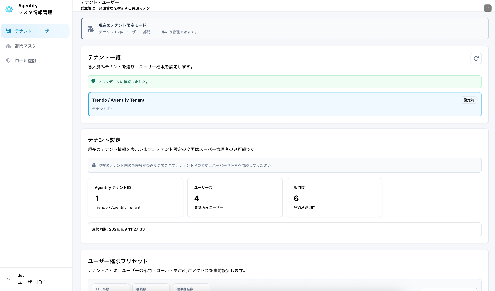

## 2. 管理者の種類

| 種類 | 管理範囲 |
| --- | --- |
| システム管理者 | 現在ログイン中のテナント内 |
| スーパー管理者 | すべてのテナント |

注意:

- システム管理者ロールを持つユーザーは、現在のテナント内のシステム管理者です。
- 全テナントを管理できるのは、システム側でスーパー管理者として指定されたアカウントだけです。
- 通常のシステム管理者は、他テナントのユーザーや権限を変更できません。

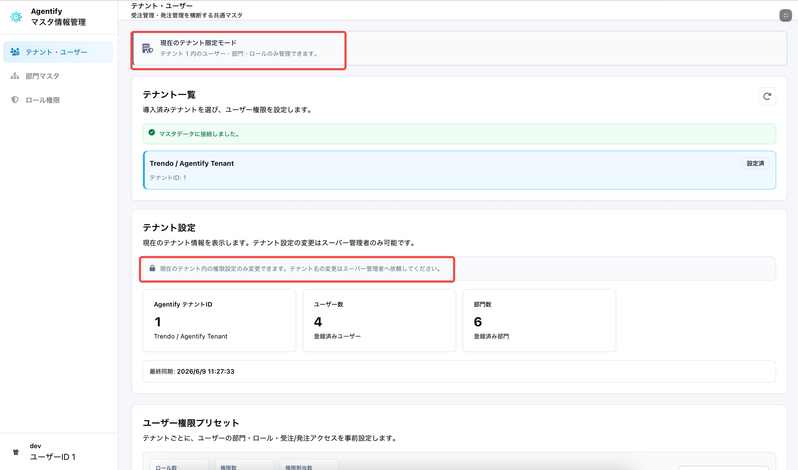

## 3. 初期表示を確認する

1. マスタ情報管理アプリを開きます。
2. 画面上部の管理範囲を確認します。
3. 左メニューから「テナント・ユーザー」「部門」「ロール権限」を切り替えます。

表示される主な情報:

- 現在のテナント
- ユーザー数
- 部門数
- ロール数
- 権限割当数

## 4. テナント・ユーザーを管理する

### 4.1 テナント情報を確認する

1. 左メニューから「テナント・ユーザー」を開きます。
2. 対象テナントを選択します。
3. テナント名や状態を確認します。

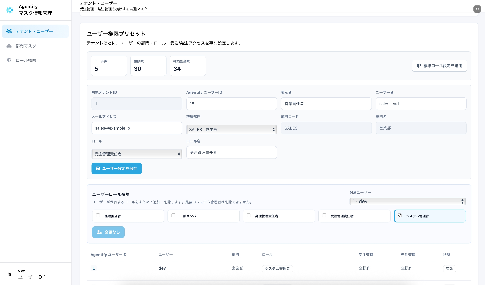

注意:

- 通常のシステム管理者は、自テナントのみ表示・管理できます。
- テナント名の変更は、スーパー管理者または運用管理者に依頼する運用を推奨します。

### 4.2 標準ロール設定を適用する

標準ロール設定を適用すると、以下のロールと権限が推奨テンプレートに同期されます。

- システム管理者
- 受注管理責任者
- 発注管理責任者
- 経理担当者
- 一般メンバー
- 経費申請者
- 経費承認者
- 経費精算担当
- 経費精算管理者

操作手順:

1. 「テナント・ユーザー」画面を開きます。
2. 対象テナントを確認します。
3. 「標準ロール設定を適用」ボタンをクリックします。
4. 確認ポップアップで内容を確認します。
5. 実行します。

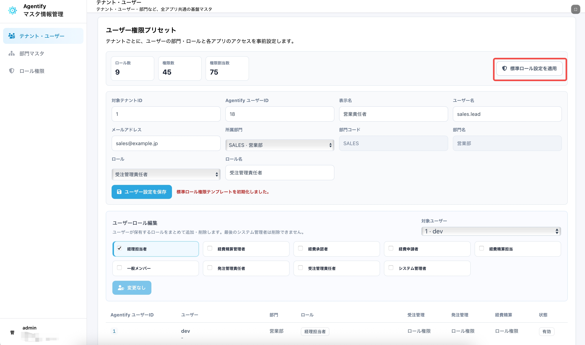

注意:

- 既存の標準ロール権限が更新されます。
- 標準ロールに手動で追加したテンプレート外の権限は削除されます。経費精算ロールも標準テンプレートに含まれる場合があります。
- 自社独自の権限構成を残したい場合は、標準ロールを直接変更するのではなく、専用ロールを追加してください。
- 適用前に、現在の権限構成を確認してください。

### 4.3 ユーザーを登録・更新する

初期導入時は、システム提供元から利用者アカウントの一覧が共有されます。通常、この一覧にはユーザー名と Agentify ユーザー ID が含まれます。
マスタ情報管理では、この Agentify ユーザー ID を使って、ログインユーザーと社内ユーザー情報を紐づけます。

事前に確認する情報:

| 確認項目 | 確認方法 |
| --- | --- |
| Agentify ユーザー ID | 初期導入時に提供されるアカウント一覧で確認します。 |
| 表示名 | アカウント一覧の氏名、または社内で利用する表示名を確認します。 |
| メールアドレス | 通知や本人確認に利用する場合は入力します。 |
| 所属部門 | ユーザーが主に所属する部門を確認します。 |
| 部門コード | 既存部門から選択する場合は自動で反映されます。新規部門を作る場合だけ、社内で一意になる短いコードを決めます。 |
| 付与するロール | 利用者の業務範囲に合わせて選択します。 |

操作手順:

1. 「ユーザー権限プリセット」エリアを確認します。
2. 初期導入時に提供されたアカウント一覧を手元に用意します。
3. Agentify ユーザー ID を入力します。
4. 表示名、ユーザー名、メールアドレスを入力します。
5. 所属部門を選択します。
6. 新しい部門を作る場合だけ、「新規部門を入力」を選択し、部門コードと部門名を入力します。
7. 付与するロールを選択します。
8. 保存します。

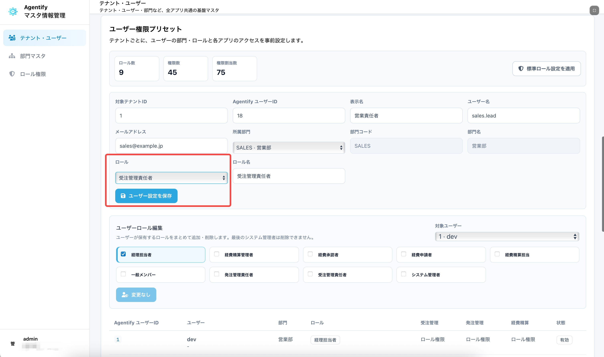

主な項目:

| 項目 | 説明 |
| --- | --- |
| Agentify ユーザー ID | Agentify 上のユーザーを識別する ID です。初期導入時に提供されるアカウント一覧から転記します。 |
| 表示名 | 画面に表示される名前です。通常は氏名または社内で利用する表示名を入力します。 |
| ユーザー名 | ログイン名や識別名です。アカウント一覧に記載された名称を入力します。 |
| メールアドレス | 連絡先です。未使用の場合でも、管理上分かる範囲で入力することを推奨します。 |
| 所属部門 | 既存部門がある場合は、一覧から選択します。 |
| 部門コード | 新規部門を作る場合に入力します。部門を識別する短いコードです。例: `SALES`、`PURCHASE`、`ACCOUNTING` |
| 部門名 | 新規部門を作る場合に入力します。画面に表示される部門名です。例: 営業部、購買部、経理部 |
| ロール | ユーザーが利用できる機能範囲です。業務内容に合わせて選択します。 |

入力例:

| 項目 | 入力例 |
| --- | --- |
| Agentify ユーザー ID | `101` |
| 表示名 | 山田 太郎 |
| ユーザー名 | yamada.taro |
| メールアドレス | yamada@example.co.jp |
| 所属部門 | `SALES` · 営業部 |
| ロール | 一般メンバー |

注意:

- Agentify ユーザー ID は、ユーザー名やメールアドレスではありません。必ず初期導入時に提供された ID を入力してください。
- Agentify ユーザー ID を誤って登録すると、ログインユーザーと権限設定が紐づかず、対象ユーザーがアプリを利用できない場合があります。
- 既存部門に所属させる場合は、所属部門の一覧から選択してください。
- 部門コードを手入力するのは、新規部門を作る場合だけです。
- 新規部門の部門コードはテナント内で重複しない値にしてください。
- 部門コードを新しく入力すると、その部門が存在しない場合は新規部門として登録されます。
- 複数部門に所属するユーザーは、まず主所属部門で登録し、その後「ユーザー所属部門」で兼務部門を追加します。
- ロールを迷う場合は、最初は最小限のロールを付与し、必要に応じて追加してください。

## 5. ユーザー所属部門を管理する

ユーザーの参照・操作範囲は、所属部門とロール割当部門に基づいて判断されます。

### 5.1 主所属を設定する

1. 対象ユーザーを選択します。
2. 主所属部門を選択します。
3. 保存します。

### 5.2 兼務部門を設定する

1. 対象ユーザーを選択します。
2. 兼務部門を選択します。
3. 保存します。

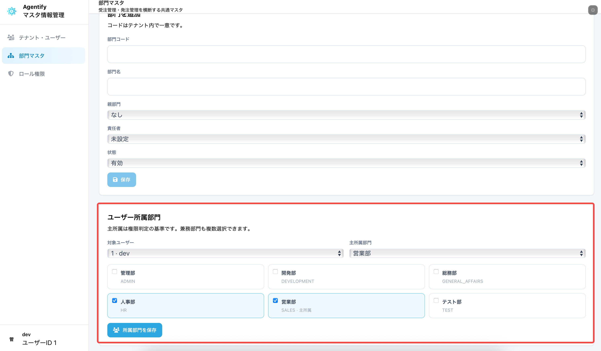

注意:

- 主所属は権限判定の基準として利用されます。
- 兼務部門を追加すると、その部門のデータも担当範囲に含まれます。
- 親部門を選択しても、子部門は自動では含まれません。

## 6. ユーザーにロールを割り当てる

1. 「テナント・ユーザー」画面で対象ユーザーを選択します。
2. 割り当てるロールにチェックを入れます。
3. 「変更を保存」をクリックします。
4. 確認ポップアップで内容を確認します。
5. 保存します。

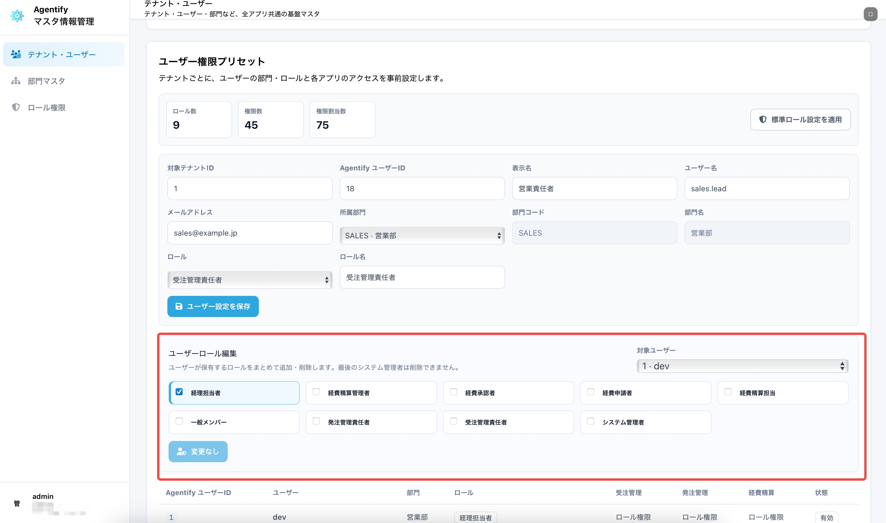

注意:

- 複数ロールを割り当てた場合、権限は加算されます。
- 自分自身のシステム管理者ロールは削除できません。
- テナント内の最後のシステム管理者ロールは削除できません。

## 7. 部門を管理する

### 7.1 部門一覧を確認する

1. 左メニューから「部門」を開きます。
2. 部門コード、部門名、親部門、状態を確認します。

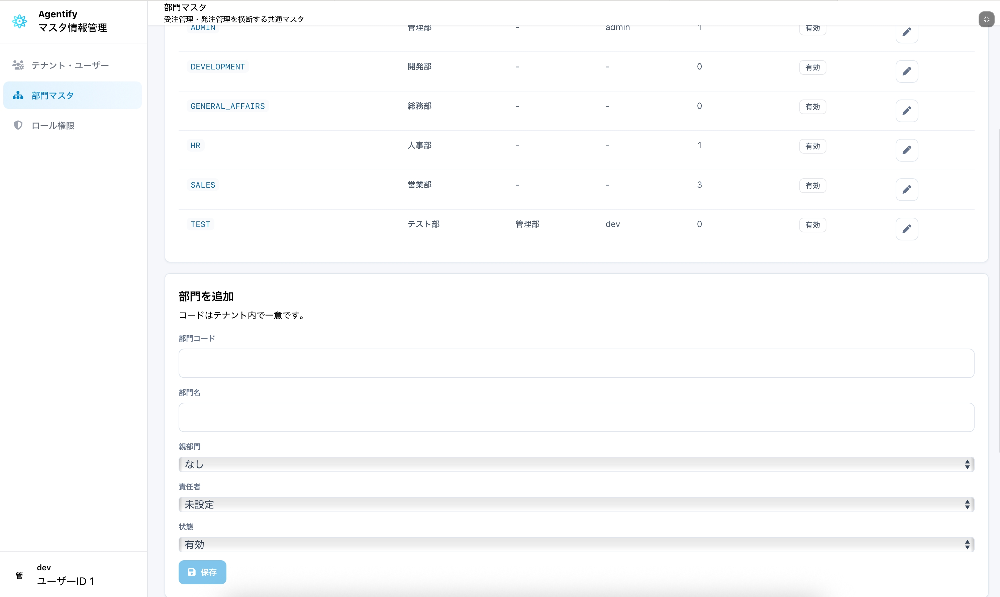

### 7.2 部門を登録・更新する

1. 部門コードを入力します。
2. 部門名を入力します。
3. 必要に応じて親部門を指定します。
4. 状態を選択します。
5. 保存します。

主な状態:

| 状態 | 説明 |
| --- | --- |
| 有効 | 通常利用する部門 |
| 準備中 | 作成途中の部門 |
| 無効 | 利用しない部門 |

注意:

- 部門コードは、業務上分かりやすく重複しない値にしてください。
- 部門階層は表示・管理用です。権限範囲として子部門が自動展開されるわけではありません。

## 8. ロール権限を編集する

### 8.1 ロールを選択する

1. 左メニューから「ロール権限」を開きます。
2. 対象テナントを確認します。
3. 対象ロールを選択します。

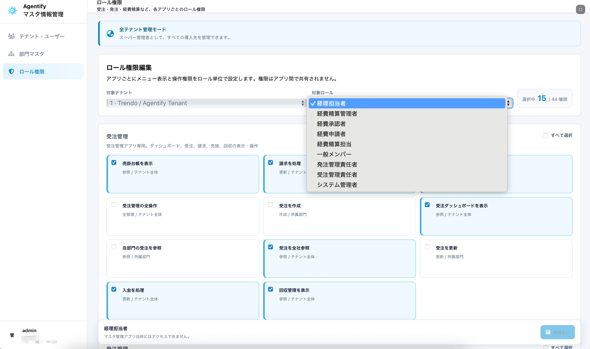

### 8.2 権限を選択する

権限はアプリ別に表示されます。

- 受注管理
- 発注管理
- 経費精算
- マスタ情報管理

必要な権限にチェックを入れます。

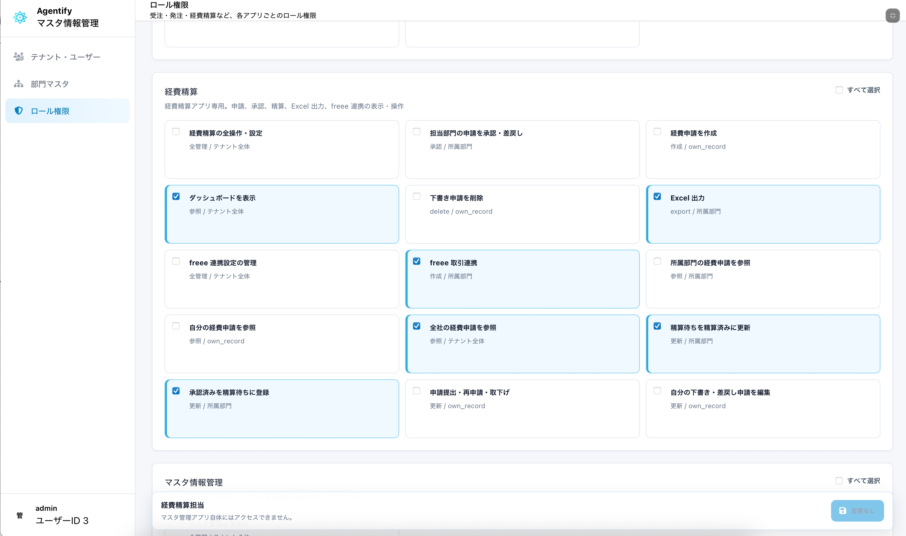

### 8.3 権限組み合わせの注意を確認する

権限の組み合わせによっては、画面上部に注意が表示されます。

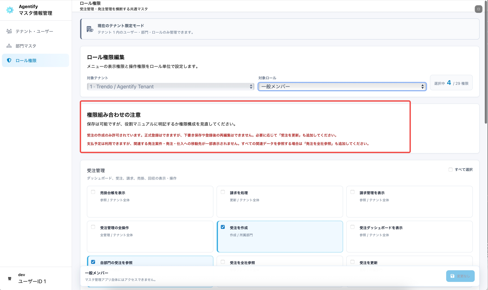

例:

| 注意内容 | 意味 |
| --- | --- |
| 作成のみ許可 | 作成はできるが、下書き保存や再編集ができない |
| 検収後の仕入計上はできない | 検収担当と仕入計上担当が分かれている |
| 関連データへの移動先が一部表示されない | 参照権限が不足している |
| 経費申請の作成のみ許可 | 下書き保存や提出に必要な権限が不足している |
| 精算・freee 連携の対象が限定される | 経費申請の参照範囲が不足している |

注意が表示されても保存は可能です。ただし、役割マニュアルに明記するか、権限構成を見直してください。

### 8.4 権限を保存する

1. 変更内容を確認します。
2. 「変更を保存」をクリックします。
3. 確認ポップアップで追加・削除件数を確認します。
4. 保存します。

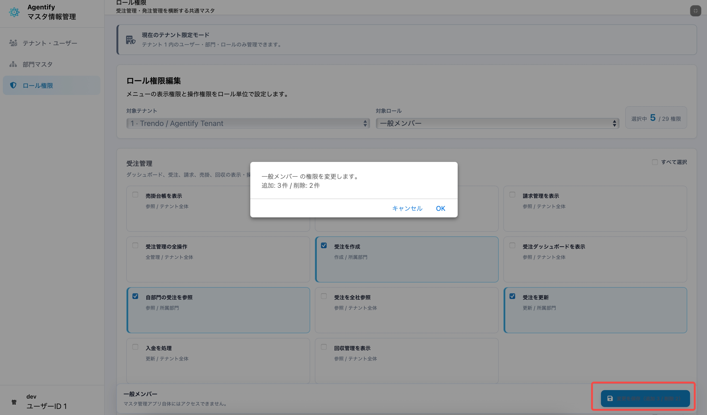

## 9. 推奨ロール設計

初期導入時は、「標準ロール設定を適用」で標準ロールを作成してから、必要に応じて自社運用に合わせて調整します。

### 9.1 一般的な構成

| 役割 | 推奨ロール |
| --- | --- |
| 営業担当 | 一般メンバー |
| 営業責任者 | 受注管理責任者 |
| 購買依頼者 | 一般メンバー |
| 購買責任者 | 発注管理責任者 |
| 経理担当 | 経理担当者 |
| 管理者 | システム管理者 |
| 経費申請者 | 経費申請者、または一般メンバー |
| 経費承認者 | 経費承認者 |
| 経費精算担当 | 経費精算担当、または経理担当者 |
| 経費精算管理者 | 経費精算管理者、またはシステム管理者 |

### 9.2 初期推奨権限配置

| ロール | 初期推奨権限 |
| --- | --- |
| システム管理者 | マスタ管理、受注管理、発注管理、経費精算の全操作 |
| 受注管理責任者 | 受注ダッシュボード、自部門受注参照、受注作成、受注更新 |
| 発注管理責任者 | 発注ダッシュボード、自部門発注参照、購買依頼作成・更新・承認、発注案件作成・更新・承認、仕入先参照、支払予定参照 |
| 経理担当者 | 全社受注参照、請求、売掛、入金、支払予定参照・更新、経費精算の全社参照・精算処理・Excel 出力・freee 連携 |
| 一般メンバー | 自部門受注参照、受注作成、自部門発注参照、購買依頼作成・更新、自分の経費申請作成・提出 |
| 経費申請者 | 経費ダッシュボード、自分の経費申請参照、作成、編集、提出、削除、Excel 出力 |
| 経費承認者 | 経費ダッシュボード、担当部門の経費申請参照、承認、差戻し |
| 経費精算担当 | 経費ダッシュボード、全社の経費申請参照、精算済み更新、Excel 出力、freee 連携 |
| 経費精算管理者 | 経費精算の全操作 |

権限コードを含む詳細な一覧は、[権限・ロール説明書](./role-permission-guide.md) を確認してください。

### 9.3 職務分離する場合の考え方

承認者と入力担当者、検収担当者と経理担当者を分ける場合は、標準ロールをそのまま使うのではなく、専用ロールを追加します。

| 分離したい業務 | 推奨する分け方 |
| --- | --- |
| 受注作成と受注更新 | 作成担当には受注作成、責任者には受注更新を付与 |
| 請求と入金 | 請求担当には請求処理、入金担当には回収処理を付与 |
| 購買依頼と発注案件 | 依頼者には購買依頼、購買担当者には発注案件を付与 |
| 承認と作成 | 承認者には承認権限だけを付与し、作成権限は必要な場合だけ追加 |
| 検収と仕入計上 | 検収担当には検収権限、仕入計上担当には発注案件更新権限を付与 |
| 支払予定確認と支払処理 | 閲覧だけの担当には支払予定表示、処理担当には支払予定処理を付与 |
| 経費申請と経費承認 | 申請者には自分の申請作成・提出、承認者には担当部門の承認・差戻しを付与 |
| 経費承認と精算処理 | 承認者と精算担当を分け、精算担当には精算処理・Excel 出力・freee 連携を付与 |

注意:

- 権限は加算方式です。複数ロールを付与すると、できる操作も増えます。
- 「見せたくない操作」を制限したい場合は、強いロールを併用しないでください。
- 全社参照権限は便利ですが、他部門データも見えるため、付与対象を限定してください。

### 9.4 作成のみ権限の扱い

作成のみ権限は、申請や正式登録だけを行うユーザーに向いています。

できること:

- 新規データの作成
- 自分が作成したデータの確認
- 正式申請または正式登録

できないこと:

- 下書き保存
- 登録後の再編集
- 他ユーザーのデータ参照

### 9.5 ダッシュボード権限の扱い

ダッシュボード権限だけを付与した場合、表示できるデータが少ない、または空になることがあります。

推奨:

- ダッシュボードを利用させる場合は、参照権限とセットで付与します。
- 受注ダッシュボードには受注参照権限を組み合わせます。
- 発注ダッシュボードには発注参照権限を組み合わせます。発注参照のみでは購買依頼一覧は表示されません。購買依頼を確認する担当者には、購買依頼作成、更新・申請、承認・差戻しのいずれかを追加します。
- 経費ダッシュボードには、自分、部門、全社のいずれかの経費申請参照権限を組み合わせます。

## 10. 監査ログ

ユーザー、部門、ロール、権限の変更は監査ログに記録されます。

記録される主な情報:

- 操作したユーザー
- 対象テーブル
- 操作内容
- 変更前データ
- 変更後データ

運用上のトラブル調査や権限変更履歴の確認に利用します。

## 11. FAQ

| メッセージ | 原因 | 対応 |
| --- | --- | --- |
| システム管理者ではありません | システム管理者ロールが付与されていない | 管理者ロールを付与する |
| Current administrator can only manage the current tenant | 他テナントを変更しようとした | 対象テナントを確認。全テナント管理はスーパー管理者のみ |
| 自分自身の管理者権限は削除できません | 自分自身の管理者権限を外そうとした | 別の管理者に依頼 |
| 最後の管理者権限は削除できません | 最後の管理者を削除しようとした | 先に別ユーザーへシステム管理者ロールを付与 |
| One or more roles are invalid | 他テナントのロールなど不正なロールが含まれる | 対象テナントとロールを確認 |
