# 受注管理 操作マニュアル

対象読者: 営業担当者、営業責任者、請求担当者、入金担当者、経理担当者

最終更新日: 2026-06-17

## はじめに: Agentify から受注管理を開く

受注管理は、Agentify にログインした後、「マイアプリ」から起動します。

操作手順:

1. ブラウザで Agentify のログイン画面を開きます。
2. メールアドレスとパスワードを入力し、「ログイン」をクリックします。
3. ログイン後、ホーム画面またはメニューから「マイアプリ」を開きます。
4. アプリ一覧から「受注管理」を選択します。
5. 受注管理のダッシュボードが表示されます。

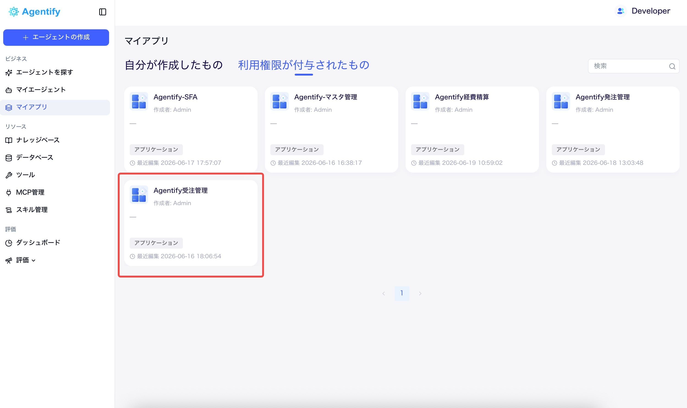

注意:

- 「受注管理」がマイアプリに表示されない場合は、Agentify 側でアプリ利用権限が付与されていません。
- 受注管理を開けても、メニューやボタンはユーザーの権限によって表示内容が変わります。
- 必要なメニューが表示されない場合は、システム管理者に権限の確認を依頼してください。

## 1. 受注管理でできること

受注管理では、受注登録から請求作成、入金登録、売掛残高確認までを管理します。

主な業務の流れ:

1. 受注を作成します。
2. 必要に応じて下書き保存または正式登録します。
3. 受注確定後、請求を作成します。
4. 入金があったら回収登録を行います。
5. 売掛台帳で未回収残高を確認します。

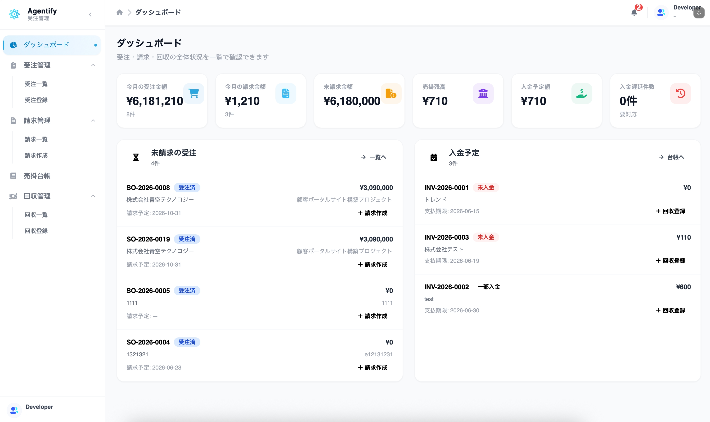

## 2. 画面構成

| メニュー | 用途 |
| --- | --- |
| ダッシュボード | 受注金額、請求状況、入金状況などを確認 |
| 受注管理 | 受注一覧、受注詳細、新規受注作成 |
| 請求管理 | 請求一覧、請求詳細、請求作成 |
| 売掛台帳 | 売掛残高、滞留状況の確認 |
| 回収管理 | 入金一覧、入金登録、入金取消 |

表示されるメニューは、ユーザーに割り当てられている権限によって異なります。

## 3. 受注を確認する

### 3.1 受注一覧を開く

1. 左メニューから「受注管理」をクリックします。
2. 受注一覧が表示されます。
3. 必要に応じてキーワード、ステータス、取引先、担当者などで絞り込みます。

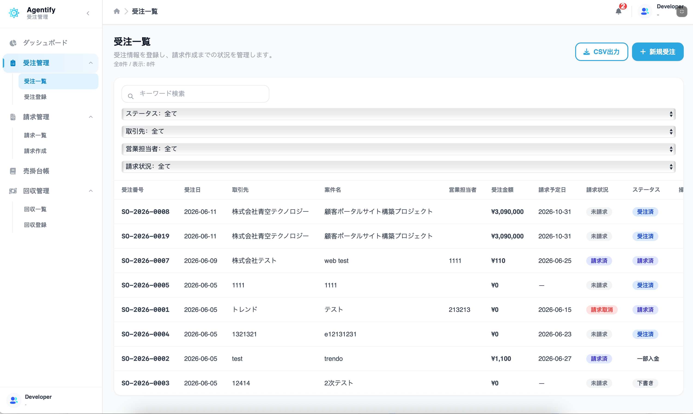

### 3.2 受注詳細を開く

1. 受注一覧で対象の受注を確認します。
2. 対象行の詳細ボタンまたは行をクリックします。
3. 受注詳細画面が表示されます。

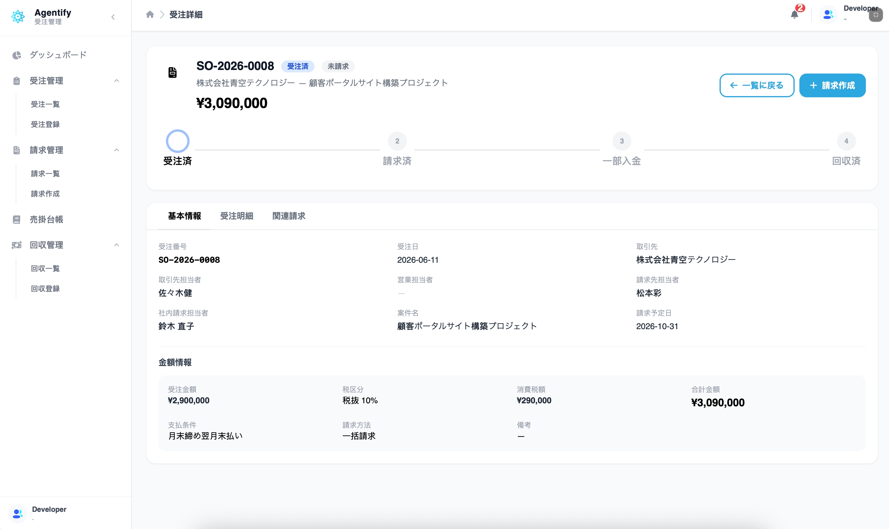

受注詳細では、以下の情報を確認できます。

- 受注番号
- 取引先
- 案件名
- 受注金額
- 請求状況
- 入金状況
- 明細
- 関連請求
- 関連入金

### 3.3 受注詳細で次の操作を判断する

受注詳細画面では、ステータスと権限に応じて表示されるボタンが変わります。表示されていないボタンは、そのユーザーが実行できない操作、または現在のステータスでは実行できない操作です。

| 表示されるボタン | 主な表示条件 | 用途 |
| --- | --- | --- |
| 下書き編集 | 受注が下書きで、更新権限がある | 登録前の内容を修正 |
| 削除 | 受注が下書きで、削除権限がある | 誤って作成した下書きを削除 |
| 受注確定 | 受注が下書きで、確定権限がある | 正式な受注へ変更 |
| 請求作成 | 受注確定後で、請求作成権限がある | 請求データを作成 |
| 回収登録 | 請求作成後で、入金登録権限がある | 入金データを登録 |

確認ポイント:

- 「関連請求」に請求番号が表示されている場合は、請求詳細から請求書印刷や入金状況を確認できます。
- 「関連入金」に回収番号が表示されている場合は、回収詳細から入金日・入金方法・取消可否を確認できます。
- 金額や取引先に誤りがある場合は、請求作成や入金登録に進む前に修正してください。

## 4. 新規受注を作成する

### 4.1 新規作成画面を開く

1. 左メニューから「受注管理」を開きます。
2. 「新規受注」ボタンをクリックします。
3. 新規受注作成画面が表示されます。

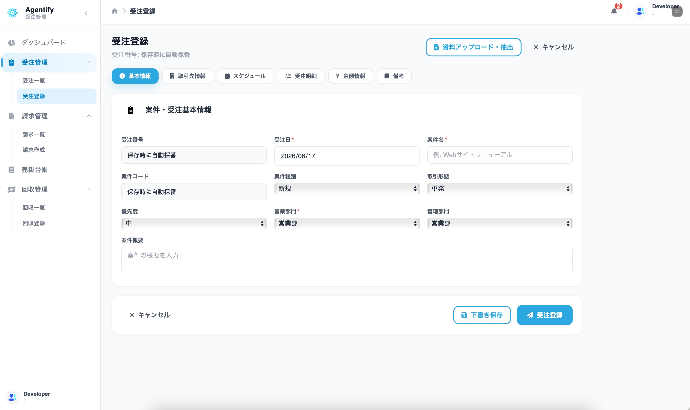

### 4.2 基本情報を入力する

以下の項目を入力します。

| 項目 | 説明 |
| --- | --- |
| 取引先 | 受注先の会社名 |
| 案件名 | 案件の名称 |
| 受注日 | 受注日 |
| 営業担当者 | 担当者名 |
| 営業部門・管理部門 | 部門別管理に利用 |
| 契約期間・納品予定日 | 必要に応じて入力 |
| 金額・税区分 | 受注金額、税額、合計金額 |

### 4.3 明細を入力する

1. 明細行に商品名・サービス名を入力します。
2. 数量、単価、税率を入力します。
3. 金額が正しいことを確認します。
4. 明細が複数ある場合は行を追加します。

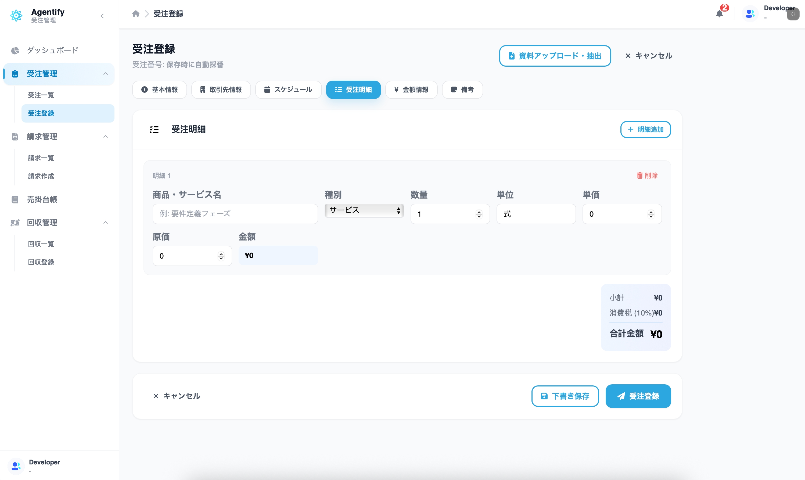

### 4.4 資料アップロード・抽出を使う

見積書、注文書、契約書などの資料がある場合は、画面上部の「資料アップロード・抽出」から AI による入力補助を利用できます。

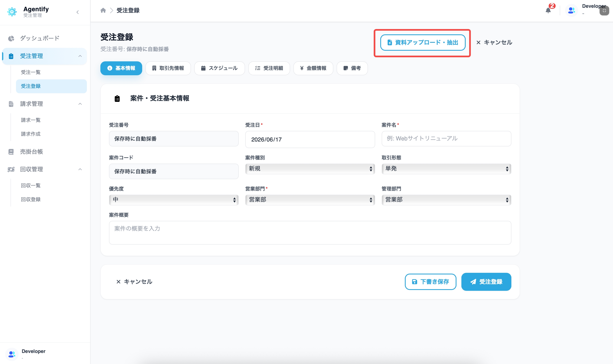

操作手順:

1. 新規受注作成画面で「資料アップロード・抽出」をクリックします。
2. PDF、画像、Word、Excel 形式の資料を選択します。
3. 「AI抽出中...」の表示が終わるまで待ちます。
4. 抽出された取引先、案件名、日付、金額、明細がフォームに反映されます。
5. 「AI抽出結果を確認してください」と表示された場合は、警告内容を確認して修正します。

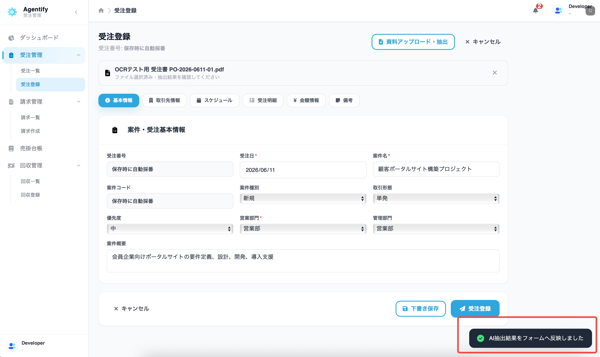

注意:

- AI抽出は入力補助です。登録前に必ず人が内容を確認してください。
- 特に、取引先名、受注日、納品予定日、明細数量、単価、税率、合計金額は確認してください。
- 抽出できない項目がある場合は、空欄または警告として表示されます。必要な項目は手入力してください。
- 資料の文字が不鮮明な場合や複数案件が混在している場合は、抽出結果が不正確になることがあります。

### 4.5 下書き保存または受注登録を行う

画面下部のボタンを使って保存します。

| ボタン | 説明 |
| --- | --- |
| 下書き保存 | 後で編集するために保存します。受注更新権限が必要です。 |
| 受注登録 | 正式な受注として登録します。 |

注意:

- 「受注作成のみ」のユーザーには、下書き保存ボタンが表示されません。
- 登録時には確認ポップアップが表示されます。
- 他のユーザーが同じ受注を更新していた場合、保存時に競合エラーが表示されます。その場合は画面を再読み込みしてから再編集してください。

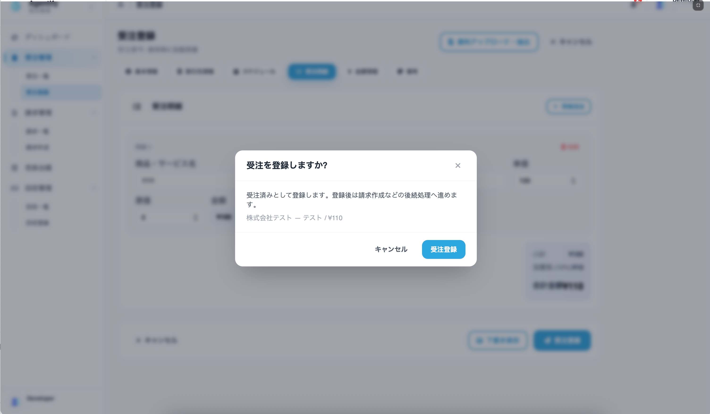

## 5. 下書き受注を編集・削除する

### 5.1 下書きを編集する

1. 受注詳細画面を開きます。
2. ステータスが「下書き」の場合、「下書き編集」ボタンが表示されます。
3. 内容を修正して保存します。

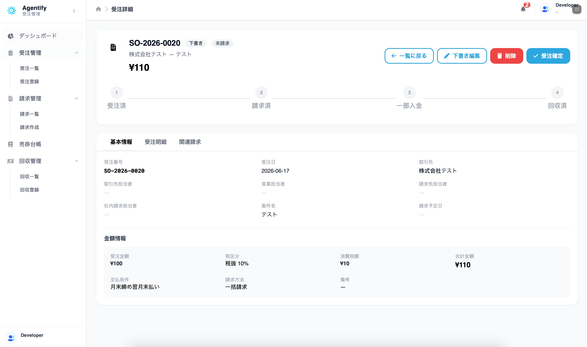

### 5.2 下書きを削除する

1. 受注詳細画面を開きます。
2. ステータスが「下書き」の場合、「削除」ボタンが表示されます。
3. 確認ポップアップで内容を確認します。
4. 「削除」をクリックします。

注意:

- 削除できるのは下書き受注のみです。
- 他のユーザーが同じ受注を更新していた場合、削除は中止されます。

## 6. 受注を確定する

1. 下書き受注の詳細画面を開きます。
2. 「受注確定」をクリックします。
3. 確認ポップアップで内容を確認します。
4. 「受注確定」をクリックします。

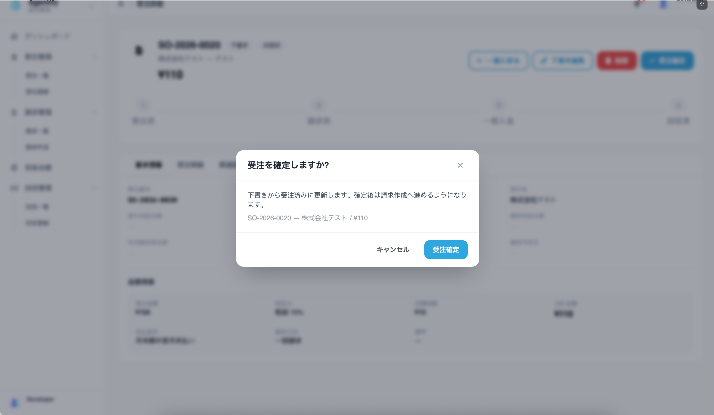

受注確定後は、請求作成へ進めるようになります。

## 7. 請求を作成する

### 7.1 請求作成画面を開く

請求作成権限があるユーザーには、受注詳細画面に「請求作成」ボタンが表示されます。

1. 受注詳細画面を開きます。
2. 「請求作成」をクリックします。
3. 請求作成画面が表示されます。

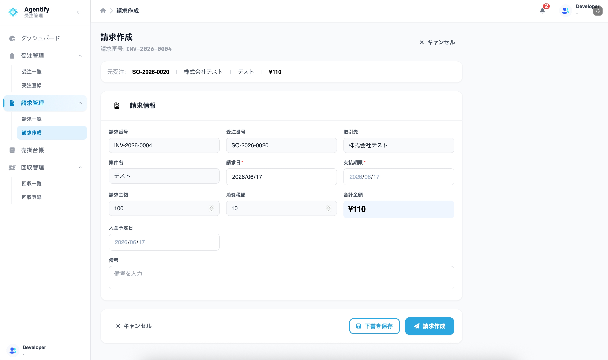

### 7.2 請求内容を入力する

以下を確認・入力します。

| 項目 | 説明 |
| --- | --- |
| 請求日 | 請求書を発行する日 |
| 支払期限 | 入金期限 |
| 請求金額 | 受注金額をもとに設定 |
| 備考 | 必要に応じて入力 |

### 7.3 下書き保存または請求作成

| ボタン | 説明 |
| --- | --- |
| 下書き保存 | 請求を下書きとして保存 |
| 請求作成 | 請求済みとして登録 |

請求作成時には確認ポップアップが表示されます。

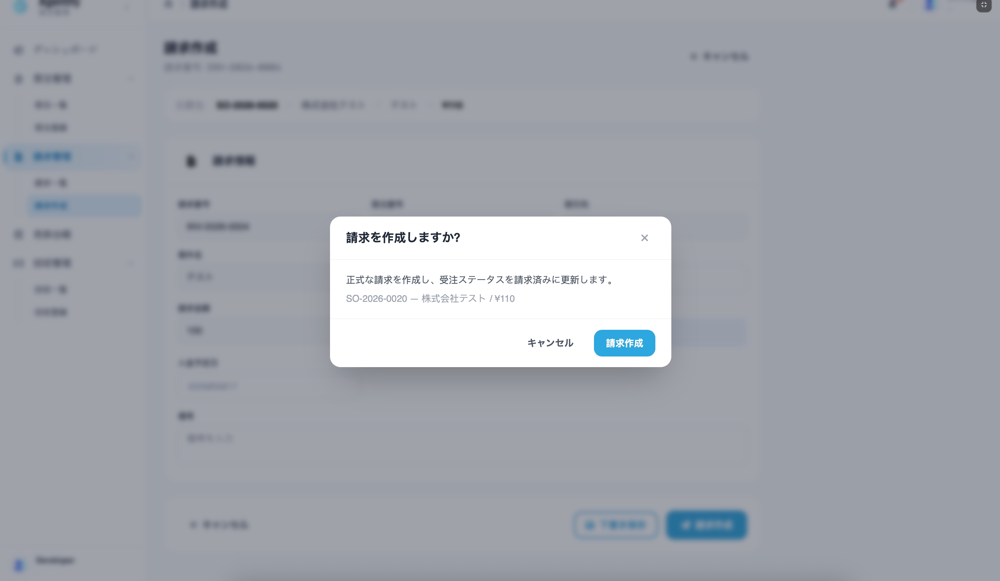

## 8. 請求を確認・取消する

### 8.1 請求詳細を確認する

1. 左メニューから「請求管理」を開きます。
2. 対象の請求を選択します。
3. 請求詳細画面で内容を確認します。

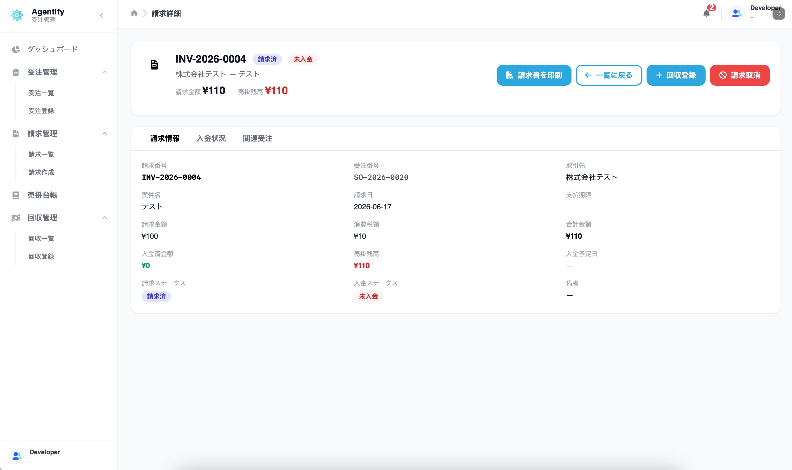

### 8.2 請求書を印刷・PDF保存する

請求済みの請求詳細では、「請求書を印刷」から請求書を出力できます。

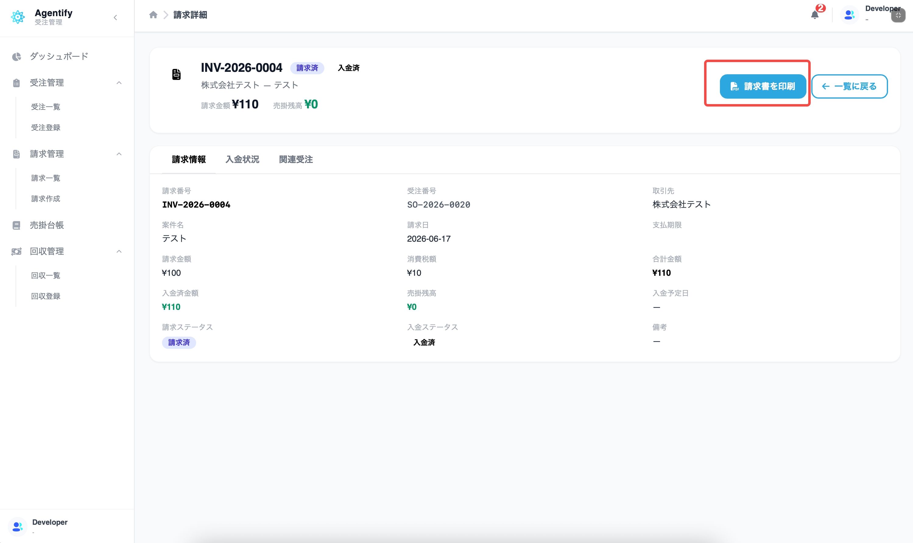

操作手順:

1. 請求詳細画面を開きます。
2. 「請求書を印刷」をクリックします。
3. 請求書プレビューで内容を確認します。
4. 「印刷・PDF保存」をクリックします。
5. ブラウザの印刷画面で、プリンター印刷または PDF 保存を選択します。

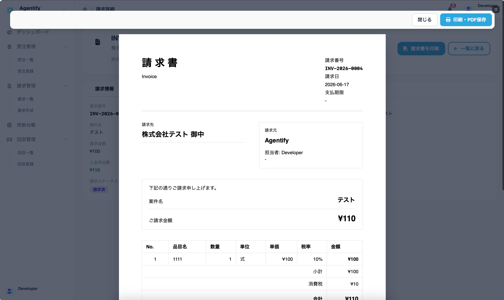

注意:

- 請求書を送付する前に、宛先、請求日、支払期限、請求金額、振込先情報を確認してください。
- 請求取消済みのデータでは、請求書印刷を行わない運用にしてください。
- PDF 保存時の保存先やファイル名は、ブラウザまたは OS の設定に従います。

### 8.3 請求を取消する

請求取消は、未入金の請求済みデータに対して実行できます。

1. 請求詳細画面を開きます。
2. 「請求取消」をクリックします。
3. 確認ポップアップで内容を確認します。
4. 「請求取消」をクリックします。

注意:

- 入金済みの請求は取消できません。
- 請求取消後、受注は請求作成前の状態に戻ります。

## 9. 入金を登録する

### 9.1 回収登録画面を開く

1. 請求詳細または回収管理から「回収登録」をクリックします。
2. 回収登録画面が表示されます。

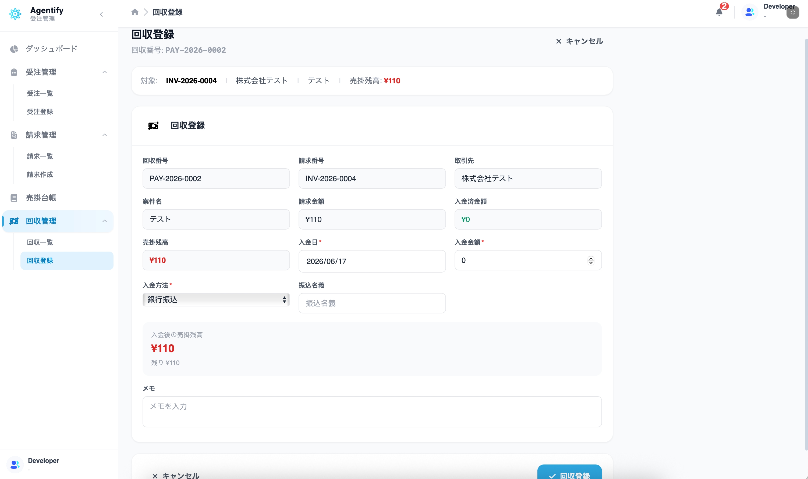

### 9.2 入金内容を入力する

| 項目 | 説明 |
| --- | --- |
| 入金日 | 実際に入金された日 |
| 入金金額 | 入金額 |
| 入金方法 | 銀行振込、現金など |
| 振込名義 | 必要に応じて入力 |
| メモ | 補足事項 |

### 9.3 回収登録を実行する

1. 内容を確認します。
2. 「回収登録」をクリックします。
3. 確認ポップアップで内容を確認します。
4. 登録を実行します。

入金額に応じて、請求と受注のステータスが自動更新されます。

| 状態 | 説明 |
| --- | --- |
| 未入金 | 入金がない |
| 一部入金 | 請求額の一部が入金済み |
| 入金済 | 請求額と同額が入金済み |
| 過入金 | 請求額を超えて入金済み |

## 10. 入金を取消する

1. 回収管理から対象の入金詳細を開きます。
2. 「取消」をクリックします。
3. 確認ポップアップで内容を確認します。
4. 「取消」をクリックします。

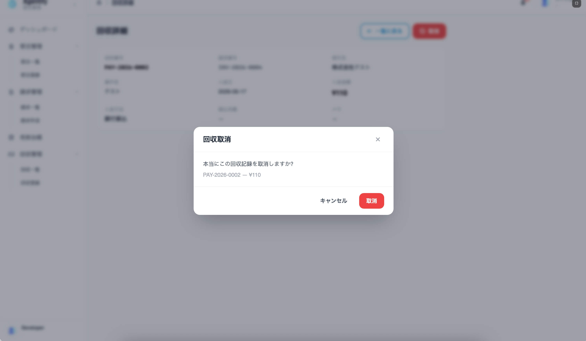

取消後、請求の入金額・売掛残高・入金ステータスが再計算されます。

## 11. 売掛台帳を確認する

1. 左メニューから「売掛台帳」を開きます。
2. 取引先、ステータス、滞留状況を確認します。
3. 必要に応じて CSV 出力します。

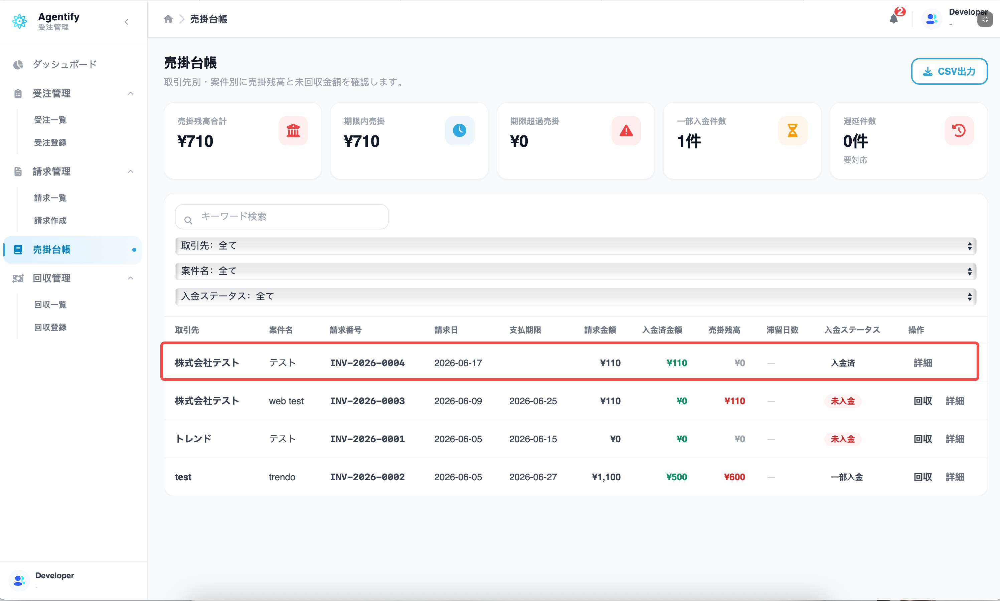

## 12. CSV出力を行う

一覧画面では、表示中のデータを CSV ファイルとして出力できます。社内集計、Excel 加工、月次確認に利用します。

CSV出力できる画面:

| 画面 | 主な出力項目 |
| --- | --- |
| 受注一覧 | 受注番号、受注日、取引先、案件名、営業担当者、受注金額、請求予定日、請求状況、ステータス |
| 請求一覧 | 請求番号、受注番号、取引先、案件名、請求日、支払期限、請求金額、入金済金額、売掛残高、請求ステータス、入金ステータス |
| 売掛台帳 | 取引先、案件名、請求番号、請求日、支払期限、請求金額、入金済金額、売掛残高、滞留日数、入金ステータス |
| 回収一覧 | 回収番号、請求番号、受注番号、取引先、案件名、入金日、入金金額、入金方法、請求金額、売掛残高、入金ステータス |

操作手順:

1. 対象の一覧画面を開きます。
2. 必要に応じてキーワード、ステータス、期間などで絞り込みます。
3. 「CSV出力」をクリックします。
4. CSV ファイルがブラウザからダウンロードされます。

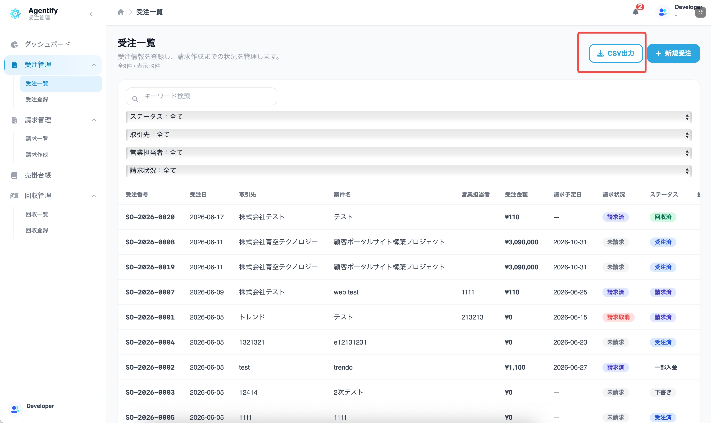

注意:

- CSV は現在の一覧に表示されている条件をもとに出力されます。
- 対象データが 0 件の場合、CSV出力ボタンは使用できません。
- Excel で開く場合は、文字化け防止のため UTF-8 対応の状態で開いてください。

## 13. ステータスと通知の見方

### 13.1 受注ステータス

| ステータス | 意味 | 次に確認すること |
| --- | --- | --- |
| 下書き | 登録前の受注です。編集・削除できます。 | 内容を確認し、必要に応じて受注登録または削除します。 |
| 受注済 | 正式登録済みで、まだ請求前の受注です。 | 請求作成の要否を確認します。 |
| 請求済 | 請求データが作成されています。 | 請求詳細、請求書、入金状況を確認します。 |
| 一部入金 | 請求額の一部だけ入金されています。 | 残額と次回入金予定を確認します。 |
| 回収済 | 請求額が全額入金されています。 | 必要に応じて売掛台帳で残高 0 を確認します。 |
| キャンセル | 業務上キャンセルされた受注です。 | 誤って処理を進めないよう関連請求・入金を確認します。 |

### 13.2 請求・入金ステータス

| ステータス | 意味 | 対応 |
| --- | --- | --- |
| 未請求 | 受注はありますが、請求データがありません。 | 請求作成が必要か確認します。 |
| 請求済 | 請求データが作成されています。 | 請求書印刷、送付、入金確認を行います。 |
| 請求取消 | 請求が取り消されています。 | 再請求が必要な場合は受注詳細から確認します。 |
| 未入金 | 入金が登録されていません。 | 入金予定日、支払期限を確認します。 |
| 一部入金 | 請求額の一部が入金済みです。 | 売掛残高を確認します。 |
| 入金済 | 請求額と同額が入金済みです。 | 必要に応じて回収詳細を確認します。 |
| 遅延 | 支払期限を過ぎても未回収です。 | 取引先への確認や社内対応を行います。 |
| 過入金 | 請求額を超えて入金されています。 | 差額の扱いを社内ルールに従って確認します。 |

### 13.3 通知ベルを確認する

画面右上のベルアイコンには、対応が必要な受注・請求・入金が表示されます。

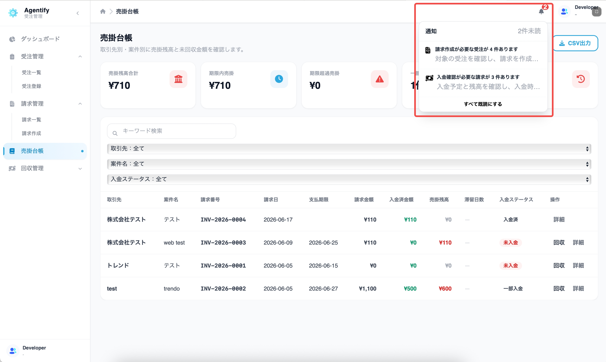

通知される主な内容:

| 通知 | 表示される条件 | 対応 |
| --- | --- | --- |
| 請求作成が必要な受注があります | 未請求の受注があり、請求作成権限がある | 受注内容を確認し、請求を作成します。 |
| 回収対応が必要な入金遅延があります | 入金ステータスが遅延で、回収権限がある | 回収一覧または売掛台帳で状況を確認します。 |
| 入金確認が必要な請求があります | 未入金または一部入金の請求があり、回収権限がある | 入金があった場合は回収登録します。 |

通知をクリックすると、関連する一覧画面へ移動します。「すべて既読にする」を押すと未読表示は消えますが、業務データ自体は更新されません。対応済みにするには、請求作成や回収登録などの実処理を行ってください。

## 14. FAQ

| メッセージ | 原因 | 対応 |
| --- | --- | --- |
| データの取得に失敗しました | 通信エラーまたは権限不足 | 時間をおいて再読み込み。解決しない場合は管理者へ連絡 |
| この画面を表示する権限がありません | 対象メニューの権限がない | 管理者へ権限設定を確認 |
| 他のユーザーがこの受注を更新しました | 同じ受注を別ユーザーが先に保存した | 画面を再読み込みしてから再編集 |
| 下書きの受注のみ削除できます | 正式登録済み受注を削除しようとした | 削除ではなく業務上の取消・修正方法を確認 |
