# 発注管理 操作マニュアル

対象読者: 購買依頼者、購買担当者、承認者、検収担当者、経理担当者

最終更新日: 2026-06-17

## はじめに: Agentify から発注管理を開く

発注管理は、Agentify にログインした後、「マイアプリ」から起動します。

操作手順:

1. ブラウザで Agentify のログイン画面を開きます。
2. メールアドレスとパスワードを入力し、「ログイン」をクリックします。
3. ログイン後、ホーム画面またはメニューから「マイアプリ」を開きます。
4. アプリ一覧から「発注管理」を選択します。
5. 発注管理のダッシュボードが表示されます。

注意:

- 「発注管理」がマイアプリに表示されない場合は、Agentify 側でアプリ利用権限が付与されていません。
- 発注管理を開けても、購買依頼、発注案件、検収、仕入、支払などの表示範囲はユーザーの権限によって変わります。
- 必要なメニューが表示されない場合は、システム管理者に権限の確認を依頼してください。

## 1. 発注管理でできること

発注管理では、購買依頼から発注、納品・検収、仕入計上、支払予定までを管理します。

主な業務の流れ:

1. 購買依頼を作成します。
2. 承認者が購買依頼を承認します。
3. 承認済みの依頼を発注案件へ変換します。
4. 発注案件を承認します。
5. 発注登録を行います。
6. 納品・検収を登録します。
7. 検収済みデータから仕入計上と支払予定を作成します。
8. 支払予定を確認し、支払済みに更新します。

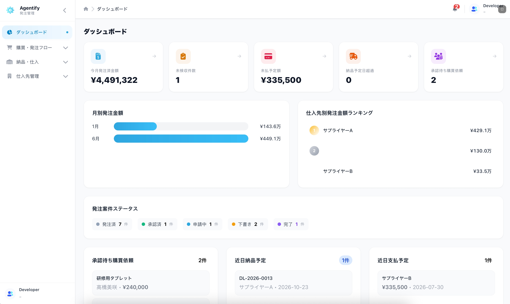

## 2. 画面構成

| メニュー | 用途 |
| --- | --- |
| ダッシュボード | 承認待ち、未検収、支払予定などの確認 |
| 購買依頼 | 購買依頼の作成、申請、承認、差戻し |
| 発注案件管理 | 発注案件の作成、編集、承認、発注登録 |
| 発注管理 | 発注済みデータの確認、納品予定作成 |
| 納品・検収管理 | 納品予定、検収登録、仕入計上 |
| 仕入管理 | 仕入計上済みデータの確認 |
| 支払予定 | 支払予定の確認、支払方法変更、支払済み更新 |
| 仕入先管理 | 仕入先情報の確認 |

表示されるメニューとボタンは、ユーザーの権限によって異なります。

## 3. 購買依頼を作成する

### 3.1 新規購買依頼画面を開く

1. 左メニューから「購買依頼」を開きます。
2. 「新規依頼」をクリックします。
3. 新規購買依頼作成画面が表示されます。

### 3.2 依頼内容を入力する

| 項目 | 説明 |
| --- | --- |
| 件名 | 依頼内容が分かる名称 |
| 申請者 | 自動表示または手入力 |
| 部門 | 申請部門 |
| 依頼金額 | 概算金額 |
| 希望納期 | 必要な納期 |

### 3.3 下書き保存または申請する

| ボタン | 説明 |
| --- | --- |
| 下書き保存 | 後で編集するために保存。購買依頼更新権限が必要です。 |
| 申請する | 承認者へ申請します。 |

注意:

- 購買依頼作成のみのユーザーには、下書き保存ボタンが表示されません。
- 申請時には確認ポップアップが表示されます。

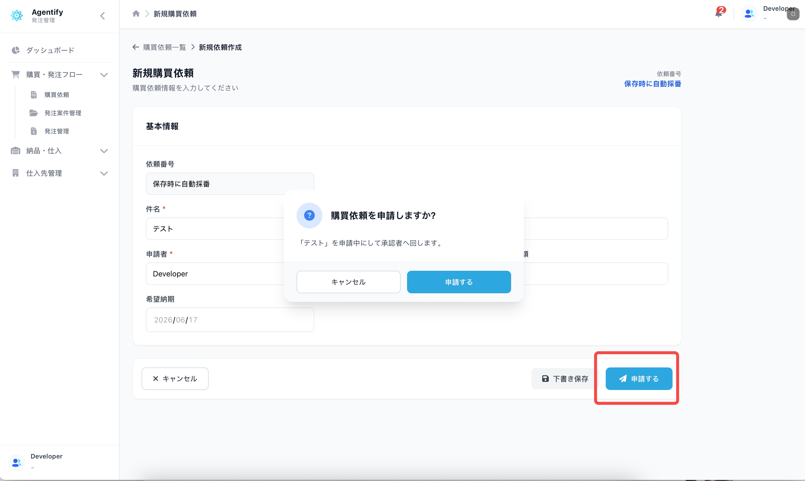

## 4. 購買依頼を確認・承認する

### 4.1 購買依頼一覧を確認する

1. 左メニューから「購買依頼」を開きます。
2. ステータスやキーワードで絞り込みます。
3. 対象依頼の「詳細」をクリックします。

### 4.2 申請・承認・差戻し

一覧上のボタンから、ステータスに応じた操作ができます。

| 現在のステータス | 操作 | 説明 |
| --- | --- | --- |
| 下書き | 申請 | 申請中に変更 |
| 差戻し | 申請 | 修正後に再申請 |
| 申請中 | 承認 | 承認済みに変更 |
| 申請中 | 差戻し | 申請者へ差戻し |
| 承認済 | 発注案件に変換 | 発注案件を作成 |

操作時には確認ポップアップが表示されます。

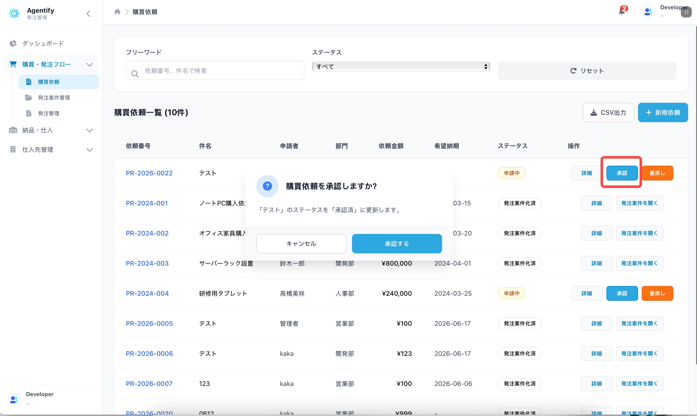

注意:

- 承認と差戻しを同時に実行した場合、先に処理された操作が優先され、後からの操作は競合として拒否されます。
- 発注案件に変換するには、購買依頼承認権限と発注案件作成権限が必要です。

## 5. 発注案件を作成する

発注案件は、購買依頼から変換する方法と、直接作成する方法があります。

### 5.1 購買依頼から発注案件へ変換する

1. 購買依頼一覧で承認済みの依頼を確認します。
2. 「発注案件に変換」をクリックします。
3. 確認ポップアップで内容を確認します。
4. 発注案件詳細画面へ移動します。

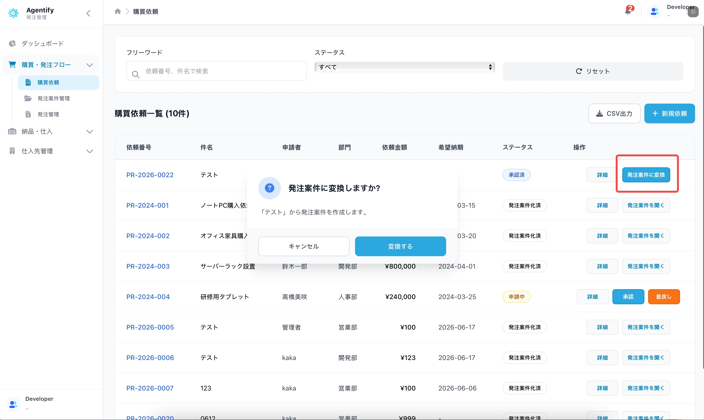

### 5.2 発注案件を直接作成する

1. 左メニューから「発注案件管理」を開きます。
2. 「新規発注案件」をクリックします。
3. 発注案件情報を入力します。

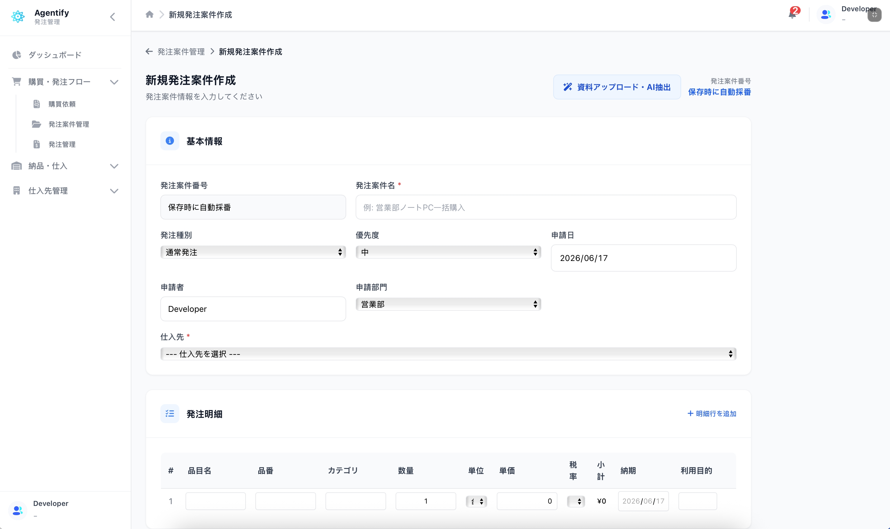

入力する主な項目:

| 項目 | 説明 |
| --- | --- |
| 発注案件名 | 案件の名称 |
| 発注区分 | 通常発注、緊急発注など |
| 優先度 | 高・中・低 |
| 申請者・部門 | 申請者と所属部門 |
| 仕入先 | 発注先 |
| 金額情報 | 予定金額、税額、合計金額 |
| 希望納期・予定納期 | 納品希望日、予定日 |
| 明細 | 品目、数量、単価、税率 |

### 5.3 資料アップロード・AI抽出

画面上部の「資料アップロード・AI抽出」から、見積書や資料をもとに入力補助ができます。

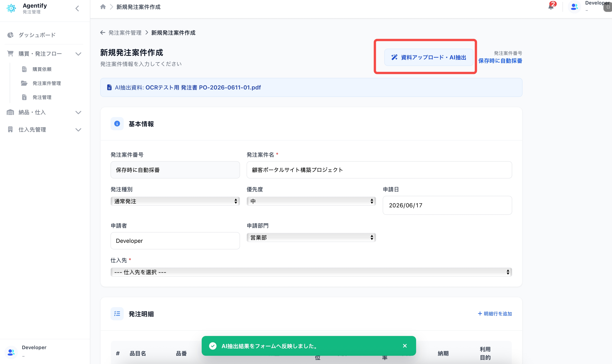

操作手順:

1. 新規発注案件作成画面で「資料アップロード・AI抽出」をクリックします。
2. PDF、画像、Excel、CSV 形式の資料を選択します。
3. 「AI抽出中...」の表示が終わるまで待ちます。
4. 抽出された発注案件名、仕入先、希望納期、支払予定日、金額、明細がフォームに反映されます。
5. 「AI抽出結果を確認してください」と表示された場合は、警告内容を確認して修正します。

注意:

- AI抽出結果は必ず人が確認してください。
- 警告が表示された場合は、内容を確認して必要に応じて修正してください。
- 特に、仕入先、予定納期、支払予定日、数量、単価、税額、合計金額は確認してください。
- 抽出できない項目がある場合は、空欄または警告として表示されます。必要な項目は手入力してください。

### 5.4 保存・申請

| ボタン | 説明 |
| --- | --- |
| 下書き保存 | 後で編集するために保存。発注案件更新権限が必要です。 |
| 申請する | 承認者へ申請します。 |

注意:

- 発注案件作成のみのユーザーには、下書き保存ボタンが表示されません。
- 他のユーザーが同じ発注案件を更新していた場合、保存時に競合エラーが表示されます。

## 6. 発注案件を承認・差戻しする

1. 発注案件詳細画面を開きます。
2. ステータスが「申請中」の場合、承認または差戻しボタンが表示されます。
3. 内容を確認して操作します。

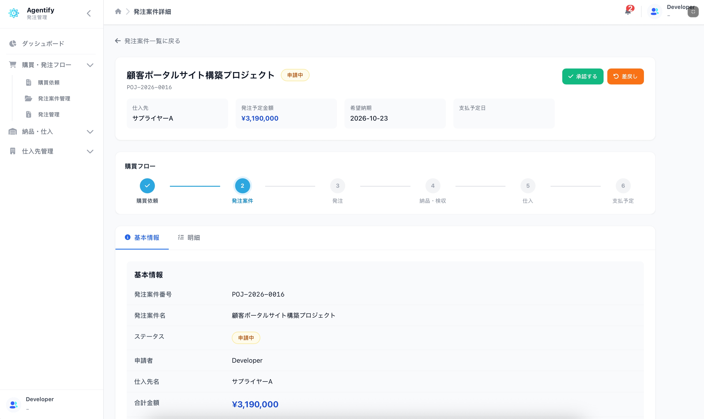

操作:

| 操作 | 結果 |
| --- | --- |
| 承認する | ステータスが承認済になります。 |
| 差戻し | 申請者が修正できる状態に戻ります。 |

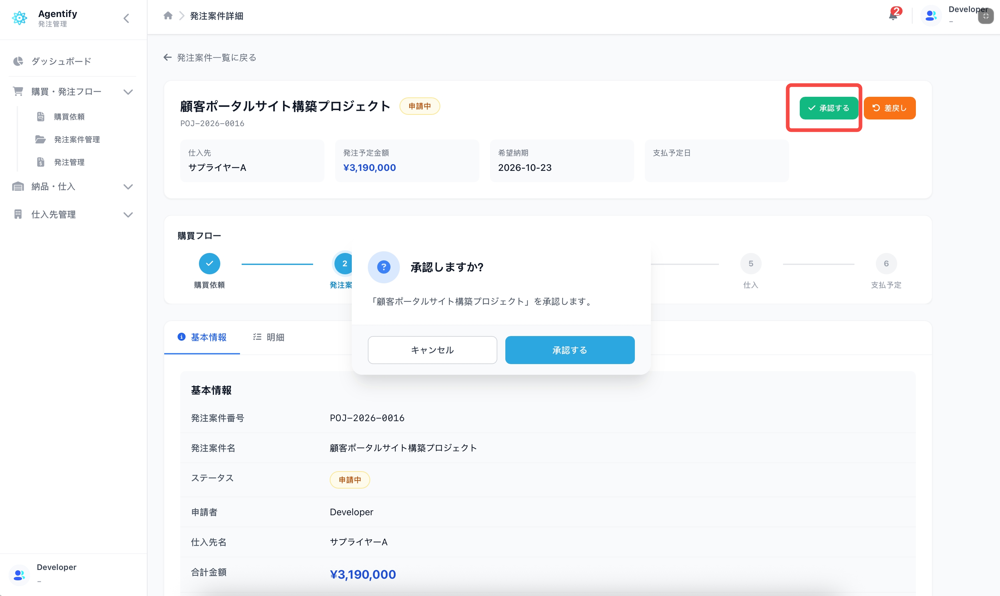

### 6.1 発注案件詳細で確認すること

発注案件詳細では、発注前に必要な情報をまとめて確認します。

確認ポイント:

- 購買フローが現在どの段階にあるか
- 発注案件名、仕入先、申請者、申請部門
- 発注予定金額、税額、合計金額
- 希望納期、予定納期、支払予定日
- 明細の品目、数量、単価、税率
- 関連する購買依頼、発注、納品・検収、仕入、支払予定

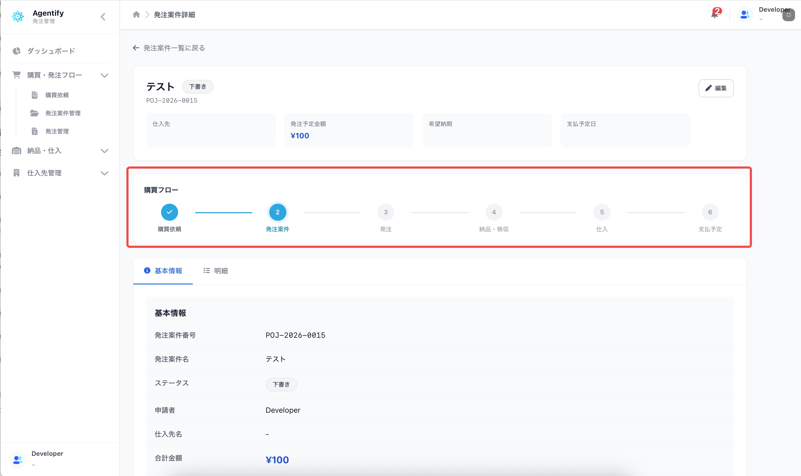

表示される主なボタン:

| ボタン | 主な表示条件 | 用途 |
| --- | --- | --- |
| 編集 | 下書きまたは差戻しで、更新権限がある | 申請前の内容を修正 |
| 申請する | 下書きまたは差戻しで、申請可能なユーザー | 承認者へ申請 |
| 承認する | 申請中で、承認権限がある | 発注登録へ進める状態に変更 |
| 差戻し | 申請中で、承認権限がある | 申請者へ修正を依頼 |
| 発注登録 | 承認済で、発注登録権限がある | 発注レコードを作成 |

注意:

- 発注管理責任者でも、検収権限がない場合は検収操作ボタンは表示されません。
- 経理担当者でも、発注案件承認権限がない場合は承認・差戻しボタンは表示されません。
- ボタンが表示されない場合は、権限不足またはステータス不一致のどちらかを確認してください。

## 7. 発注登録を行う

承認済みの発注案件は、発注登録できます。

1. 発注案件詳細画面を開きます。
2. 「発注登録」をクリックします。
3. 確認ポップアップで内容を確認します。
4. 発注レコードが作成されます。

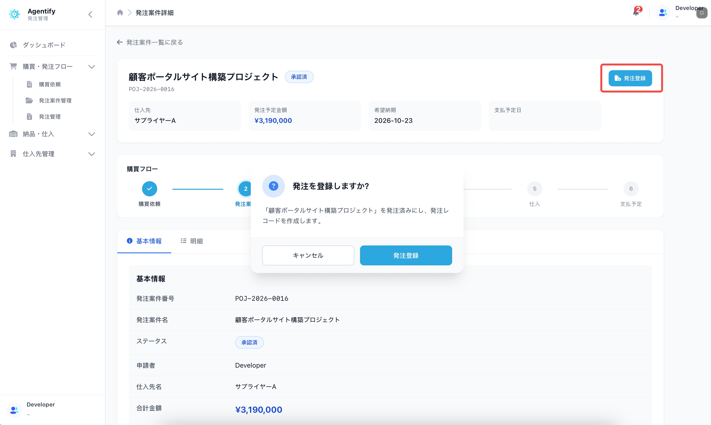

発注登録後は、発注管理画面または発注詳細画面で確認できます。

## 8. 発注を確認し、納品予定を作成する

### 8.1 発注一覧を確認する

1. 左メニューから「発注管理」を開きます。
2. 発注番号、仕入先、納品予定日、ステータスを確認します。

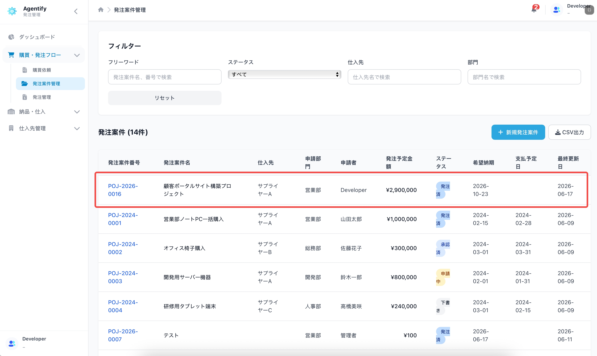

### 8.2 発注詳細を確認する

発注一覧から対象の発注を開くと、発注詳細を確認できます。

確認ポイント:

- 発注番号、発注日、発注金額
- 仕入先、納品予定日、発注ステータス
- 発注元の発注案件
- 納品・検収、仕入、支払予定への関連

発注詳細では、現在のステータスと権限に応じて「納品予定を作成」「納品・検収を開く」「発注書を印刷」などのボタンが表示されます。

### 8.3 発注書を印刷・PDF保存する

発注詳細では、「発注書を印刷」から発注書を出力できます。

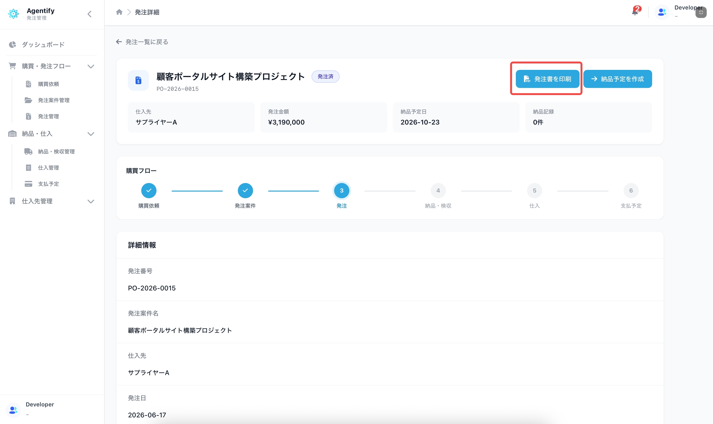

操作手順:

1. 発注詳細画面を開きます。
2. 「発注書を印刷」をクリックします。
3. 発注書プレビューで内容を確認します。
4. 「印刷・PDF保存」をクリックします。
5. ブラウザの印刷画面で、プリンター印刷または PDF 保存を選択します。

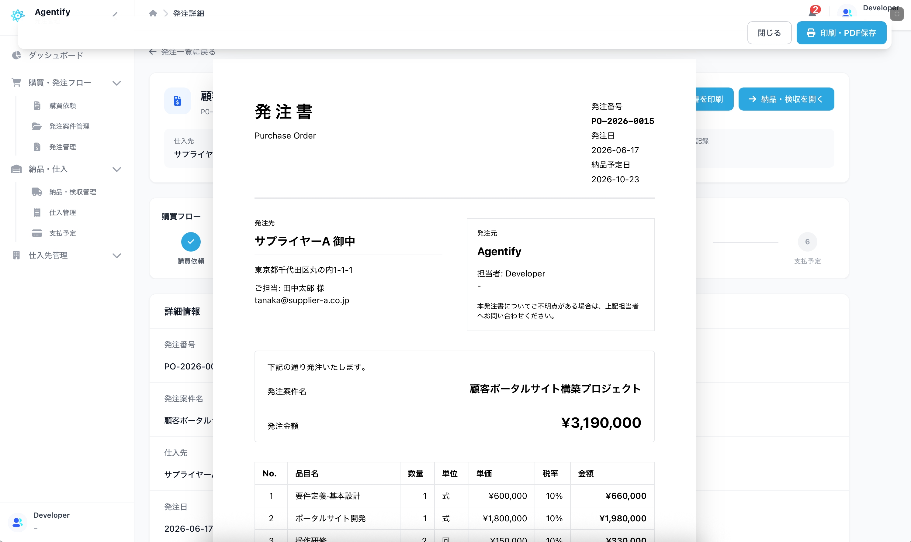

注意:

- 発注書を送付する前に、仕入先、発注日、納品予定日、明細、発注金額を確認してください。
- PDF 保存時の保存先やファイル名は、ブラウザまたは OS の設定に従います。
- 発注書印刷は、発注済みデータの確認・社外送付に利用します。下書き段階の発注案件は、発注書として扱わないでください。

### 8.4 納品予定を作成する

検収権限があるユーザーには、「納品予定」または「検収へ」ボタンが表示されます。

1. 対象発注の「納品予定」をクリックします。
2. 確認ポップアップで内容を確認します。
3. 納品・検収レコードが作成されます。

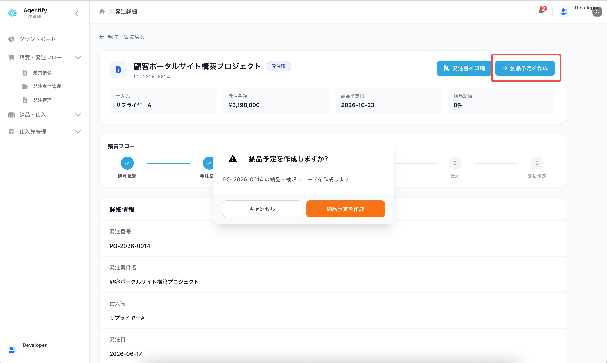

注意:

- 検収権限がないユーザーには、納品・検収を開くボタンは表示されません。
- すでに納品・検収レコードがある場合は、既存レコードへ移動します。

## 9. 検収を登録する

1. 左メニューから「納品・検収管理」を開きます。
2. 対象の納品データを確認します。
3. 「検収登録」をクリックします。
4. 確認ポップアップで内容を確認します。
5. 検収済みに更新します。

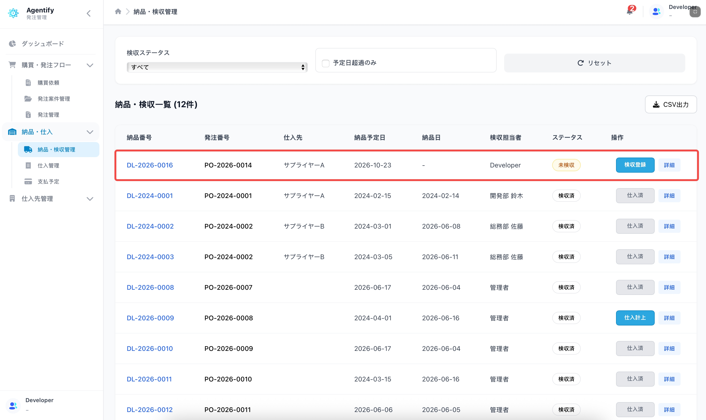

納品・検収詳細では、納品予定日、実際の納品日、検収担当者、検収ステータスを確認できます。

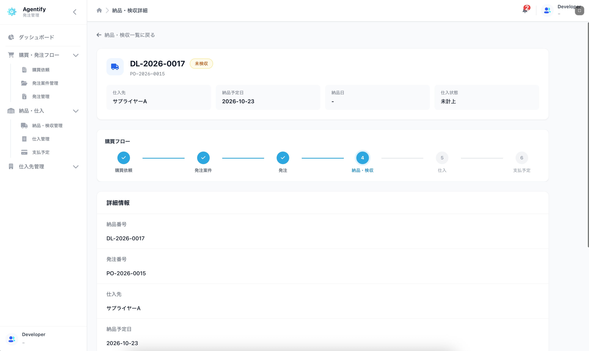

注意:

- 検収登録後、発注ステータスは検収済みへ進みます。
- 検収のみのユーザーは、ここまで処理できます。
- 仕入計上には発注案件更新権限が必要です。

## 10. 仕入計上を行う

検収済みの納品データに対して、仕入計上を行います。

1. 納品・検収管理で検収済みデータを確認します。
2. 「仕入計上」をクリックします。
3. 確認ポップアップで内容を確認します。
4. 仕入データと支払予定が作成されます。

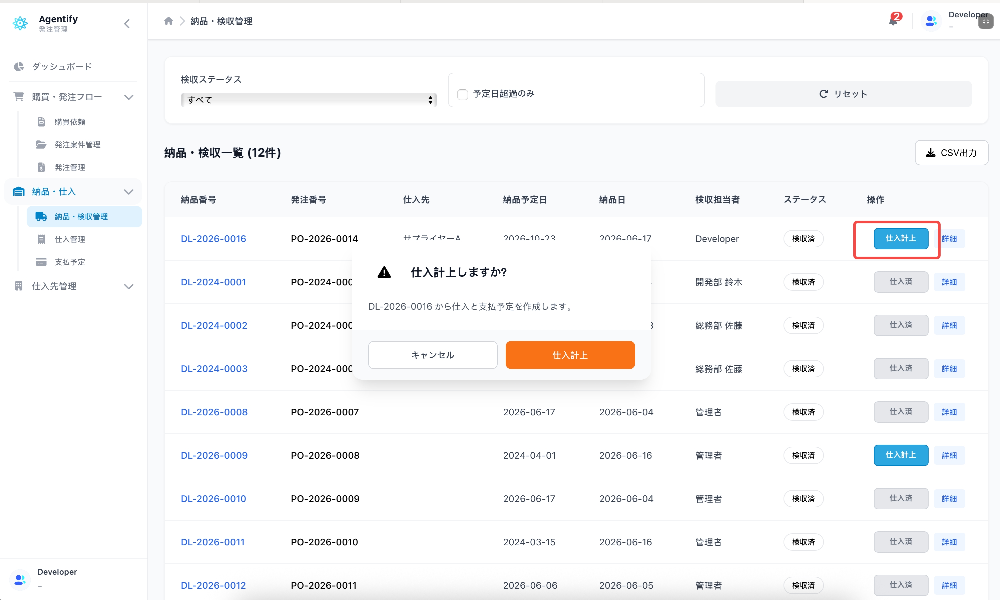

仕入計上後は、以下の画面で確認できます。

- 仕入管理
- 支払予定

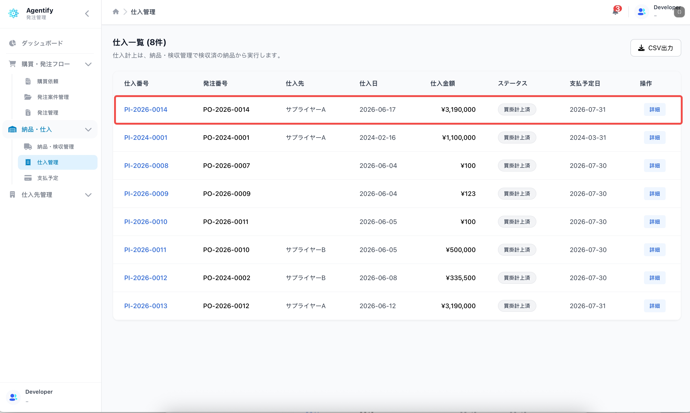

仕入詳細では、仕入番号、発注番号、仕入日、仕入金額、支払予定日を確認できます。

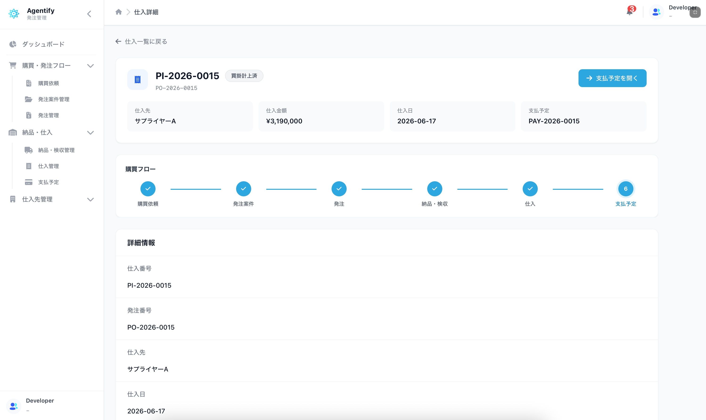

## 11. 支払予定を確認・更新する

### 11.1 支払予定一覧を確認する

1. 左メニューから「支払予定」を開きます。
2. 支払予定日、支払金額、支払方法、ステータスを確認します。
3. 必要に応じて CSV 出力します。

### 11.2 支払方法を変更する

1. 支払予定一覧で支払方法のプルダウンを変更します。
2. 自動で保存されます。

### 11.3 支払済みに更新する

1. 対象の支払予定で「支払済みにする」をクリックします。
2. 確認ポップアップで内容を確認します。
3. 支払済みに更新します。

支払済みにすると、関連する発注と発注案件のステータスも更新されます。

支払予定詳細では、支払予定番号、仕入先、支払予定日、支払金額、支払方法、支払ステータスを確認できます。

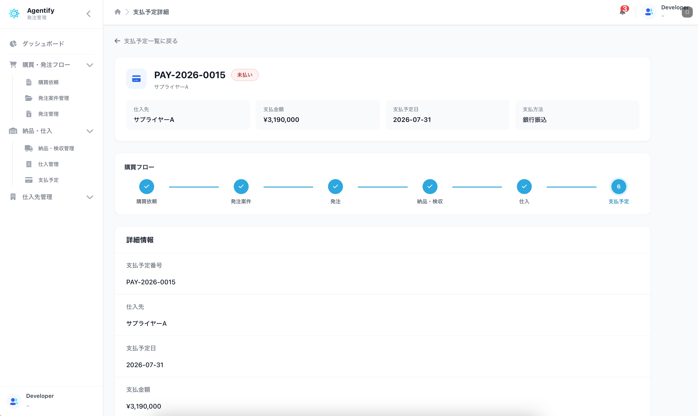

## 12. 仕入先を確認する

1. 左メニューから「仕入先管理」を開きます。
2. 仕入先一覧を確認します。
3. 対象の仕入先を開くと、連絡先や支払条件を確認できます。

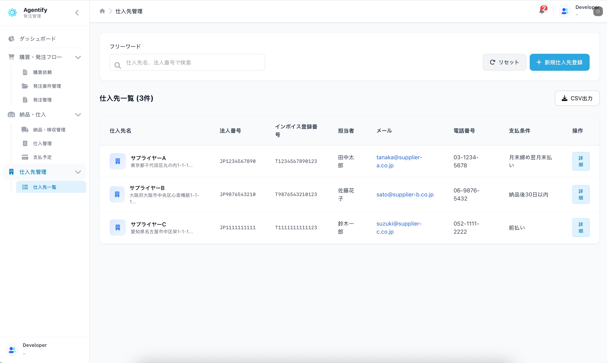

仕入先の登録・編集は管理者権限があるユーザーのみ実行できます。

### 12.1 新規仕入先を登録する

管理者権限があるユーザーには、仕入先一覧に「新規仕入先登録」ボタンが表示されます。

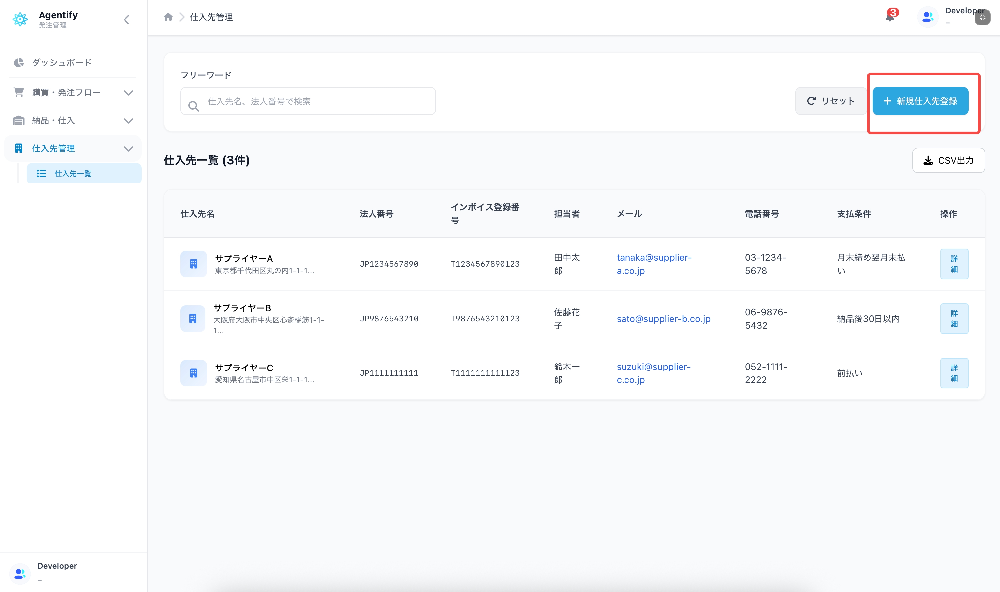

操作手順:

1. 左メニューから「仕入先管理」を開きます。
2. 「新規仕入先登録」をクリックします。
3. 新規仕入先登録画面で仕入先情報を入力します。
4. 内容を確認し、「登録する」をクリックします。
5. 登録後、仕入先一覧または仕入先詳細で内容を確認します。

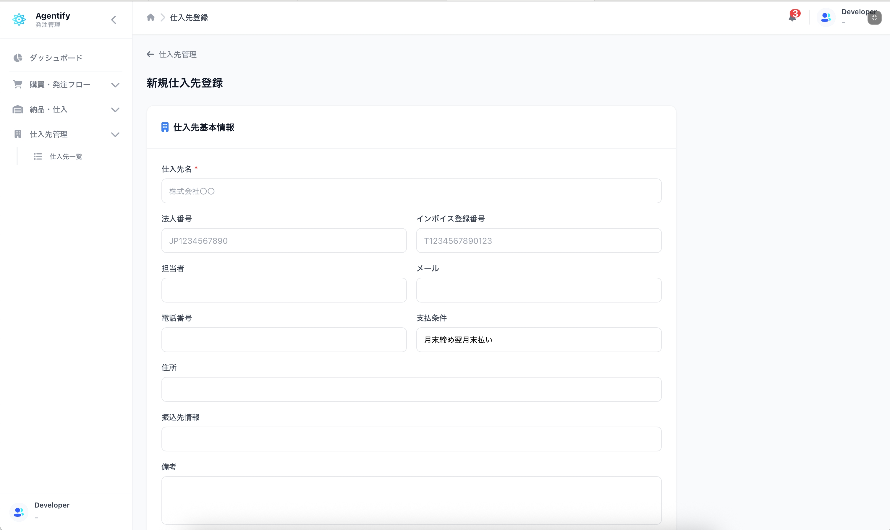

入力する主な項目:

| 項目 | 説明 |
| --- | --- |
| 仕入先名 | 仕入先の会社名または屋号。必須項目です。 |
| 法人番号 | 任意項目です。確認できる場合に入力します。 |
| インボイス登録番号 | 任意項目です。適格請求書発行事業者の登録番号を確認できる場合に入力します。 |
| 担当者 | 仕入先側の担当者名を入力します。 |
| メール | 連絡用メールアドレスを入力します。 |
| 電話番号 | 連絡用電話番号を入力します。 |
| 支払条件 | 任意項目です。月末締め翌月末払い、納品後30日以内など、確認できる場合に入力します。 |
| 住所 | 仕入先住所を入力します。 |
| 振込先情報 | 任意項目です。銀行名、支店名、口座番号など、確認できる場合に入力します。 |
| 備考 | 社内共有事項を入力します。 |

注意:

- 発注案件作成時の仕入先選択に利用するため、仕入先名は重複や表記ゆれを避けて登録してください。
- 仕入先名以外は必須ではありません。初回登録時点で不明な項目は空欄のまま登録し、確認後に編集できます。
- インボイス登録番号、支払条件、振込先情報は、発注書・支払予定の確認に影響します。確認できる場合は入力してください。
- 仕入先登録ボタンが表示されない場合は、管理者権限がありません。

### 12.2 仕入先を編集する

1. 仕入先一覧から対象の仕入先を開きます。
2. 仕入先詳細で「編集」をクリックします。
3. 内容を修正します。
4. 「更新する」をクリックします。

注意:

- 既存の発注案件や支払予定で利用している仕入先を編集する場合は、変更内容が今後の確認作業に影響します。
- 名称変更や振込先変更は、社内承認または確認ルールに従って実施してください。

## 13. CSV出力を行う

一覧画面では、表示中のデータを CSV ファイルとして出力できます。月次集計、支払確認、発注履歴の確認に利用します。

CSV出力できる画面:

| 画面 | 主な出力項目 |
| --- | --- |
| 購買依頼一覧 | 依頼番号、件名、申請者、部門、依頼金額、希望納期、ステータス |
| 発注案件一覧 | 発注案件番号、発注案件名、仕入先、申請部門、申請者、発注予定金額、ステータス、希望納期、支払予定日 |
| 発注一覧 | 発注番号、発注案件名、仕入先、発注日、発注金額、納品予定日、ステータス |
| 納品・検収一覧 | 納品番号、発注番号、仕入先、納品予定日、納品日、検収担当者、ステータス |
| 仕入一覧 | 仕入番号、発注番号、仕入先、仕入日、仕入金額、ステータス、支払予定日 |
| 支払予定一覧 | 支払予定番号、仕入先、支払予定日、支払金額、支払方法、ステータス |
| 仕入先一覧 | 仕入先名、法人番号、インボイス登録番号、担当者、メール、電話番号、住所、支払条件 |

操作手順:

1. 対象の一覧画面を開きます。
2. 必要に応じてキーワード、ステータス、期間などで絞り込みます。
3. 「CSV出力」をクリックします。
4. CSV ファイルがブラウザからダウンロードされます。

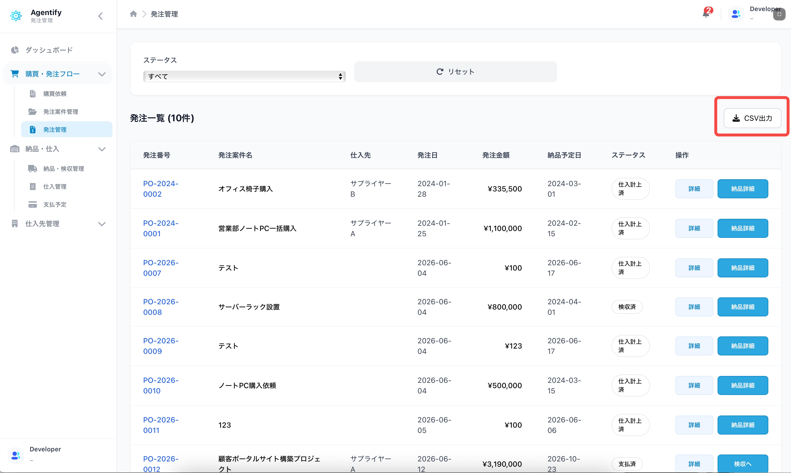

注意:

- CSV は現在の一覧に表示されている条件をもとに出力されます。
- 対象データが 0 件の場合、CSV出力ボタンは使用できません。
- 支払予定や仕入先情報を外部共有する場合は、社内ルールに従って取り扱ってください。

## 14. ステータスと通知の見方

### 14.1 購買依頼ステータス

| ステータス | 意味 | 次に確認すること |
| --- | --- | --- |
| 下書き | 申請前の購買依頼です。 | 内容を確認し、申請します。 |
| 申請中 | 承認待ちの購買依頼です。 | 承認者が内容を確認します。 |
| 承認済 | 承認済みで、発注案件へ変換できます。 | 発注案件化の要否を確認します。 |
| 差戻し | 承認者から修正依頼されています。 | 内容を修正して再申請します。 |
| 発注案件化済 | 発注案件へ変換済みです。 | 発注案件詳細で以降の処理を確認します。 |
| 却下 | 申請が却下されています。 | 必要な場合は新しい依頼として作成し直します。 |

### 14.2 発注案件・発注ステータス

| ステータス | 意味 | 次に確認すること |
| --- | --- | --- |
| 下書き | 発注案件の登録前または申請前です。 | 内容を確認し、申請します。 |
| 申請中 | 発注案件が承認待ちです。 | 承認者が内容を確認します。 |
| 承認済 | 発注登録できる状態です。 | 発注登録を行います。 |
| 差戻し | 承認者から修正依頼されています。 | 内容を修正して再申請します。 |
| 発注済 | 発注レコードが作成されています。 | 発注書印刷、納品予定作成を確認します。 |
| 一部納品 | 納品・検収レコードがありますが、検収完了前です。 | 納品・検収詳細を確認します。 |
| 検収済 | 検収が完了しています。 | 仕入計上の要否を確認します。 |
| 仕入計上済 | 仕入データと支払予定が作成されています。 | 支払予定を確認します。 |
| 支払済 | 支払予定が支払済みに更新されています。 | 必要に応じて支払予定詳細を確認します。 |
| 完了 | 発注案件全体の処理が完了しています。 | 追加対応がないか確認します。 |
| キャンセル | 業務上キャンセルされたデータです。 | 誤って次工程へ進めないよう関連データを確認します。 |

### 14.3 検収・支払ステータス

| ステータス | 意味 | 対応 |
| --- | --- | --- |
| 未検収 | 納品予定はありますが検収前です。 | 納品内容を確認し、検収登録します。 |
| 一部検収 | 一部だけ検収済みです。 | 未検収分を確認します。 |
| 検収済 | 検収が完了しています。 | 仕入計上に進めます。 |
| 未払い | 支払予定はありますが未払いです。 | 支払予定日と支払方法を確認します。 |
| 支払処理中 | 支払処理中です。 | 社内処理状況を確認します。 |
| 支払済 | 支払済みに更新されています。 | 必要に応じて支払証跡を確認します。 |
| 保留 | 支払を一時停止しています。 | 保留理由を確認します。 |

### 14.4 通知ベルを確認する

画面右上のベルアイコンには、対応が必要な購買依頼、検収、支払予定が表示されます。

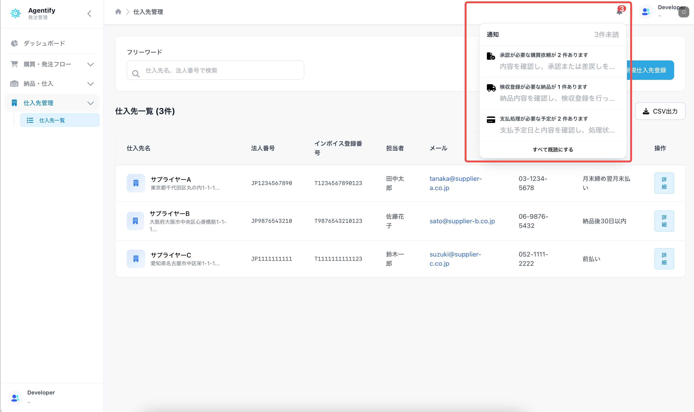

通知される主な内容:

| 通知 | 表示される条件 | 対応 |
| --- | --- | --- |
| 承認が必要な購買依頼があります | 申請中の購買依頼があり、購買依頼承認権限がある | 購買依頼一覧で内容を確認し、承認または差戻しを行います。 |
| 検収登録が必要な納品があります | 未検収の納品があり、検収権限がある | 納品・検収一覧で内容を確認し、検収登録します。 |
| 支払処理が必要な予定があります | 未払いの支払予定があり、支払予定処理権限がある | 支払予定一覧で支払予定日と内容を確認します。 |

通知をクリックすると、関連する一覧画面へ移動します。「すべて既読にする」を押すと未読表示は消えますが、承認、検収、支払などの業務処理は完了しません。実際の処理は各一覧または詳細画面で行ってください。

## 15. よくあるメッセージ

| メッセージ | 原因 | 対応 |
| --- | --- | --- |
| データ取得に失敗しました | 通信エラーまたは権限不足 | 時間をおいて再読み込み。解決しない場合は管理者へ連絡 |
| 他のユーザーが対象データを更新しました | 同じデータを別ユーザーが先に保存した | 画面を再読み込みして最新内容を確認 |
| 申請中の発注案件だけ承認・差戻しできます | 対象ステータスが変わっている | 一覧を更新して状態を確認 |
| この発注案件はすでに発注登録されています | 重複登録を防止した | 既存の発注を確認 |
| 支払予定を更新する権限がありません | 支払予定更新権限がない | 管理者へ権限設定を依頼 |
