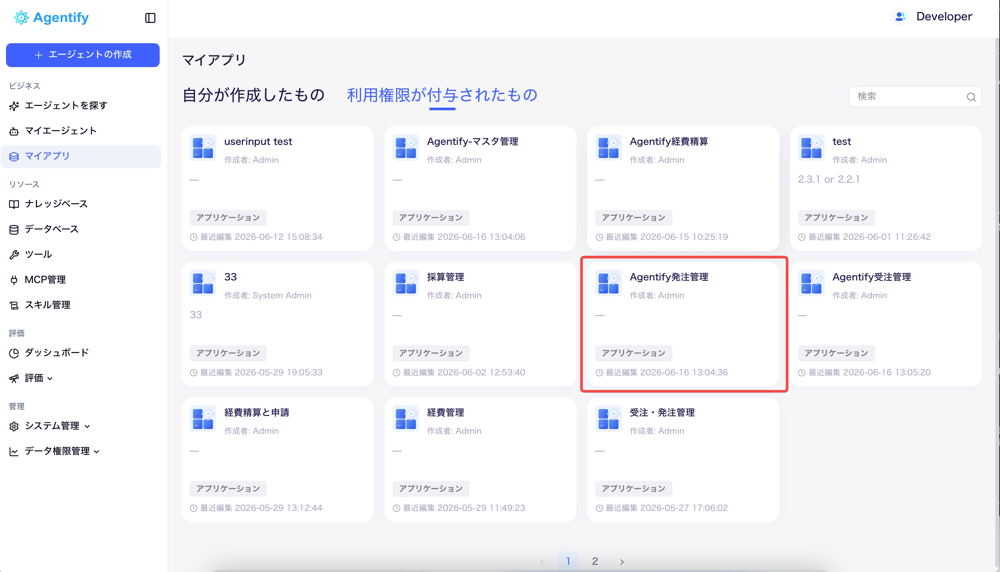
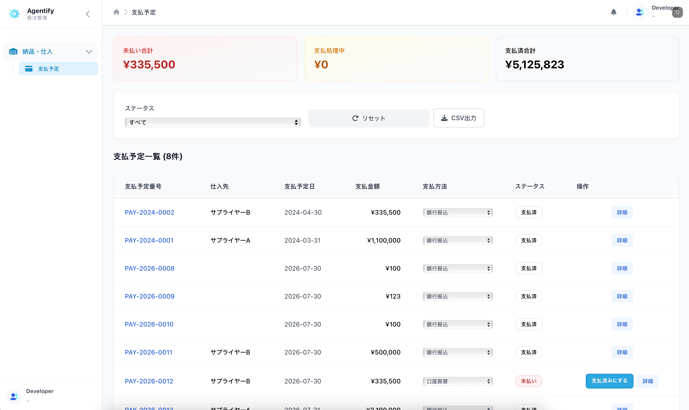
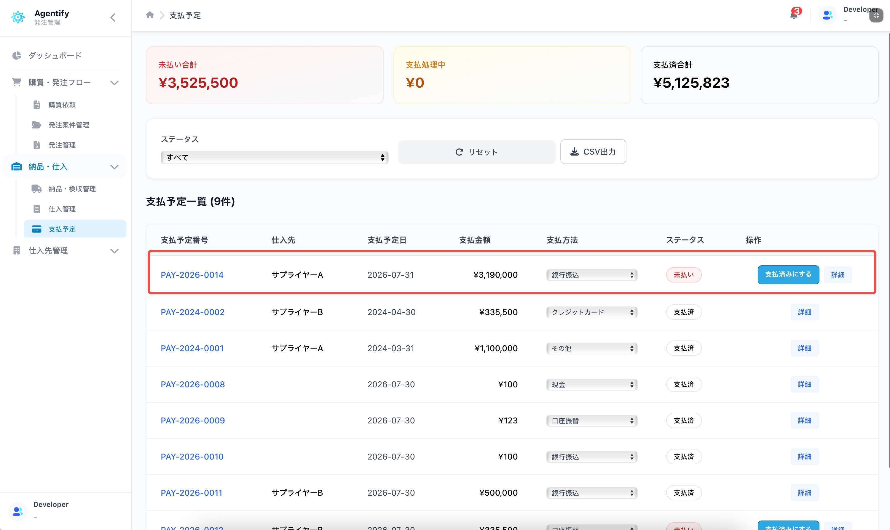
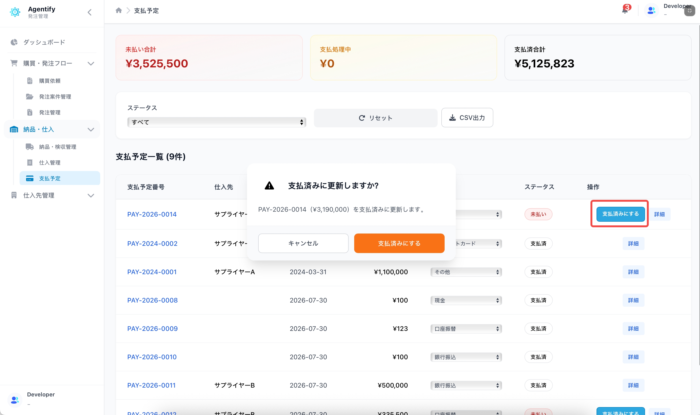

# 発注経理担当者向け担当別手順

対象者: 支払担当者、経理担当者

最終更新日: 2026-06-17

## 1. 発注管理を開く

1. Agentify にログインします。
2. 「マイアプリ」を開きます。
3. 「発注管理」をクリックします。
4. 左メニューから「支払予定」を開きます。

## 2. 表示される主な画面

| 画面 | 用途 |
| --- | --- |
| 支払予定一覧 | 支払予定日、支払金額、支払方法、ステータスを確認します。 |
| 支払予定詳細 | 支払予定の詳細を確認します。 |

購買依頼、発注案件、発注管理、納品・検収が表示されない場合があります。これは購買担当者や検収担当者向けの画面です。

## 3. 支払予定を確認する

1. 支払予定一覧を開きます。
2. 支払予定日、仕入先、支払金額、支払方法を確認します。
3. 必要に応じてステータスや期間で絞り込みます。
4. 月次確認や社内集計が必要な場合は「CSV出力」をクリックします。

主なステータス:

| ステータス | 意味 |
| --- | --- |
| 未払い | 支払前です。 |
| 支払処理中 | 支払処理中です。 |
| 支払済 | 支払済みに更新されています。 |
| 保留 | 支払を一時停止しています。 |

## 4. 支払方法を変更する

1. 支払予定一覧で対象行を確認します。
2. 支払方法のプルダウンを変更します。
3. 変更内容は自動で保存されます。

変更後は、念のため対象行の支払方法が正しく表示されていることを確認してください。

## 5. 支払済みに更新する

1. 対象の支払予定で「支払済みにする」をクリックします。
2. 確認ポップアップで支払予定番号、仕入先、金額を確認します。
3. 「支払済みにする」を実行します。

支払済みにすると、関連する発注と発注案件のステータスも更新されます。

