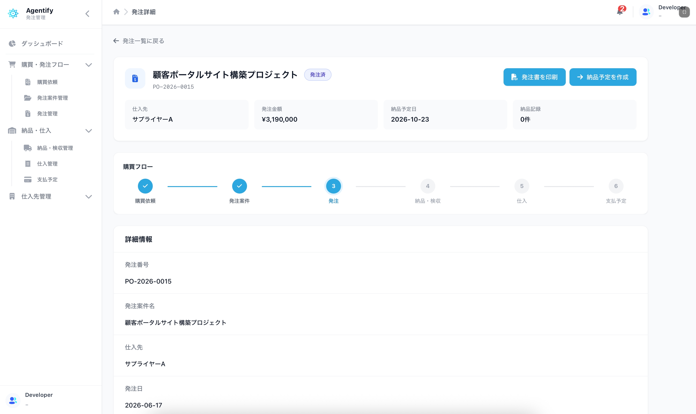
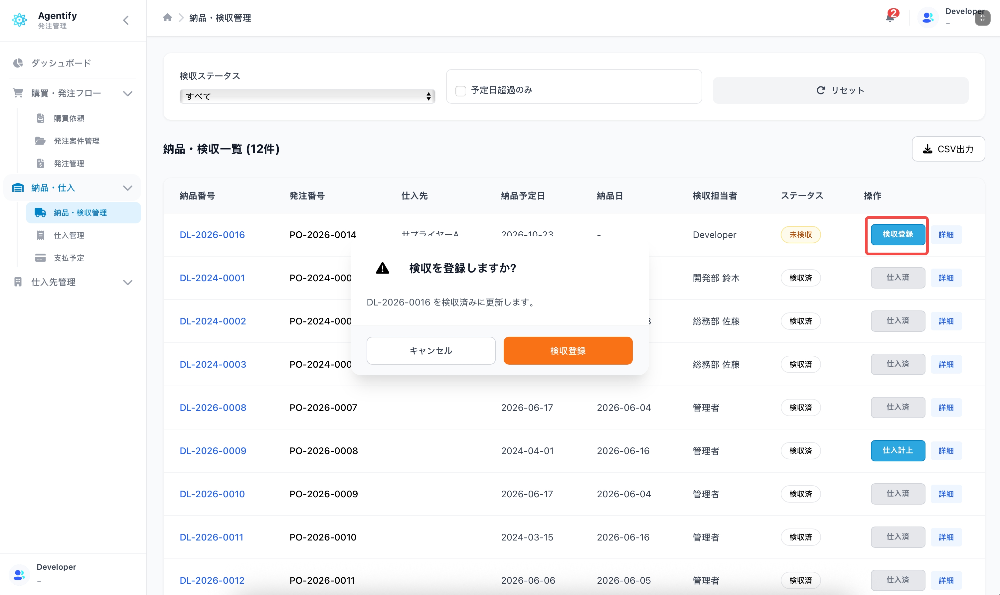

# 検収担当者向けクイック手順

対象者: 納品確認、検収登録を行う担当者

最終更新日: 2026-06-17

## 1. 発注管理を開く

1. Agentify にログインします。
2. 「マイアプリ」を開きます。
3. 「発注管理」をクリックします。
4. 左メニューから「発注管理」または「納品・検収管理」を開きます。

## 2. 表示される主な画面

| 画面 | 用途 |
| --- | --- |
| 発注一覧・発注詳細 | 発注内容、納品予定日、仕入先を確認します。 |
| 納品・検収一覧 | 検収が必要な納品を確認します。 |
| 納品・検収詳細 | 納品日、検収担当者、検収ステータスを確認します。 |

発注案件の編集、発注登録、支払済み更新は担当外の業務です。

## 3. 納品予定を作成・確認する

1. 発注一覧から対象の発注を確認します。
2. 「納品予定」または「納品・検収を開く」をクリックします。
3. 納品予定日、仕入先、発注内容を確認します。

すでに納品・検収レコードがある場合は、既存の納品・検収詳細へ移動します。

## 4. 検収登録を行う

1. 納品・検収一覧を開きます。
2. ステータスが「未検収」のデータを確認します。
3. 対象の詳細を開きます。
4. 納品日、数量、内容に問題がないか確認します。
5. 「検収登録」をクリックします。
6. 確認ポップアップで内容を確認し、登録します。

主なステータス:

| ステータス | 意味 |
| --- | --- |
| 未検収 | まだ検収していません。 |
| 一部検収 | 一部だけ検収済みです。 |
| 検収済 | 検収が完了しています。 |
| 差戻し | 内容確認が必要です。 |

## 5. 検収後の流れ

検収登録後は、仕入計上と支払予定作成に進みます。仕入計上が表示されない場合は、購買担当者または経理担当者へ連絡してください。

## 6. FAQ

| 状況 | 対応 |
| --- | --- |
| 納品・検収管理が表示されない | 検収権限を管理者に確認します。 |
| 検収登録ボタンが表示されない | 対象データのステータス、または検収権限を確認します。 |
| 発注内容と実際の納品が違う | 検収登録前に購買担当者へ確認します。 |
| 仕入計上ボタンが表示されない | 仕入計上は別権限です。購買担当者または経理担当者へ依頼します。 |
