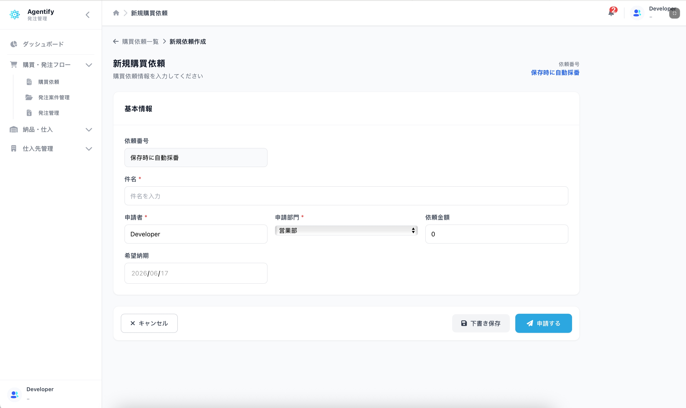
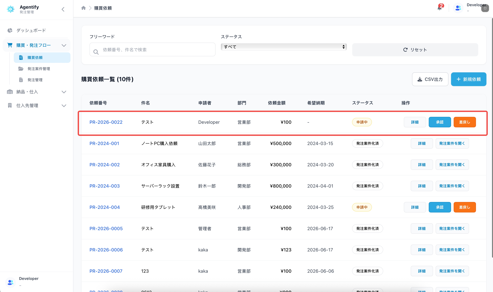

# 購買依頼者向け担当別手順

対象者: 購買依頼を作成する一般ユーザー

最終更新日: 2026-06-17

## 1. 発注管理を開く

1. Agentify にログインします。
2. 「マイアプリ」を開きます。
3. 「発注管理」をクリックします。
4. 左メニューから「購買依頼」を開きます。

## 2. 表示される主な画面

| 画面 | 用途 |
| --- | --- |
| 購買依頼一覧 | 自分または自部門の購買依頼を確認します。 |
| 購買依頼詳細 | 依頼内容とステータスを確認します。 |
| 新規購買依頼作成 | 新しい購買依頼を作成します。 |

発注案件、発注、検収、支払予定が表示されない場合があります。これは担当外の業務です。

## 3. 購買依頼を作成する

1. 購買依頼一覧で「新規依頼」をクリックします。
2. 件名、申請者、部門、依頼金額、希望納期を入力します。
3. 内容を確認します。
4. 「申請する」をクリックします。
5. 確認ポップアップで内容を確認し、申請します。

下書き保存が表示される場合は、途中保存できます。表示されない場合は、申請のみ可能な設定です。

## 4. 依頼状況を確認する

購買依頼一覧または購買依頼詳細でステータスを確認します。

| ステータス | 意味 | 対応 |
| --- | --- | --- |
| 下書き | 申請前です。 | 内容を確認して申請します。 |
| 申請中 | 承認待ちです。 | 承認者の確認を待ちます。 |
| 承認済 | 承認済みです。 | 発注案件化を購買担当者が行います。 |
| 差戻し | 修正依頼されています。 | 内容を修正して再申請します。 |
| 発注案件化済 | 発注案件に変換済みです。 | 必要に応じて購買担当者へ状況確認します。 |

## 5. 差戻しされた場合

1. 購買依頼詳細を開きます。
2. 差戻し理由や修正内容を確認します。
3. 内容を修正します。
4. 再度「申請する」をクリックします。

