# ロール別操作ガイド

対象読者: システム管理者、部門責任者、役割別マニュアルを作成する担当者

最終更新日: 2026-06-16

このガイドでは、ユーザーのロールや業務上の役割ごとに、表示される主な画面、表示されるボタン、実行できない操作を説明します。

## 1. 共通ルール

各アプリでは、ユーザーに割り当てられたロールによって、表示されるメニューやボタンが変わります。

基本的な考え方:

- 利用できない機能のメニューやボタンは、原則として表示されません。
- 複数ロールを持つユーザーは、それぞれのロールで許可された操作をまとめて利用できます。
- 自部門参照のユーザーは、主所属部門、兼務部門、ロール割当部門のデータを中心に利用します。
- 全社参照のユーザーは、部門をまたいでデータを確認できます。
- 画面にボタンが表示されない場合は、ロールまたは担当範囲が不足している可能性があります。

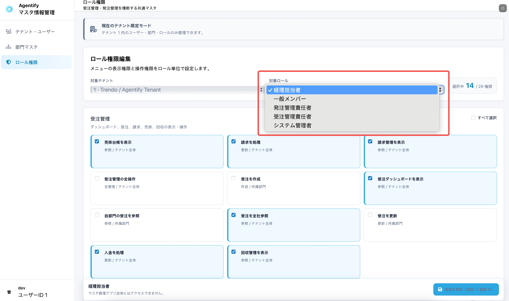

## 2. 標準ロール別の見え方

### 2.1 一般メンバー

主な利用者:

- 営業担当者
- 購買依頼を行う一般利用者

表示される主な画面:

| アプリ | 表示される画面 |
| --- | --- |
| 受注管理 | 受注一覧、受注詳細、新規受注作成 |
| 発注管理 | 購買依頼一覧、購買依頼詳細、新規購買依頼作成 |
| マスタ情報管理 | 表示されません |

表示される主なボタン:

| 画面 | 表示されるボタン |
| --- | --- |
| 受注一覧 | 新規受注、詳細 |
| 新規受注作成 | 受注登録 |
| 購買依頼一覧 | 新規依頼、詳細 |
| 新規購買依頼作成 | 下書き保存、申請する |

表示されない主なボタン:

| 画面 | 表示されないボタン |
| --- | --- |
| 受注詳細 | 請求作成、回収登録 |
| 請求管理 | 請求関連の操作全般 |
| 発注案件詳細 | 発注登録、発注案件承認 |
| 納品・検収管理 | 検収登録 |
| 支払予定 | 支払済みにする |

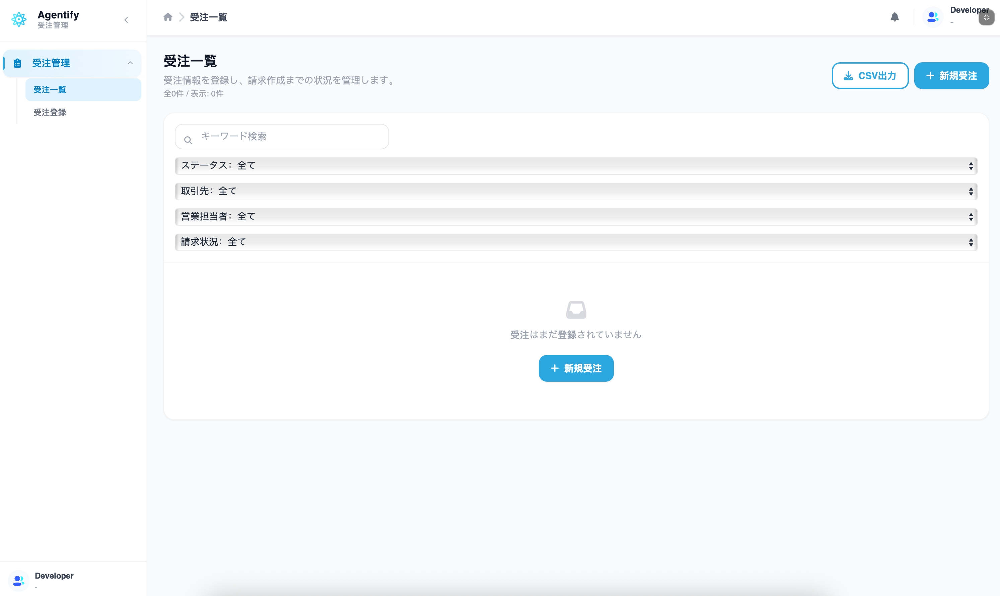

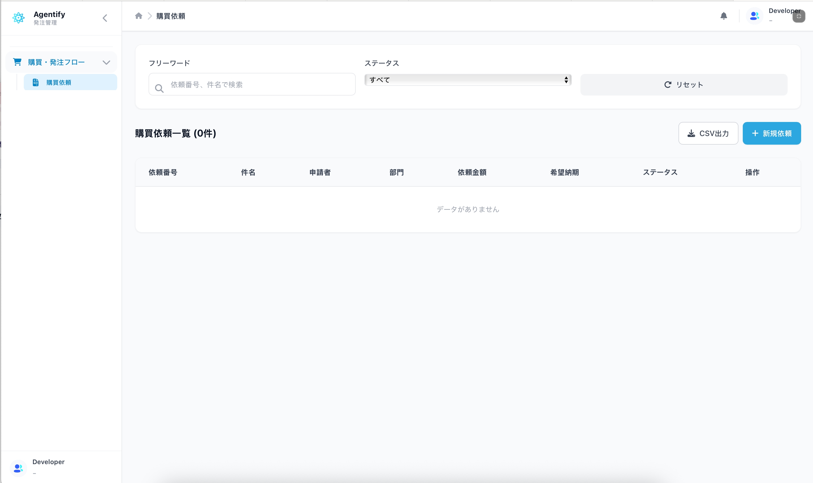

注意:

- 一般メンバーは、受注作成と購買依頼作成の両方を含む初期導入向けロールです。
- 営業担当者と購買依頼者を分けたい場合は、一般メンバーをそのまま使わず、専用ロールを作成してください。
- 請求、入金、発注承認、検収、支払処理はできません。

### 2.2 受注管理責任者

主な利用者:

- 営業責任者
- 部門内の受注を管理するユーザー

表示される主な画面:

| アプリ | 表示される画面 |
| --- | --- |
| 受注管理 | ダッシュボード、受注一覧、受注詳細、新規受注作成 |
| 発注管理 | 表示されません |
| マスタ情報管理 | 表示されません |

表示される主なボタン:

| 画面 | 表示されるボタン |
| --- | --- |
| 受注一覧 | 新規受注、詳細、請求作成対象の確認 |
| 受注詳細 | 編集、下書き削除、受注確定 |
| 新規受注作成 | 下書き保存、受注登録 |

表示されない主なボタン:

| 画面 | 表示されないボタン |
| --- | --- |
| 受注詳細 | 請求作成、回収登録 |
| 請求管理 | 請求作成、請求取消 |
| 回収管理 | 回収登録、回収取消 |
| 発注管理 | 発注関連の操作全般 |

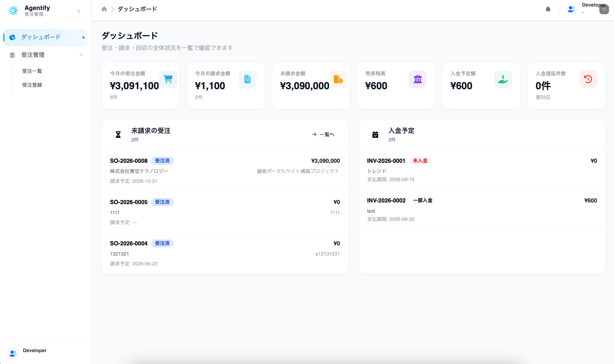

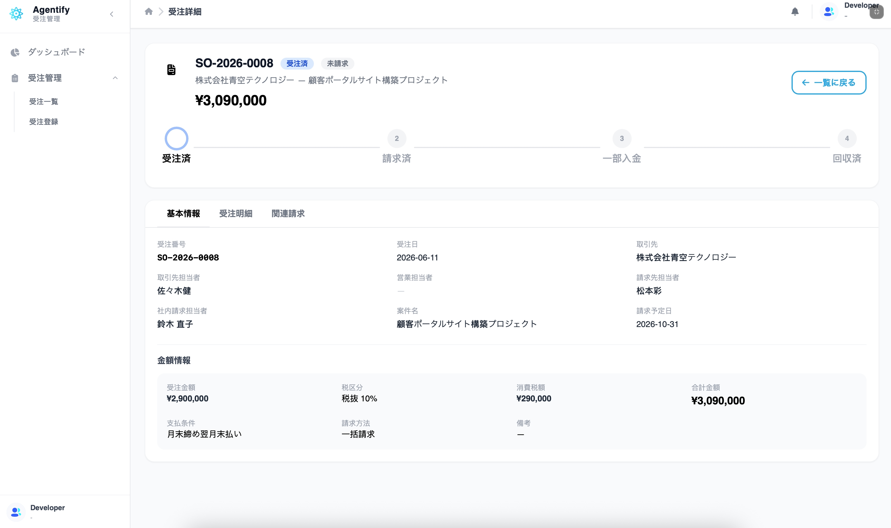

注意:

- 受注管理責任者は、部門内の受注作成・更新を担当するロールです。
- 請求や入金は経理担当者の業務として分けています。
- 営業責任者が請求作成まで担当する運用の場合は、請求担当ロールを追加で付与してください。

### 2.3 発注管理責任者

主な利用者:

- 購買責任者
- 少人数で購買依頼から発注登録までを管理するユーザー

表示される主な画面:

| アプリ | 表示される画面 |
| --- | --- |
| 受注管理 | 表示されません |
| 発注管理 | ダッシュボード、購買依頼、発注案件、発注管理、仕入管理、支払予定、仕入先管理 |
| マスタ情報管理 | 表示されません |

表示される主なボタン:

| 画面 | 表示されるボタン |
| --- | --- |
| 購買依頼一覧 | 新規依頼、承認、差戻し、発注案件に変換 |
| 発注案件一覧 | 新規発注案件、詳細 |
| 発注案件詳細 | 編集、承認、差戻し、発注登録、発注を開く |
| 発注一覧 | 詳細 |
| 仕入管理 | 仕入詳細、支払予定を開く |
| 支払予定 | 詳細 |
| 仕入先管理 | 仕入先一覧、仕入先詳細 |

表示されない主なボタン:

| 画面 | 表示されないボタン |
| --- | --- |
| 支払予定 | 支払済みにする、支払方法変更 |
| 発注一覧 | 納品予定を作成、納品・検収を開く |
| 納品・検収一覧 | 検収登録、仕入計上 |
| マスタ情報管理 | ユーザー、部門、ロール権限の管理 |
| 受注管理 | 受注、請求、入金関連の操作全般 |

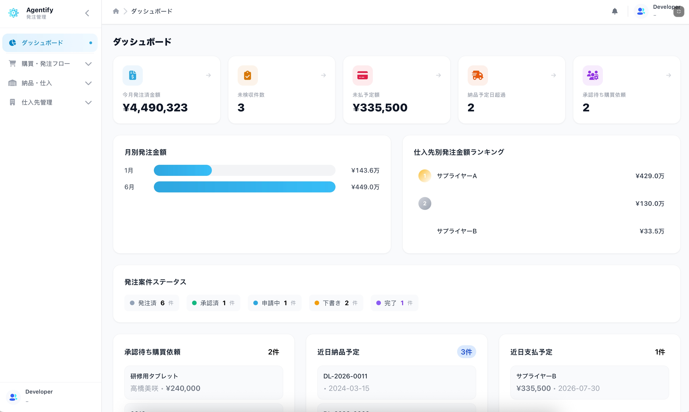

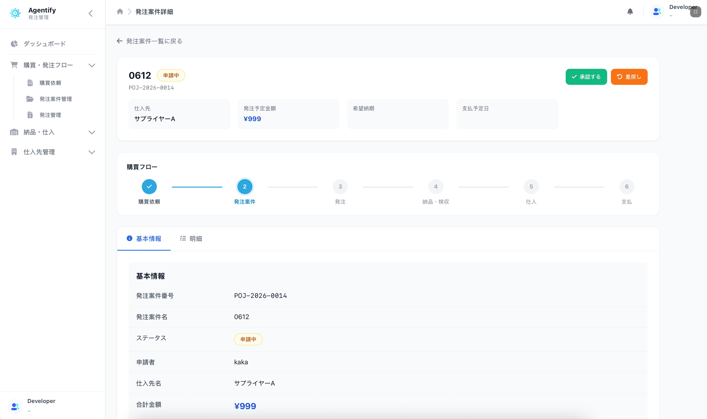

注意:

- 発注管理責任者は、購買依頼から発注登録までを管理するロールです。納品・検収と仕入計上は標準では担当しません。
- 支払予定の確認はできますが、支払済み更新などの支払処理は経理担当者の業務です。
- 検収まで同じ担当者に任せる会社では、発注管理責任者へ検収権限を追加するのではなく、検収担当ロールを併用する運用を推奨します。

### 2.4 経理担当者

主な利用者:

- 請求担当者
- 入金担当者
- 支払担当者
- 経理責任者

表示される主な画面:

| アプリ | 表示される画面 |
| --- | --- |
| 受注管理 | ダッシュボード、受注一覧、受注詳細、請求管理、売掛台帳、回収管理 |
| 発注管理 | 支払予定 |
| マスタ情報管理 | 表示されません |

表示される主なボタン:

| 画面 | 表示されるボタン |
| --- | --- |
| 受注一覧 | 詳細、請求作成 |
| 受注詳細 | 請求作成、請求詳細を開く、回収登録 |
| 請求管理 | 請求作成、請求詳細、請求取消 |
| 回収管理 | 回収登録、回収詳細、回収取消 |
| 支払予定 | 支払方法変更、支払済みにする、詳細 |

表示されない主なボタン:

| 画面 | 表示されないボタン |
| --- | --- |
| 受注詳細 | 受注編集、受注確定、下書き削除 |
| 発注案件詳細 | 発注案件編集、承認、差戻し、発注登録 |
| 納品・検収管理 | 検収登録、仕入計上 |
| 購買依頼・発注案件・発注管理 | 左メニューには表示されません |
| マスタ情報管理 | ユーザー、部門、ロール権限の管理 |

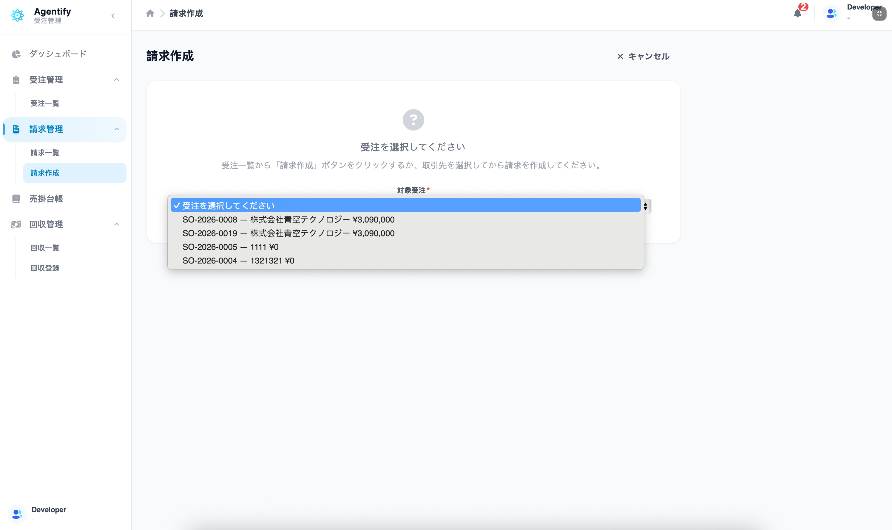

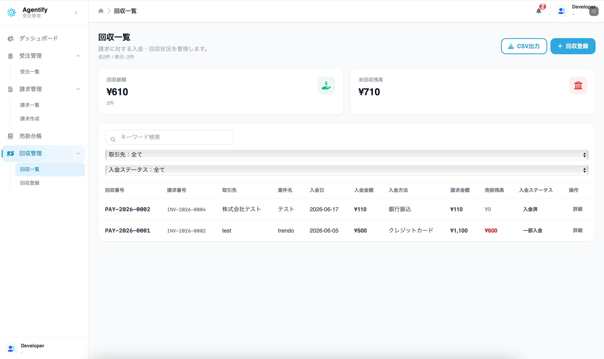

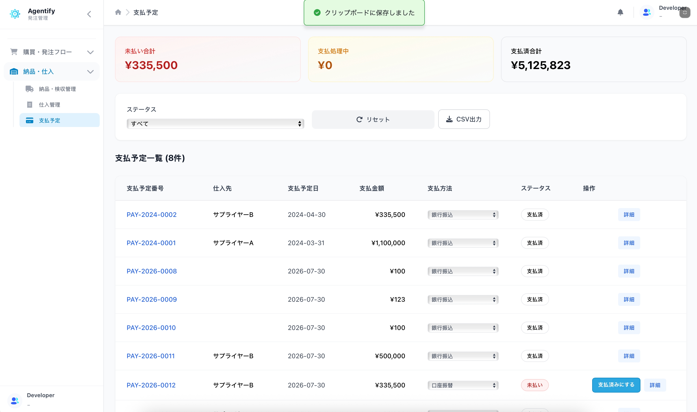

注意:

- 経理担当者は、受注側の全社参照と金銭処理、発注側の支払予定処理を含むロールです。
- 発注側では、購買依頼、発注案件、発注管理、納品・検収、仕入管理は通常表示されません。
- 請求担当、入金担当、支払担当を分けたい場合は、専用ロールを作成してください。
- 受注内容や発注内容の業務編集は、営業責任者や購買担当者の業務として分けています。

### 2.5 システム管理者

主な利用者:

- テナント内の管理者
- ユーザー、部門、ロール権限を管理する担当者

表示される主な画面:

| アプリ | 表示される画面 |
| --- | --- |
| 受注管理 | すべての画面 |
| 発注管理 | すべての画面 |
| マスタ情報管理 | テナント・ユーザー、部門、ロール権限 |

表示される主なボタン:

| 画面 | 表示されるボタン |
| --- | --- |
| マスタ情報管理 | 標準ロール設定を適用、ユーザー設定を保存、所属部門を保存、ロール変更を保存、権限を保存 |
| 受注管理 | 受注、請求、回収に関する操作 |
| 発注管理 | 発注、検収、仕入、支払予定に関する操作 |

操作できない主な範囲:

| 対象 | 説明 |
| --- | --- |
| 他テナント | 通常のシステム管理者は、自テナントのみ管理できます。 |
| スーパー管理者保護対象 | 保護された管理者アカウントや保護ロールは変更できません。 |
| 最後のシステム管理者 | テナント内の最後の管理者ロールは削除できません。 |

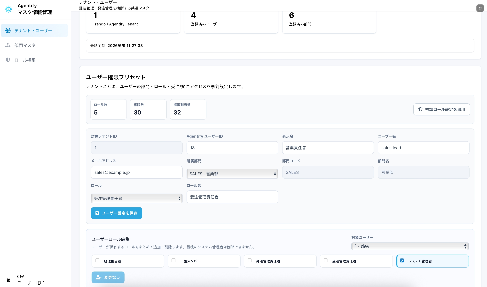

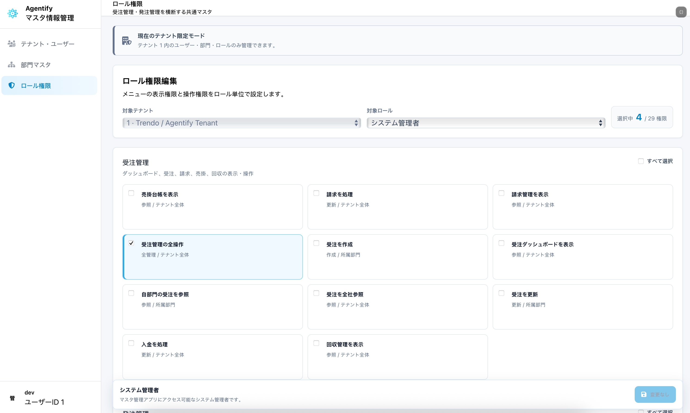

注意:

- システム管理者は強い権限を持つため、付与対象を最小限にしてください。
- 日常業務のためだけにシステム管理者ロールを付与する運用は推奨しません。
- 権限を変更した後は、対象ユーザーで実際に画面表示を確認してください。

## 3. 職務別ロールを作る場合の見え方

標準ロールを分割して運用する場合は、以下を目安にしてください。

### 3.1 受注作成担当

表示される画面:

- 受注一覧
- 受注詳細
- 新規受注作成

表示されるボタン:

- 新規受注
- 受注登録
- 詳細

表示されないボタン:

- 下書き保存
- 受注編集
- 受注確定
- 請求作成
- 回収登録

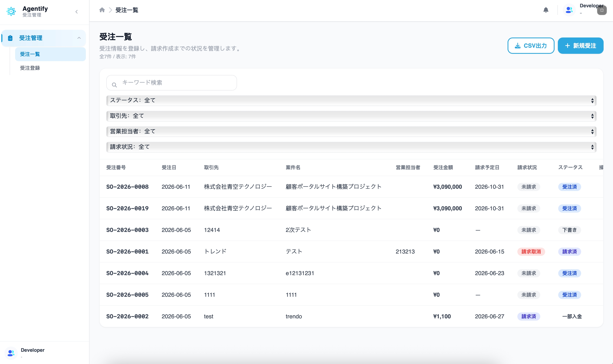

### 3.2 請求担当

表示される画面:

- 受注一覧
- 受注詳細
- 請求管理
- 売掛台帳

表示されるボタン:

- 請求作成
- 請求詳細
- 請求取消

表示されないボタン:

- 受注編集
- 回収登録
- 回収取消

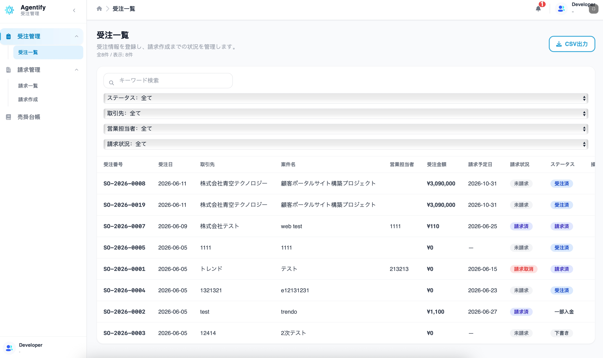

### 3.3 入金担当

表示される画面:

- 受注一覧
- 受注詳細
- 売掛台帳
- 回収管理

表示されるボタン:

- 回収登録
- 回収詳細
- 回収取消

表示されないボタン:

- 受注編集
- 請求作成
- 請求取消

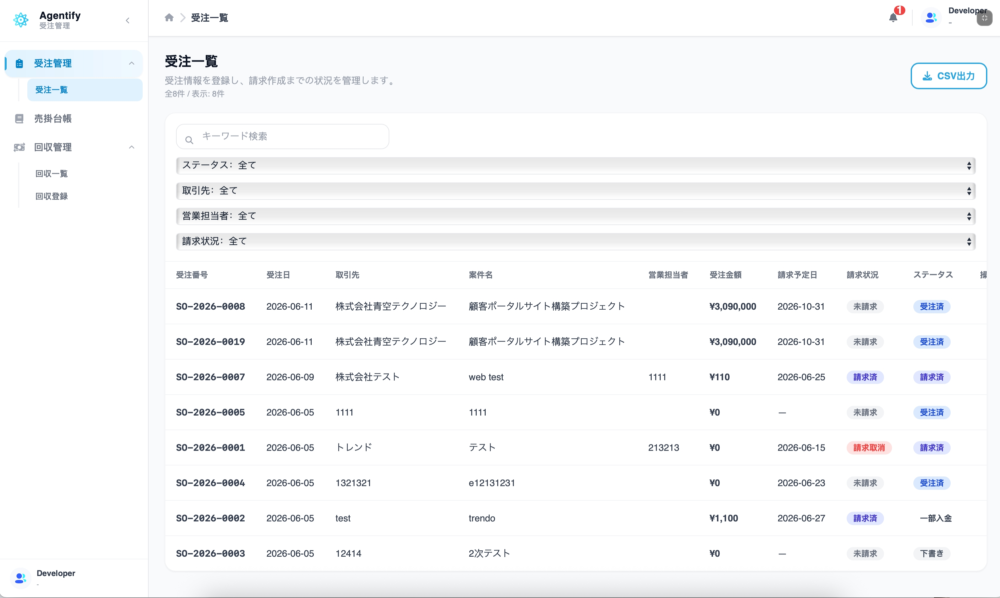

### 3.4 購買依頼者

表示される画面:

- 購買依頼一覧
- 購買依頼詳細
- 新規購買依頼作成

表示されるボタン:

- 新規依頼
- 下書き保存
- 申請する
- 詳細

表示されないボタン:

- 購買依頼承認
- 購買依頼差戻し
- 発注案件に変換
- 発注登録
- 検収登録
- 支払済みにする

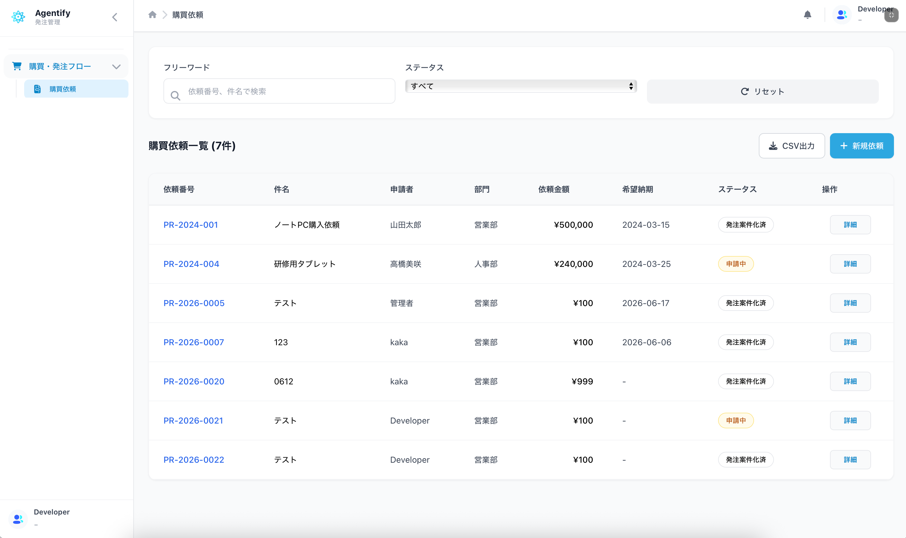

### 3.5 購買依頼承認者

表示される画面:

- 購買依頼一覧
- 購買依頼詳細

表示されるボタン:

- 承認
- 差戻し

表示されないボタン:

- 新規購買依頼
- 発注案件作成
- 発注登録
- 検収登録

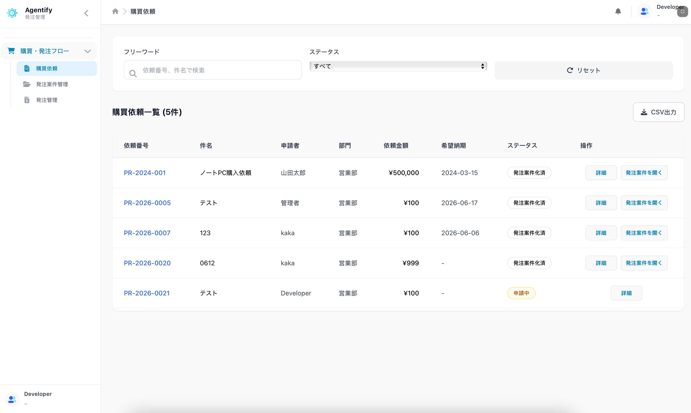

### 3.6 発注案件担当

表示される画面:

- 発注ダッシュボード
- 発注案件一覧
- 発注案件詳細
- 新規発注案件作成
- 発注一覧
- 仕入先管理

表示されるボタン:

- 新規発注案件
- 下書き保存
- 申請する
- 発注登録
- 発注を開く

表示されないボタン:

- 発注案件承認
- 発注案件差戻し
- 検収登録
- 支払済みにする

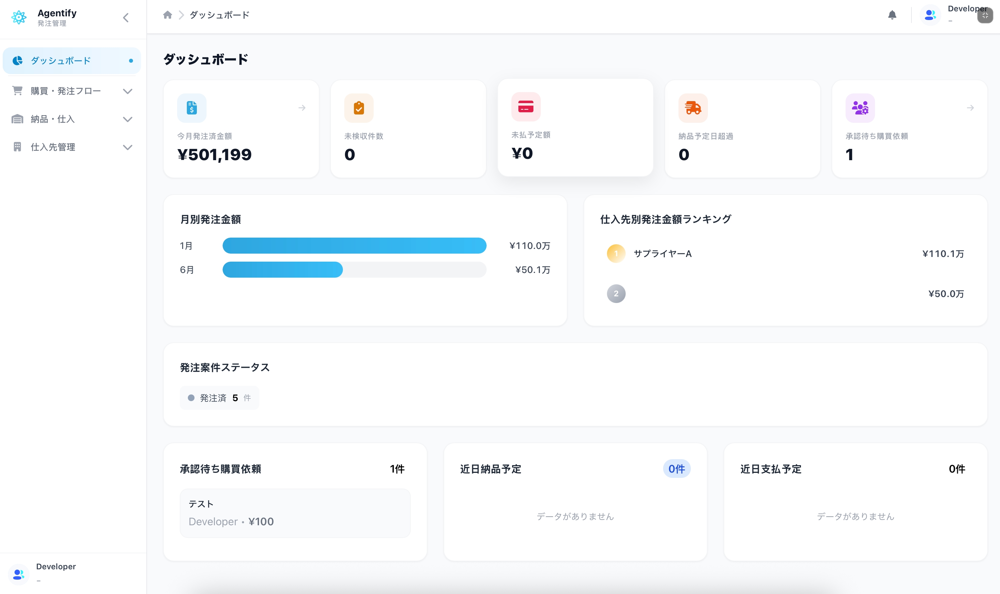

### 3.7 発注案件承認者

表示される画面:

- 発注案件一覧
- 発注案件詳細

表示されるボタン:

- 承認
- 差戻し

表示されないボタン:

- 新規発注案件
- 発注登録
- 検収登録
- 仕入計上
- 支払済みにする

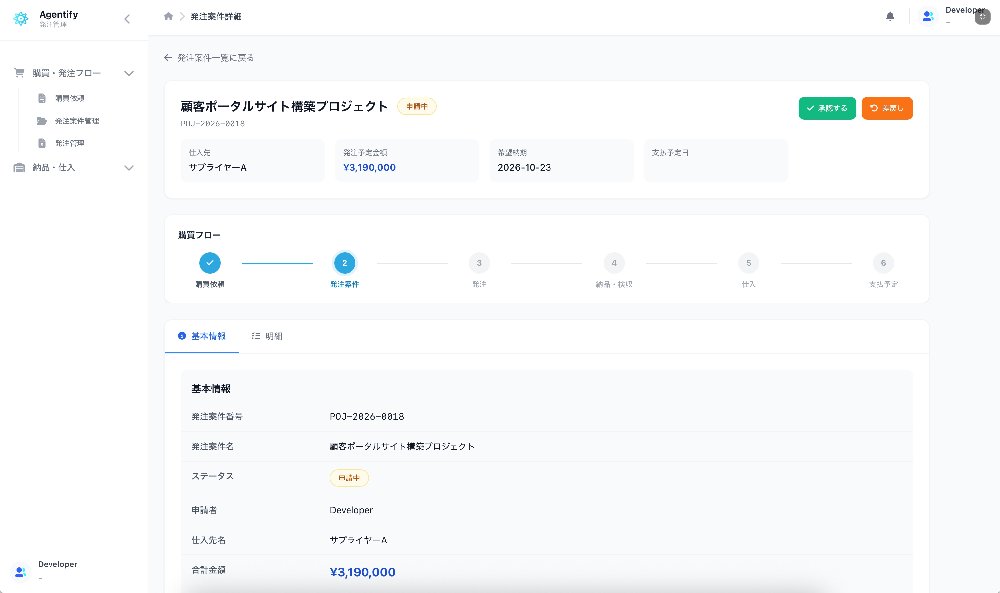

### 3.8 検収担当

表示される画面:

- 発注一覧
- 発注詳細
- 納品・検収一覧
- 納品・検収詳細

表示されるボタン:

- 納品予定を作成
- 納品・検収を開く
- 検収登録

表示されないボタン:

- 発注案件編集
- 発注登録
- 仕入計上
- 支払済みにする

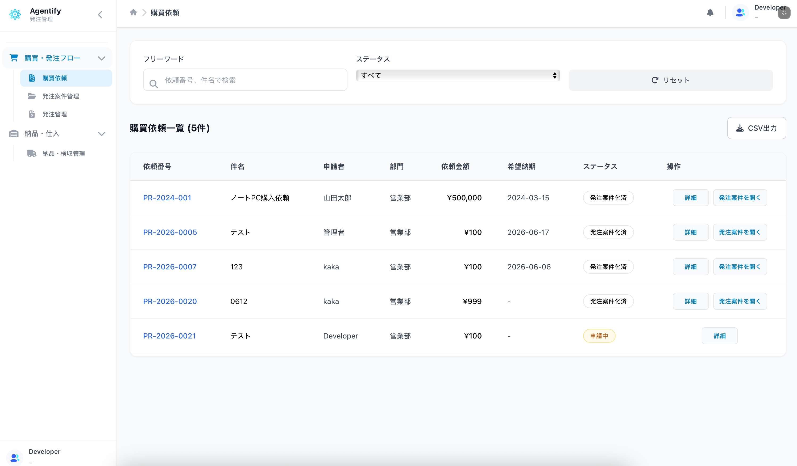

### 3.9 支払担当

表示される画面:

- 支払予定一覧
- 支払予定詳細
- 関連する発注、仕入の参照画面

表示されるボタン:

- 支払方法変更
- 支払済みにする
- 詳細

表示されないボタン:

- 発注案件編集
- 発注登録
- 検収登録
- 仕入計上

## 4. ロール別マニュアル作成時の確認ポイント

役割別マニュアルを作成する場合は、以下を確認してください。

| 確認項目 | 確認内容 |
| --- | --- |
| メニュー | 対象ロールで表示される左メニューを確認します。 |
| 一覧画面 | 対象ロールで一覧が表示されるか、対象データが部門範囲どおりか確認します。 |
| 詳細画面 | 関連データへのリンクやボタンが表示されるか確認します。 |
| 作成ボタン | 新規作成、申請、登録などのボタンが表示されるか確認します。 |
| 承認ボタン | 承認、差戻し、却下などのボタンが対象者だけに表示されるか確認します。 |
| 金銭処理ボタン | 請求作成、回収登録、支払済み更新などが経理担当者だけに表示されるか確認します。 |
| 取消ボタン | 請求取消、回収取消など、影響が大きいボタンの表示対象を確認します。 |

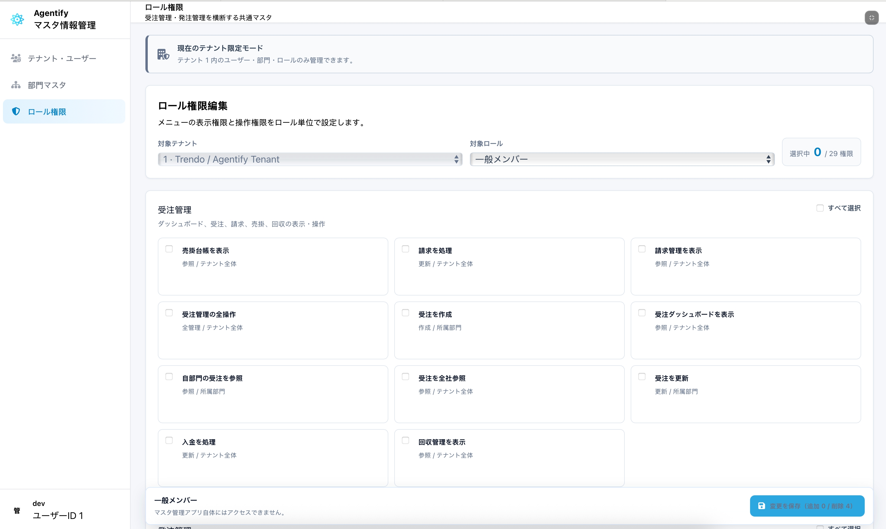

注意:

- ロールを変更した直後は、対象ユーザーで再ログインして画面表示を確認してください。
- 複数ロールを付与した場合、ボタン表示も加算されます。
- 画面にボタンが表示されない場合でも、データの状態によって非表示になっている場合があります。権限だけでなく、ステータスも確認してください。
