# 営業支援（SFA）操作マニュアル

対象読者: 営業担当者、営業管理者、営業責任者

最終更新日: 2026-06-30

## はじめに: Agentify から営業支援（SFA）を開く

営業支援（SFA）は、Agentify にログインした後、「マイアプリ」から起動します。

操作手順:

1. ブラウザで Agentify のログイン画面を開きます。
2. メールアドレスとパスワードを入力し、「ログイン」をクリックします。
3. ログイン後、ホーム画面またはメニューから「マイアプリ」を開きます。
4. アプリ一覧から「営業支援（SFA）」を選択します。
5. ユーザー情報と営業データの読込が完了すると、ダッシュボードが表示されます。

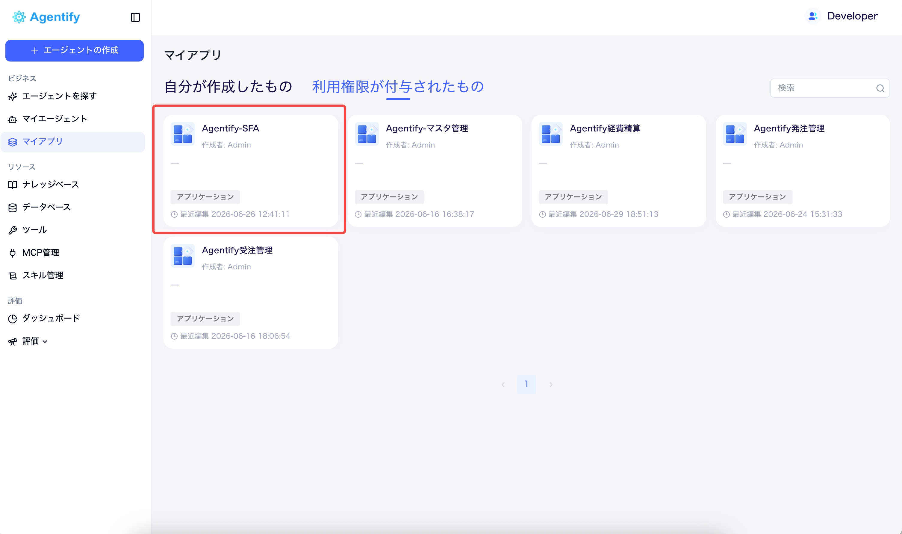

注意:

- 「営業支援（SFA）」がマイアプリに表示されない場合は、Agentify 側でアプリ利用権限が付与されていません。
- 起動時には「ユーザー情報を取得しています」「営業データを読み込んでいます」が順に表示されます。
- データが表示されない場合は、左下の再取得ボタンでユーザー情報と営業データを再読み込みしてください。

## 1. 営業支援（SFA）でできること

営業支援（SFA）では、顧客登録、商談管理、商材管理、市場リサーチ、販促活動、営業実績確認までを一つの画面で管理します。

主な業務の流れ:

1. 商材管理で販売する商材を登録します。
2. 顧客管理で顧客・担当者を登録します。名刺画像から AI 読取も利用できます。
3. 顧客詳細または案件・商談管理から案件を登録します。
4. 案件詳細で商材、見込み金額、確率、優先度、ステータスを管理します。
5. 商談後は議事録やメモを AI 要約し、商談進捗と TODO を残します。
6. ダッシュボード、パイプライン、営業実績で状況を確認します。
7. 必要に応じて市場リサーチや販促活動から新規開拓につなげます。

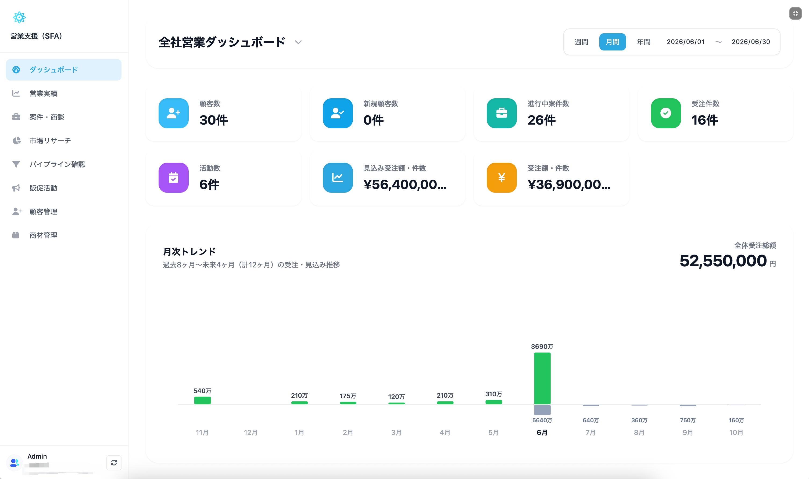

## 2. 画面構成

| メニュー | 用途 |
| --- | --- |
| ダッシュボード | 全社 KPI、受注間近案件、TODO、ランキングの確認 |
| 営業実績 | 目標と実績の対比、週次レポートの生成 |
| 案件・商談 | 案件一覧、案件新規登録、案件詳細の確認 |
| 市場リサーチ | AI によるニュース調査、企業深掘り、顧客登録 |
| パイプライン確認 | 確率別の進行中案件をカンバン形式で確認 |
| 販促活動 | キャンペーンの登録、共有、削除 |
| 顧客管理 | 顧客・担当者の一覧、顧客登録、顧客詳細 |
| 商材管理 | 商材の登録、AI 要約、編集、削除 |

画面左下にはログインユーザー情報が表示されます。回転矢印の再取得ボタンをクリックすると、Agentify のユーザー情報と営業データを再読み込みします。

## 3. ダッシュボードを確認する

### 3.1 ダッシュボードで確認できること

左メニューから「ダッシュボード」をクリックすると、全社営業ダッシュボードが表示されます。

確認できる主な項目:

| 項目 | 説明 |
| --- | --- |
| 顧客数 | 登録されている顧客の総数 |
| 新規顧客数 | 選択期間内に登録された顧客数 |
| 進行中案件数 | 受注・失注・スキップ以外の案件数 |
| 受注件数 | 選択期間内に受注した案件数 |
| 活動数 | 選択期間内に登録された商談進捗数 |
| 見込み受注額・件数 | 進行中案件の見込み金額と件数 |
| 受注額・件数 | 受注案件の金額と件数 |

### 3.2 期間を切り替える

画面右上の期間フィルターで「週間」「月間」「年間」を選択できます。開始日と終了日を指定して任意の期間で集計することもできます。

注意:

- 進行中案件数は全期間を対象に表示されます。
- 受注金額は受注金額が入力されている場合は受注金額、未入力の場合は見込み金額をもとに集計します。

### 3.3 受注間近案件と TODO を確認する

「受注間近案件リスト」では、優先度、確率、受注予定日、見込み金額をもとに重要な案件が表示されます。

操作手順:

1. ダッシュボードで「受注間近案件リスト」を確認します。
2. 対象案件の行をクリックします。
3. 案件詳細画面で状況や商談進捗を確認します。

「受注間近案件 TO DO」には、優先度が高い進行中案件に紐づく未完了 TODO が表示されます。TODO をクリックすると、該当案件の詳細画面へ移動します。

### 3.4 AI 案件分析について

「AI案件分析」ボタンは、現在は次フェーズ接続予定の機能です。クリックすると、接続予定である旨のメッセージが表示されます。

## 4. 営業実績を確認する

### 4.1 営業実績画面を開く

1. 左メニューから「営業実績」をクリックします。
2. 期間フィルターで確認したい期間を選択します。
3. 上部の KPI と担当者別の目標・実績テーブルを確認します。

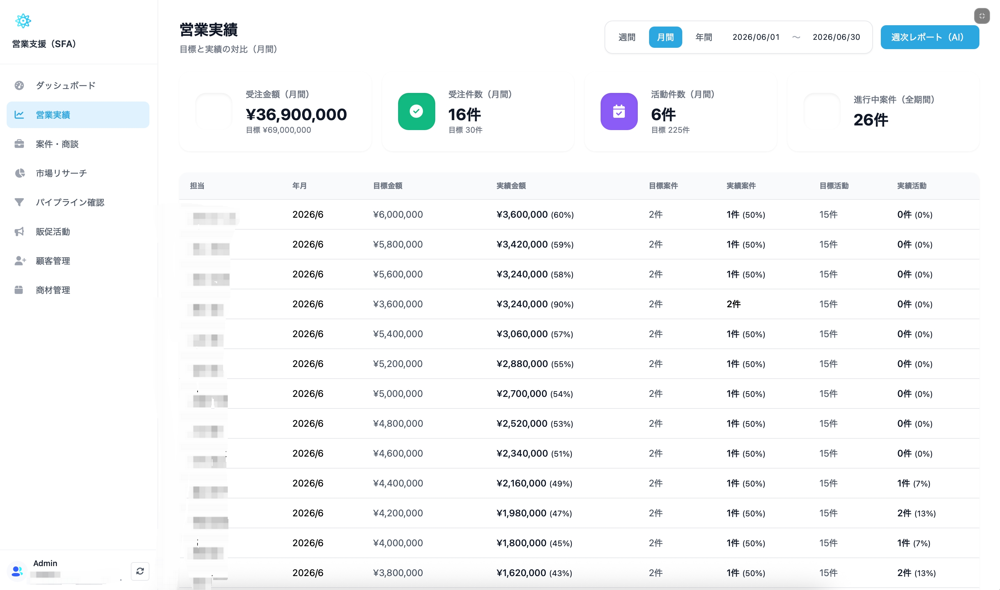

確認できる主な項目:

| 項目 | 説明 |
| --- | --- |
| 受注金額 | 選択期間内の受注金額合計 |
| 受注件数 | 選択期間内の受注件数 |
| 活動件数 | 選択期間内の商談進捗件数 |
| 進行中案件 | 現在進行中の案件数 |

### 4.2 担当者別の目標・実績を確認する

担当者別テーブルでは、担当者ごとの目標金額、実績金額、目標案件数、実績案件数、目標活動数、実績活動数を確認できます。

注意:

- 目標未達の場合は、実績欄に達成率が表示されます。
- 目標データは管理者が登録します。画面上から目標値を編集することはできません。
- データがない場合は「選択期間の目標・実績データがありません」と表示されます。

### 4.3 週次レポートを生成する

1. 期間を選択します。
2. 「週次レポート（AI）」をクリックします。
3. ボタンが「生成中...」に変わるため、完了まで待ちます。
4. 生成後、画面下部に週次レポートが表示されます。
5. 内容を確認し、必要に応じて社内報告に利用します。

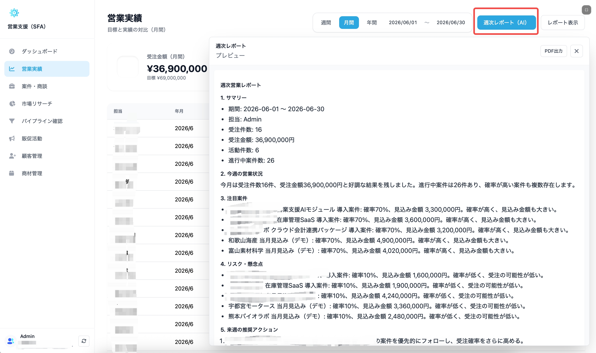

## 5. 案件・商談を確認する

### 5.1 案件一覧を開く

1. 左メニューから「案件・商談」をクリックします。
2. 案件・商談管理画面が表示されます。
3. 一覧で案件番号、案件名、顧客名、商材、販促活動、見込み金額、受注金額、受注予定、ステータスを確認します。

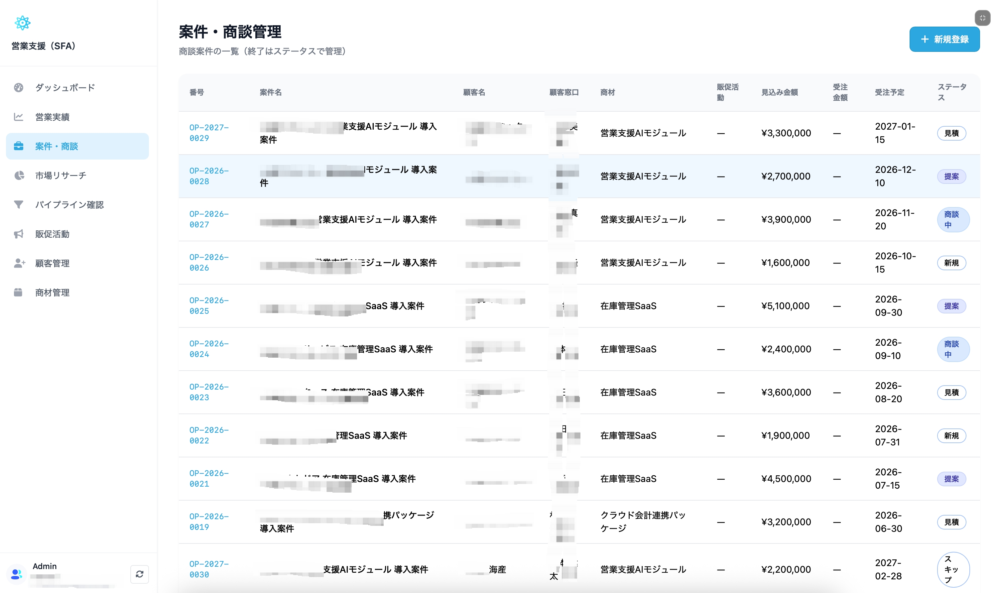

### 5.2 案件詳細を開く

1. 案件一覧で対象案件を確認します。
2. 対象行をクリックします。
3. 案件詳細画面が表示されます。

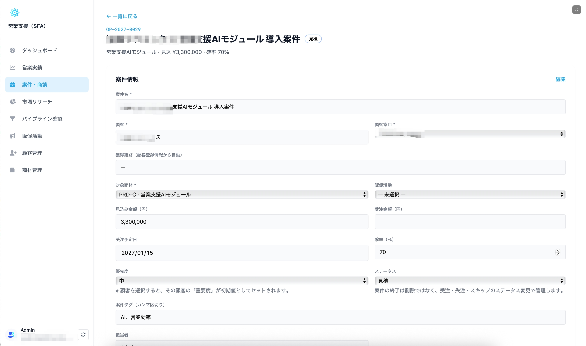

注意:

- 案件一覧には削除ボタンはありません。
- 案件の終了は、案件詳細でステータスを「受注」「失注」「スキップ」に変更して管理します。

## 6. 案件を登録・更新する

### 6.1 新規案件を登録する

1. 左メニューから「案件・商談」を開きます。
2. 「新規登録」をクリックします。
3. 案件名、顧客、顧客窓口、対象商材を入力します。
4. 必要に応じて、販促活動、見込み金額、受注予定日、確率、優先度、タグ、案件概要、社内メモを入力します。
5. 「登録する」をクリックします。
6. 登録が完了すると、登録した案件の詳細画面へ移動します。

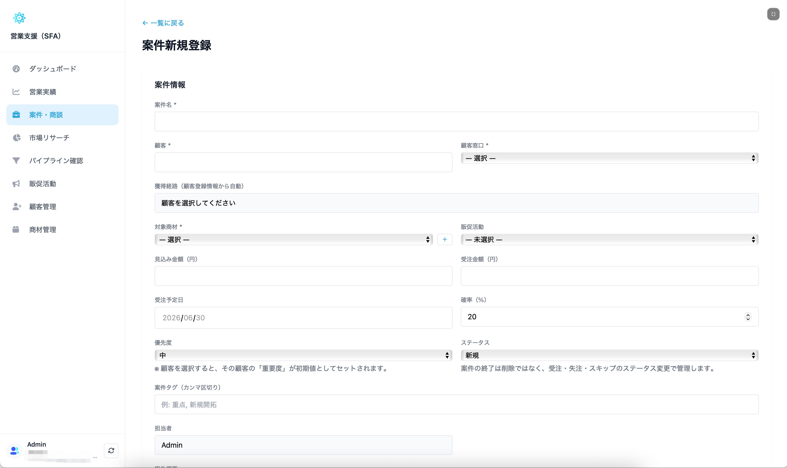

主な入力項目:

| 項目 | 説明 |
| --- | --- |
| 案件名 | 案件の名称。必須項目です。 |
| 顧客 | 登録済み顧客から選択します。必須項目です。 |
| 顧客窓口 | 選択した顧客の担当者を選択します。必須項目です。 |
| 獲得経路 | 顧客登録情報から自動表示されます。 |
| 対象商材 | 案件で提案する商材を選択します。必須項目です。 |
| 販促活動 | 関連するキャンペーンを選択します。 |
| 見込み金額 | 受注見込み金額を入力します。 |
| 受注金額 | 受注時の金額を入力します。ステータスが受注の場合は必須です。 |
| 受注予定日 | 受注予定日を入力します。 |
| 確率 | 0 から 100% で入力します。パイプラインの表示列に反映されます。 |
| 優先度 | 高・中・低から選択します。 |
| ステータス | 新規、商談中、提案、見積、受注、失注、スキップから選択します。 |

### 6.2 既存案件を更新する

1. 案件詳細画面を開きます。
2. 「編集」をクリックします。
3. 内容を修正します。
4. 「保存」をクリックします。

受注としてクローズする場合:

1. 「編集」をクリックします。
2. ステータスを「受注」に変更します。
3. 受注金額を入力します。
4. 「保存」をクリックします。

保存時の主なエラー:

| 条件 | 表示されるメッセージ |
| --- | --- |
| 案件名が未入力 | 案件名は必須です |
| 顧客または顧客窓口が未選択 | 顧客と顧客窓口を選択してください |
| 対象商材が未選択 | 対象商材を選択してください（未登録の場合は商材管理で追加） |
| 受注なのに受注金額が未入力 | 受注の場合は受注金額を入力してください |

## 7. 商談進捗と TODO を登録する

### 7.1 商談進捗を追加する

商談進捗は、既存案件の案件詳細画面から登録します。新規案件登録中は表示されません。

操作手順:

1. 案件詳細画面で「進捗を追加」をクリックします。
2. 議事録や商談メモを貼り付けます。
3. 必要に応じて「AI要約」をクリックします。
4. ファイルを使う場合は「議事録ファイル」から txt、md、pdf、doc、docx、画像などを選択します。
5. 件名、日時、時間、内容・要約、活動 TODO を確認・修正します。
6. 「商談進捗を保存」をクリックします。

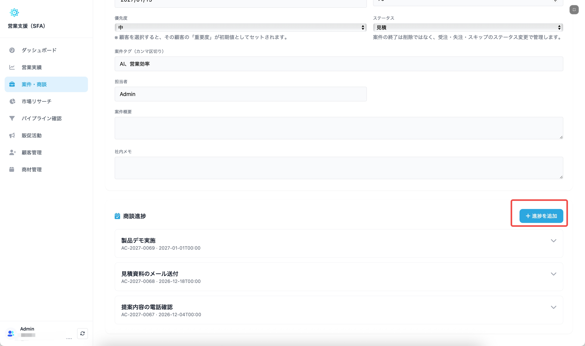

注意:

- AI 要約は入力補助です。保存前に必ず内容を確認してください。
- 添付追加では、複数ファイル名を活動履歴に残せます。

### 7.2 活動履歴を確認する

活動履歴の行をクリックすると、内容が展開されます。

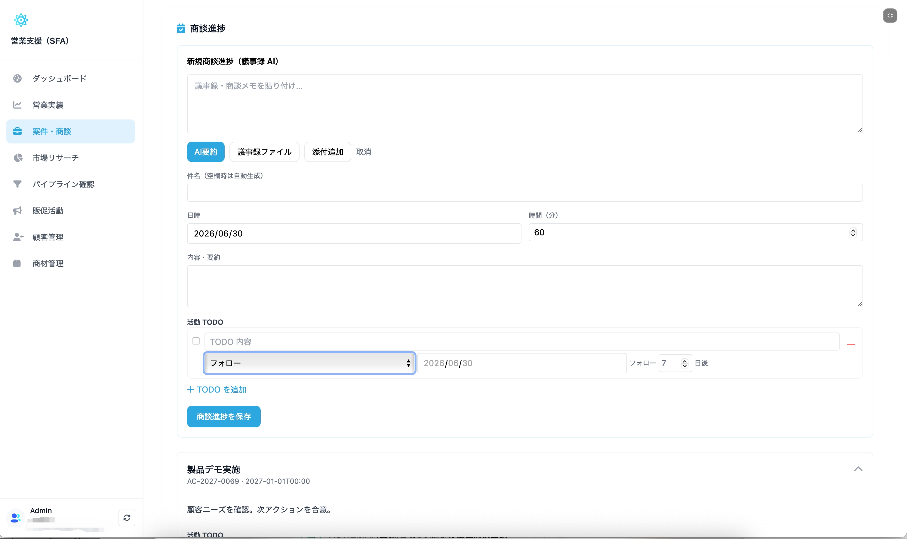

展開後に確認できる項目:

| 項目 | 説明 |
| --- | --- |
| 内容・要約 | 商談内容の要約 |
| 原文 | 議事録原文。表示と非表示を切り替えできます。 |
| 活動 TODO | 商談に紐づく TODO の一覧 |

### 7.3 TODO を操作する

活動 TODO では、フォロー、資料送付、社内対応、提案、その他の種別を管理できます。

主な操作:

| 操作 | 説明 |
| --- | --- |
| 完了切替 | チェックボックスで未完了・完了を切り替えます。 |
| 削除 | 赤いマイナスボタンで TODO を削除します。 |
| 手動追加 | TODO 内容、種別、期限、フォロー日数を入力して追加します。 |

## 8. 市場リサーチを使う

### 8.1 AI でニュース調査を行う

市場リサーチでは、テーマに基づいてニュースから企業候補を抽出し、深掘り調査後に顧客として登録できます。

操作手順:

1. 左メニューから「市場リサーチ」をクリックします。
2. 調査テーマを入力します。
3. 必要に応じて背景、対象商材を入力・選択します。
4. 「AI でニュース調査」をクリックします。
5. 調査結果一覧に企業候補が表示されます。

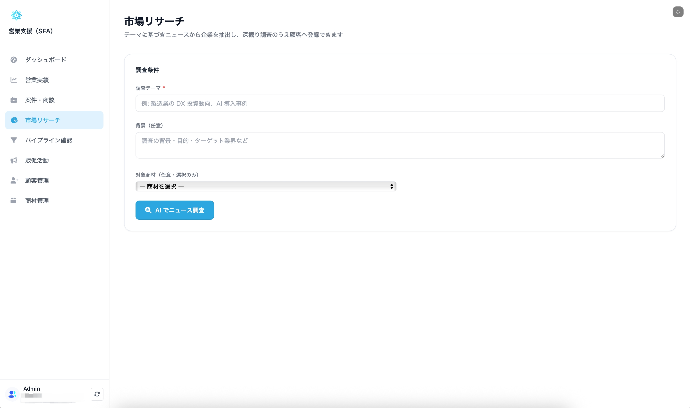

調査テーマの例:

- 製造業の DX 投資動向
- AI 導入事例
- 新規出店を進めている小売企業

### 8.2 企業を深掘りする

1. 調査結果一覧で深掘りしたい企業にチェックを入れます。
2. 「選択企業を深掘り」をクリックします。
3. 深掘りが完了すると、企業概要、業種、規模、Web サイト、潜在担当者などが表示されます。
4. 「詳細を見る」で深掘り結果を展開します。

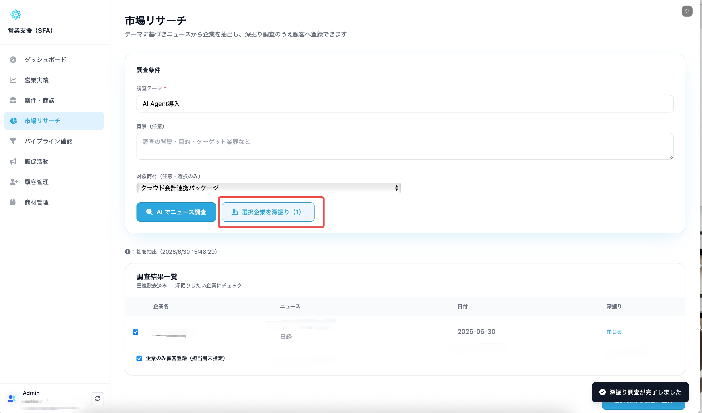

### 8.3 顧客として登録する

1. 深掘り結果で、登録したい担当者にチェックを入れます。
2. 担当者が不明な場合は「企業のみ顧客登録（担当者未指定）」を選択します。
3. 「選択項目を顧客に登録」をクリックします。
4. 登録完了後、顧客管理で登録結果を確認します。

注意:

- 市場リサーチから登録した顧客は、獲得チャンネルに市場リサーチ由来の情報が入ります。
- 顧客登録後は、顧客詳細から案件登録へ進めます。

## 9. パイプラインを確認する

### 9.1 パイプライン画面を開く

1. 左メニューから「パイプライン確認」をクリックします。
2. 確率別のカンバンが表示されます。
3. 各列の件数と見込み金額合計を確認します。

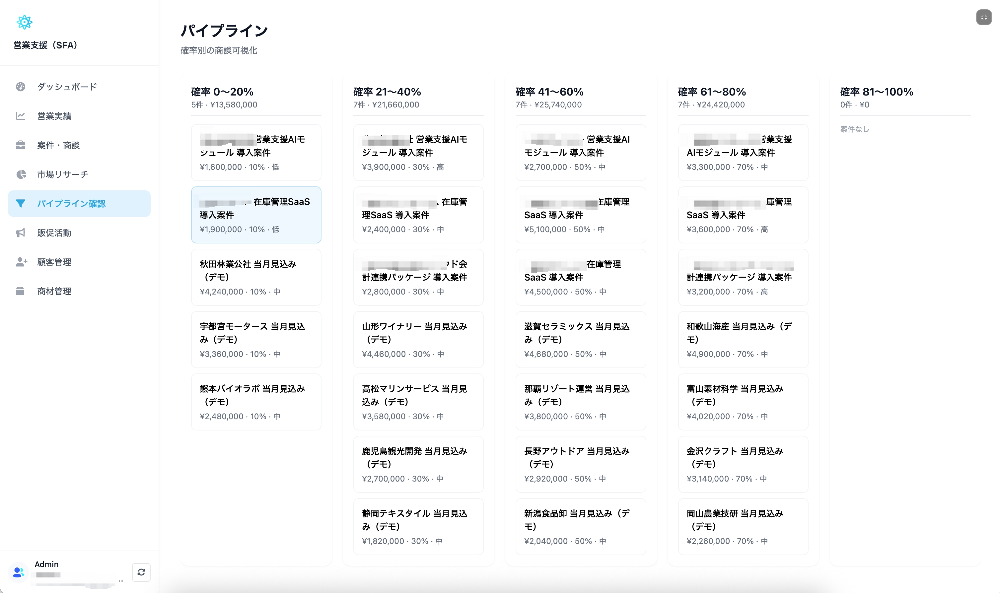

確率の列:

| 列 | 対象確率 |
| --- | --- |
| 確率 0〜20% | 0 から 20% |
| 確率 21〜40% | 21 から 40% |
| 確率 41〜60% | 41 から 60% |
| 確率 61〜80% | 61 から 80% |
| 確率 81〜100% | 81 から 100% |

### 9.2 案件カードを開く

各カードには、案件名、見込み金額、確率、優先度が表示されます。カードをクリックすると、案件詳細画面へ移動します。

注意:

- パイプラインに表示されるのは進行中案件のみです。
- ステータスが受注、失注、スキップの案件は表示されません。

## 10. 販促活動を管理する

### 10.1 販促活動を登録する

1. 左メニューから「販促活動」をクリックします。
2. 「活動を追加」をクリックします。
3. 活動名、開始日、終了日、予算、ステータスを入力します。
4. 「登録」をクリックします。

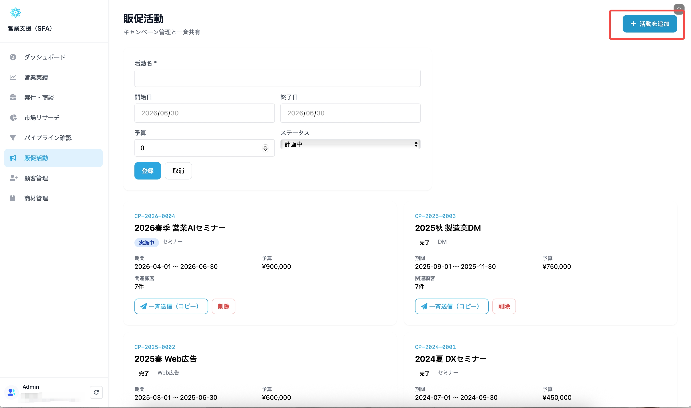

入力項目:

| 項目 | 説明 |
| --- | --- |
| 活動名 | キャンペーン名。必須項目です。 |
| 開始日 | 活動開始日 |
| 終了日 | 活動終了日 |
| 予算 | 活動予算 |
| ステータス | 計画中、実施中、完了、中止 |

### 10.2 販促活動を共有・削除する

販促活動カードでは、活動番号、活動名、ステータス、期間、予算、関連顧客件数を確認できます。

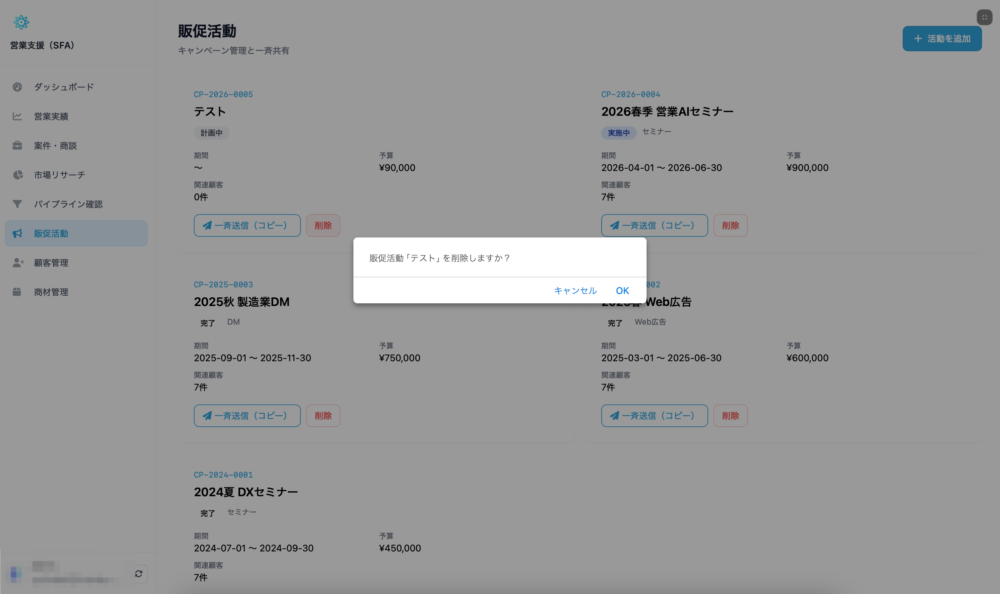

主な操作:

| 操作 | 説明 |
| --- | --- |
| 一斉送信（コピー） | 活動情報をクリップボードにコピーします。メールやチャットに貼り付けて共有できます。 |
| 削除 | 確認ダイアログ後に削除します。関連案件がある場合は削除できません。 |

## 11. 顧客を確認・登録する

### 11.1 顧客一覧を開く

1. 左メニューから「顧客管理」をクリックします。
2. 顧客一覧が表示されます。
3. 顧客番号、会社名、担当者、獲得チャンネル、属性、重要度、ステータス、登録日を確認します。

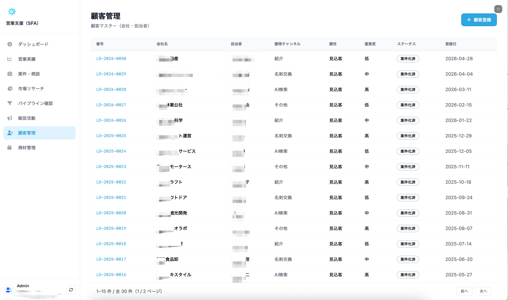

注意:

- 同一の会社名と担当者の組み合わせは、一覧上 1 件として表示されます。
- 顧客一覧には削除ボタンはありません。

### 11.2 顧客を新規登録する

1. 顧客管理画面で「顧客登録」をクリックします。
2. 名刺画像を使う場合は、アップロードエリアをクリック、またはドラッグアンドドロップします。
3. AI 読取結果がフォームに反映されたら、内容を確認・修正します。
4. 会社名、担当者名、役職、メール、電話、業種、住所、獲得チャンネル、属性、重要度、メモを入力します。
5. 「登録する」をクリックします。
6. 登録が完了すると、顧客詳細画面へ移動します。

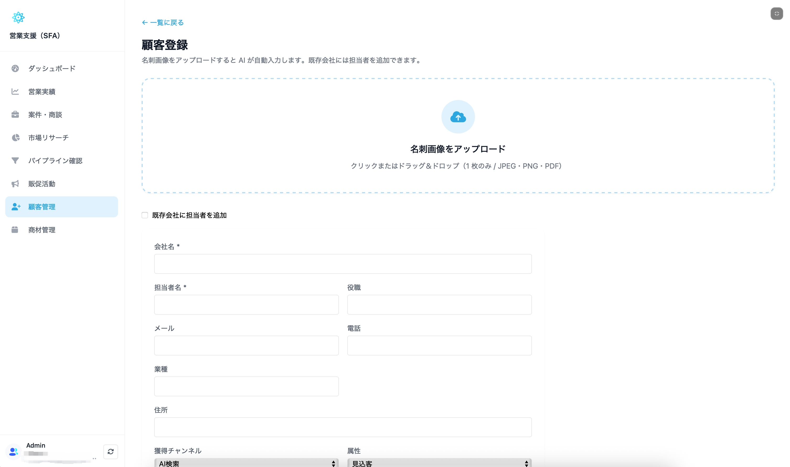

名刺 AI 読取で利用できる主なファイル形式:

| ファイル形式 | 説明 |
| --- | --- |
| JPEG / JPG | 名刺画像 |
| PNG | 名刺画像 |
| PDF | 名刺 PDF。1 枚のみ |

注意:

- AI 読取は入力補助です。会社名、担当者名、メール、電話番号は必ず確認してください。
- 会社名と担当者名は必須です。
- 獲得チャンネルで「その他」または「紹介」を選択した場合は、獲得チャンネル詳細の入力が必要です。

### 11.3 既存会社に担当者を追加する

1. 顧客登録画面で「既存会社に担当者を追加」にチェックを入れます。
2. 会社名を入力し、登録済み会社を選択します。
3. 新しい担当者情報を入力します。
4. 「担当者を追加」をクリックします。

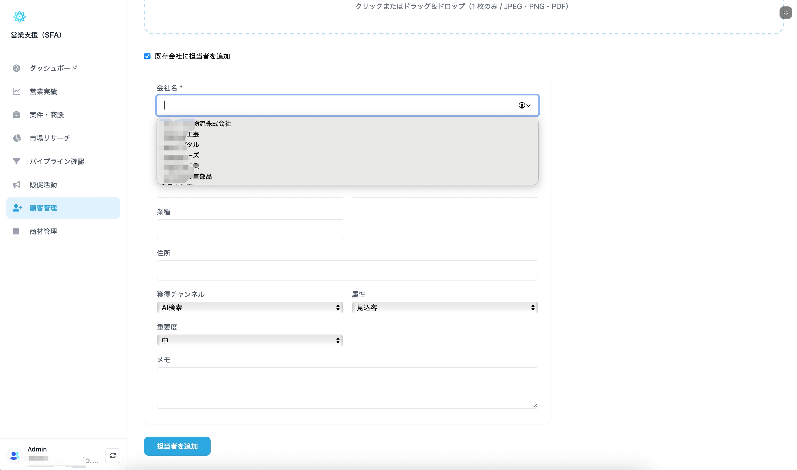

保存時の主なエラー:

| 条件 | 表示されるメッセージ |
| --- | --- |
| 会社名が未入力 | 会社名は必須です |
| 担当者名が未入力 | 担当者名は必須です |
| 獲得チャンネル詳細が未入力 | 獲得チャンネルの詳細を入力してください |
| 同じ会社・担当者が存在する | 同一の会社・担当者は既に登録されています |
| 登録済み会社を通常登録しようとした | 登録済みの会社です。担当者追加モードで登録してください |

## 12. 顧客詳細を編集し、案件化する

### 12.1 顧客詳細を開く

1. 顧客管理画面で対象行をクリックします。
2. 顧客詳細画面が表示されます。
3. 顧客番号、会社名、ステータス、担当者、属性、重要度を確認します。

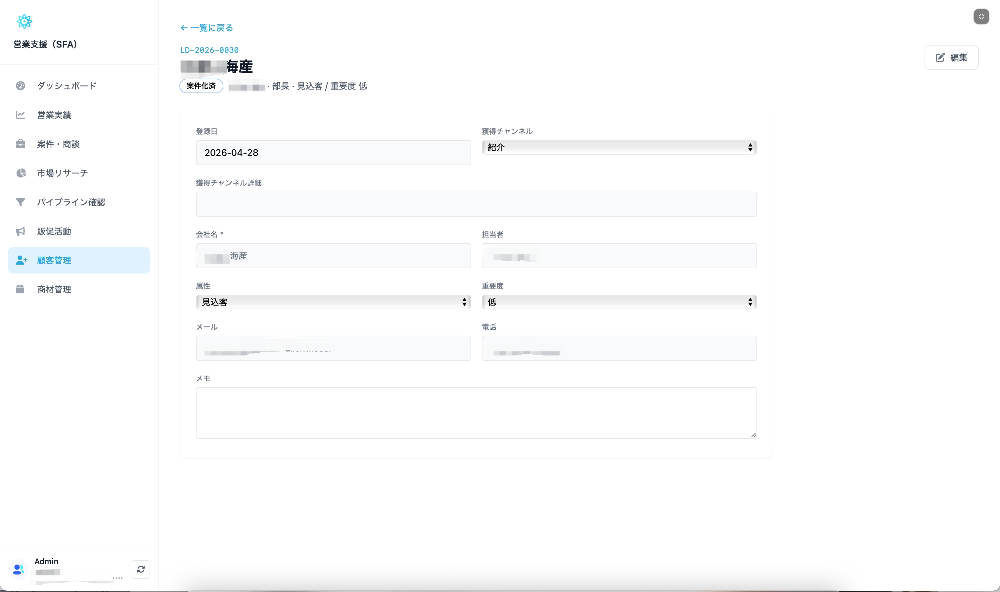

### 12.2 顧客情報を編集する

1. 顧客詳細画面で「編集」をクリックします。
2. 獲得チャンネル、会社名、担当者、属性、重要度、メール、電話、メモを修正します。
3. 「保存」をクリックします。

注意:

- 登録日は編集できません。
- 会社名は必須です。
- 獲得チャンネル詳細が必要なチャンネルを選択した場合は、詳細を入力してください。

### 12.3 顧客を案件化する

1. 顧客詳細画面で「編集」をクリックします。
2. 案件名を入力します。未入力の場合は「会社名 案件」という名前で作成されます。
3. 「案件登録」をクリックします。
4. 案件登録が完了すると、案件詳細画面へ移動します。
5. 顧客ステータスは「案件化済」に更新されます。

注意:

- すでに案件化済みの顧客では、案件登録ボタンは表示されません。
- 案件化後、案件詳細で対象商材や金額などを入力してください。

## 13. 商材を管理する

### 13.1 商材を新規登録する

1. 左メニューから「商材管理」をクリックします。
2. 「新規登録」をクリックします。
3. 商材資料をアップロードするか、商材説明テキストを入力します。
4. 必要に応じて「AI要約」をクリックします。
5. 商材コード、商材名、カテゴリ、単価、AI 要約、説明を確認・入力します。
6. 「保存」をクリックします。

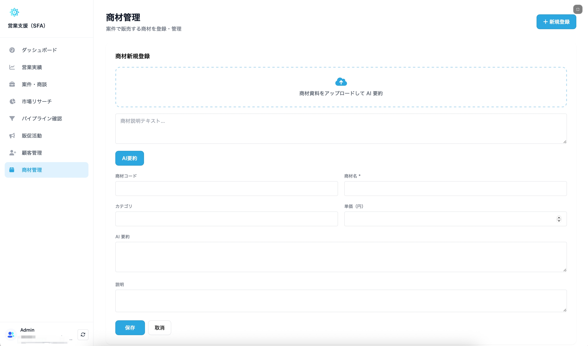

入力項目:

| 項目 | 説明 |
| --- | --- |
| 商材コード | 任意入力。空欄の場合は自動採番されます。 |
| 商材名 | 商材の名称。必須項目です。 |
| カテゴリ | 商材カテゴリ |
| 単価 | 標準単価 |
| AI 要約 | 商材資料や説明文から生成された要約 |
| 説明 | 商材の補足説明 |

注意:

- AI 要約は入力補助です。保存前に内容を確認してください。
- 商材名が未入力の場合は「商材名は必須です」と表示されます。

### 13.2 商材を編集・削除する

編集手順:

1. 商材一覧で対象商材の「編集」をクリックします。
2. 商材編集フォームで内容を修正します。
3. 「保存」をクリックします。

削除手順:

1. 商材一覧で対象商材の「削除」をクリックします。
2. 確認ダイアログで内容を確認します。
3. OK をクリックします。

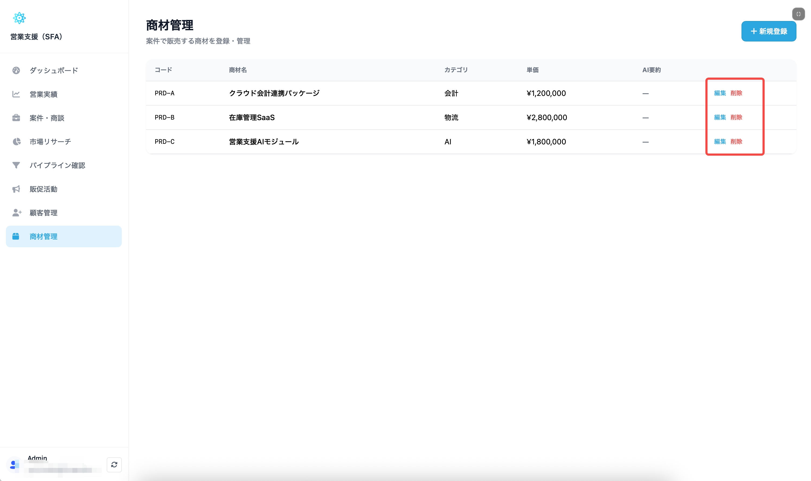

注意:

- 関連案件がある商材は削除できません。
- 商材を案件に利用する場合は、先に商材管理で登録してください。

## 14. ステータスの意味

### 14.1 案件ステータス

| ステータス | 分類 | パイプライン表示 | 説明 |
| --- | --- | --- | --- |
| 新規 | 進行中 | 表示 | 登録直後または初期接点の案件 |
| 商談中 | 進行中 | 表示 | 商談を進めている案件 |
| 提案 | 進行中 | 表示 | 提案中の案件 |
| 見積 | 進行中 | 表示 | 見積提示中の案件 |
| 受注 | 終了 | 非表示 | 受注済み案件 |
| 失注 | 終了 | 非表示 | 失注した案件 |
| スキップ | 終了 | 非表示 | 追客対象外にした案件 |

### 14.2 顧客ステータス

| ステータス | 説明 |
| --- | --- |
| 新規 | 新しく登録した顧客 |
| 育成中 | 継続フォロー中の顧客 |
| 案件化済 | 案件登録済みの顧客 |
| 失注 | 失注した顧客 |
| 休眠 | 現在は活動していない顧客 |
| その他 | 上記以外 |

### 14.3 販促活動ステータス

販促活動は「計画中」「実施中」「完了」「中止」で管理します。

### 14.4 TODO ステータス

活動 TODO は「未完了」「完了」で管理します。

## 15. 業務フロー早見表

### 15.1 標準フロー

1. 商材管理で商材を登録します。
2. 顧客管理で顧客を登録します。
3. 顧客詳細で案件登録を行います。
4. 案件詳細で商材、金額、確率、優先度を入力します。
5. 商談後、案件詳細で商談進捗と TODO を登録します。
6. 受注、失注、スキップが確定したら案件ステータスを更新します。
7. ダッシュボードと営業実績で結果を確認します。

### 15.2 新規開拓フロー

1. 市場リサーチで AI ニュース調査を行います。
2. 企業を深掘りします。
3. 顧客として登録します。
4. 顧客詳細から案件登録します。
5. 以降は標準フローと同じです。

### 15.3 日次チェック

- ダッシュボードで受注間近案件と TODO を確認します。
- 対応後は案件詳細で商談進捗を登録します。
- 未完了 TODO が残っている場合は期限を確認します。

### 15.4 週次チェック

- パイプライン確認で高確率案件を確認します。
- 営業実績で目標達成率を確認します。
- 週次レポート（AI）を生成し、営業会議や報告に利用します。

## 16. よくある質問

### Q1. 起動後、ローディングが終わらない、またはデータが空です

数十秒待っても改善しない場合は、左下の再取得ボタンをクリックしてください。Agentify へのログイン状態や、ユーザー情報の登録状態も確認してください。

### Q2. 保存時に「接続の準備に失敗しました」と表示されます

テナント情報の自動取得に失敗している可能性があります。ページを再読み込みするか、左下の再取得ボタンをクリックしてください。

### Q3. パイプラインに案件が表示されません

ステータスが受注、失注、スキップになっている案件はパイプラインに表示されません。案件詳細でステータスを確認してください。

### Q4. 案件や顧客を削除できますか

案件と顧客には削除操作はありません。案件は受注、失注、スキップなどのステータスで終了状態を管理してください。

### Q5. 営業実績の目標と実績が合いません

期間フィルターと目標の年月が一致しているか確認してください。受注実績は受注予定日、受注予定日がない場合は登録日をもとに集計されます。

### Q6. AI 機能が失敗します

ネットワーク状態、Agentify 側の接続状態、ファイル形式を確認してください。AI 機能が使えない場合でも、手入力で登録できます。

## 付録: 自動採番プレフィックス

| 種別 | プレフィックス | 例 |
| --- | --- | --- |
| 顧客 | LD | LD-0001 |
| 案件 | OP | OP-0001 |
| 活動 | AC | AC-0001 |
| 販促活動 | CP | CP-0001 |
